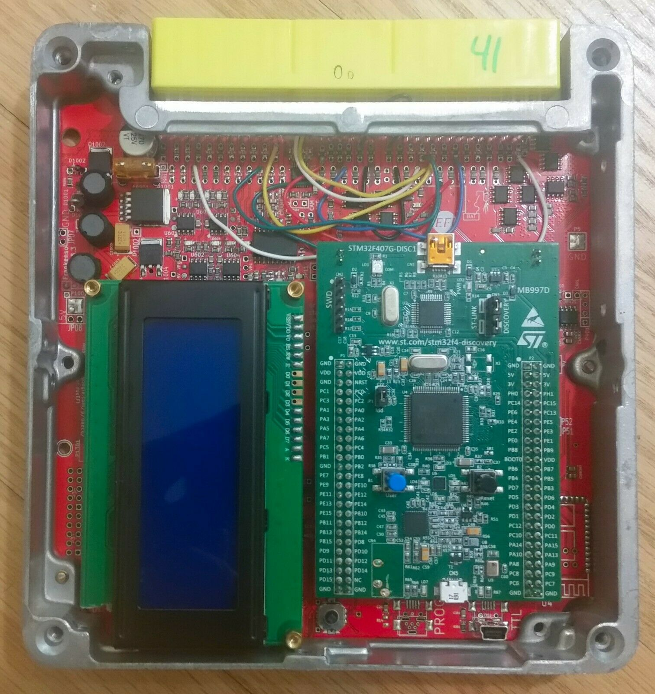

Since day one rusEFI had considerations for Plug&Play usage on Mazda Miata MX5.

First and second generation Miata have used for major pinouts, this page goes into some defailts of each of four cases:

# Miata NA6 and early NA8
1989-1995 Miata 48 pin connector has two PnP rusEFI options: [Frankenso](Frankenso) and [MREAdapter48](MREAdapter48)
Listed for sale with early June deliveries.

# Late NA8
1996 and 1997 while connector looks the same, the pinout is drastically different from early NA8

[Frankenso](Frankenso) could be set for this pinout using a few dozen jumper wires in the wiring breakout area.

As of May 2020 [Proteus](Proteus) or [Hardware-microRusEFI](Hardware-microRusEFI) could be wired
using [breakout board](https://www.ebay.com/itm/64-pin-ECU-connector-civic-mazda-mx-5-eunos-miata-toyota-with-breakout-PCB/332771650527)

One day we plan to have a microRusEFI adapter for these cars maybe in August 2020?

# Early NB
NB1 1999-2000 while connector still looks similar that's another different pinout.

As of May 2020 [Proteus](Proteus) or [Hardware-microRusEFI](Hardware-microRusEFI) could be wired
using [breakout board](https://www.ebay.com/itm/64-pin-ECU-connector-civic-mazda-mx-5-eunos-miata-toyota-with-breakout-PCB/332771650527)

One day we plan to have a microRusEFI adapter for these cars maybe in August 2020?

# Late NB
NB2 2001-2005

[MREAdapter72](MREAdapter72) is the Plug&Play solution for Miata NB2. Listed for sale.

# Other links

See also [Frankenso NA6 PnP](Frankenso-MazdaMiataNA6-pnp)

