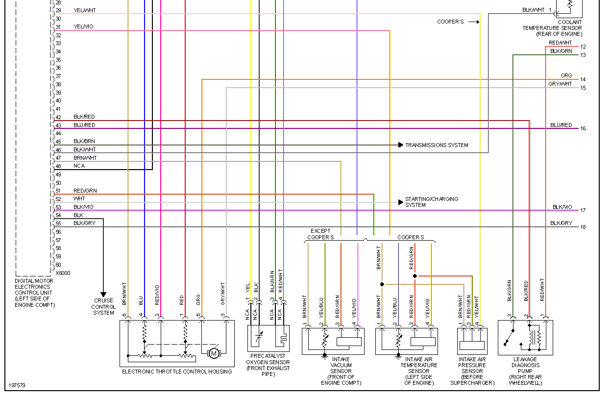
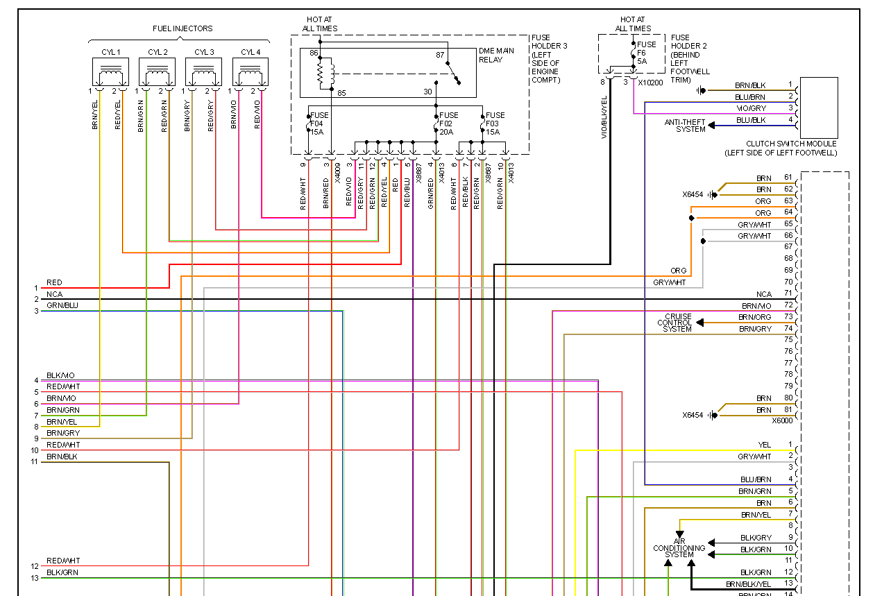
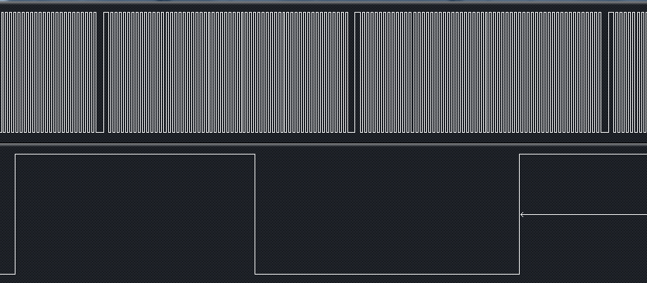

CAN bus notes see https://rusefi.com/forum/viewtopic.php?f=5&t=473

## Minimalistic wiring

|    |         |                                              |        |
| -- | ------- | -------------------------------------------- | ------ |
| 3  | BLK/RED | Output: Ignition coil 2-3                    | ?      |
| 4  | BLK/BLU | Output: Ignition coil 1-4                    | ?      |
| 10 | ?       | Electronic Throttle Body position signal \#1 | white  |
| 11 | ?       | Electronic Throttle Body position signal \#2 | red    |
| 12 | ?       | Electronic Throttle Body TPS ground          | green  |
| 13 | ?       | Electronic Throttle Body TPS power           | orange |
| 19 | BRN/VIO | Output: Injector \#4                         | orange |
| 20 | BRN/GRN | Output: Injector \#2                         | blue   |
| 21 | BRN/YEL | Output: Injector \#1                         | red    |
| 22 | BRN/GRY | Output: Injector \#3                         | green  |
| 53 | BLK/VIO | Input: Camshaft position sensor (2)          | green  |
| 55 | BLK/GRY | Input: Crankshaft position sensor (2)        | orange |
| 65 | GRY/WHT | ETB                                          | ?      |
| 66 | GRY/WHT | ETB                                          | C      |
| 72 | BRN/VIO | Input: Camshaft position sensor (3) Ground   | ?      |
| 74 | BRN/GRY | Input: Crankshaft position sensor (1) Ground | ?      |
| 80 | BRN     | Ground                                       | black  |
| 81 | BRN     | Ground                                       | black  |

|        |         |                           |        |
| ------ | ------- | ------------------------- | ------ |
| 82/1   | YEL     | Acceleration Pedal +5v    | black  |
| 83/2   | GRY/WHT | Acceleration Pedal +5v    | orange |
| 85/4   | B       | Clutch switch             | black  |
| 86/5   | BRN/GRN | Acceleration Pedal        | white  |
| 87/6   | BRN     | Acceleration Pedal Ground | blue   |
| 97/16  | BRN/RED | Pwr?                      | red    |
| 105/24 | B       | Fuel Pump                 | blue   |
| 106/25 | BLK/VIO | Anti-theft system         | green  |
| 107/26 | GRY/YEL | Acceleration Pedal signal | green  |
| 108/27 | WHT     | Acceleration Pedal        | white  |
| 114/33 | BRN     | ECU Ground                | clear  |
| 115/34 | BRN     | ECU Ground                | clear  |
| 118/37 | B       | Fuel Pump relay           | clear  |
| 120/39 | GRN/RED | \+12V                     | clear  |
| 121/40 | RED/WHT | Power +12V all times      | clear  |
| A      | B       | C                         |        |
| A      | B       | C                         |        |

## 2003 Mini Cooper ECU Wiring Diagram

#1 BRN/BLK ground
#2 YEL/BRN CAN low
#3 YEL/BLK CAN high
#7 BLU +12v power

See also [CAN Sniffer](CAN-Sniffer)

ECU header: 121p, compatible with IV Volkswagen Jetta VR6, part number [966971-2](http://www.te.com/catalog/pn/en/966971-2)

## Trigger shape

