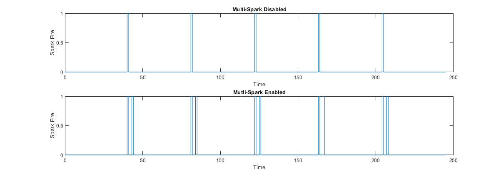
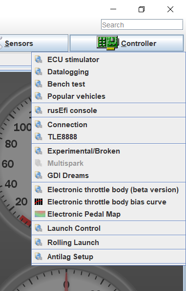
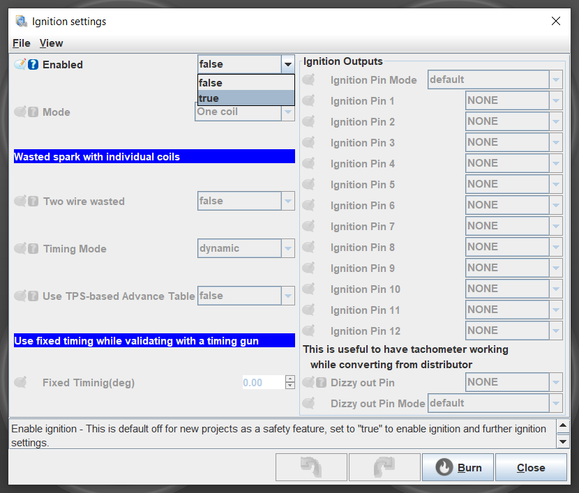
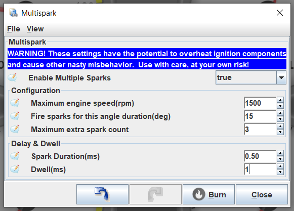

# Multispark Ignition

Multispark is a feature that will fire the ignition coil for a single cylinder multiple times in a single combustion cycle. This is useful for cold start conditions where complete fuel burn may not occur from a single spark. During multispark, the first ignition will be a partial burn and stir up the remaining fuel in the cylinder allowing subsequent sparks to create a more complete fuel burn.

## Disclaimer

Multispark in rusEFI is currently completely experimental and should only be used as such. Use it at your own risk, risking catastrophic damage to your ECU, engine, and vehicle.  

## Working Theory

During low-speed operation, if there is enough time for the dwell and ignition period of an ignition coil in a single power stroke, the ECU can fire the ignition coil multiple times. The result of this will be a more complete fuel burn, giving more power, better fuel economy, and lower emissions. The downside is that due to the ignition coil firing multiple times per power stroke, the ignition coil will operate *hotter*, possibly leading to overheating and shorter ignition coil lifespan.  

  

## How to Enable Multispark

To enable the multispark feature, open the "Ignition" tab in the options bar. In the drop down menu, open the "Multispark" window.

In the event that the Multispark option is greyed out, spark will need to be enabled. In  the "Ignition" -> "Ignition settings" dialog, double-check that "Enabled" is set to true in the drop down menu.  

{: style="width: 250px;" }

{: style="width: 500px;" }

If ignition is enabled, multispark settings should be available. In the Multispark menu, simply set "Enable multiple sparks" to true to enable multispark. *NOTE:* The "Configuration" and "Delay & Dwell" settings should be set with extreme caution as serious permanent damage could be caused to your engine.  

{: style="width: 500px;" }

## Configuration Definition

### Maximum engine speed(rpm)

This is the maximum engine speed at which multispark will occur. At engine speeds above this limit, multispark will be disabled.

### Fire sparks for this angle duration(deg)

This is a set angle duration after the first ignition spark durinch which subsequent spark events (multispark) are allowed. If an additional spark is scheduled to fire after this set window, it will not occur.  

### Maximum extra spark count

This is the maximum number of *additional* spark events, not including the main spark event.

### Spark Duration(ms)

This is the delay between sparks during multispark.

### Dwell(ms)

This is the ignition dwell used for subsequent sparks. Keep in mind that this does not need to be as long as your main ignition dwell due to a partial burn having already occured. Nor *should* it be as long in order to prevent overheating of the ignition coils.  

## Example

An example of multispark in action can be viewed [here](https://www.youtube.com/watch?v=SZn2CPouFek).  
