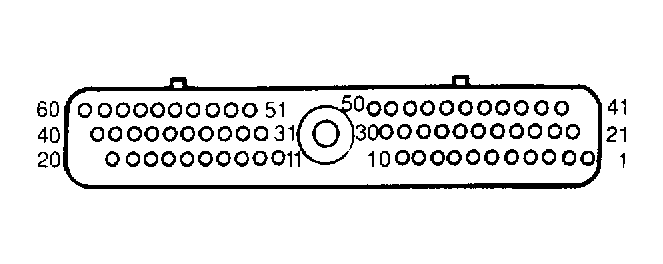
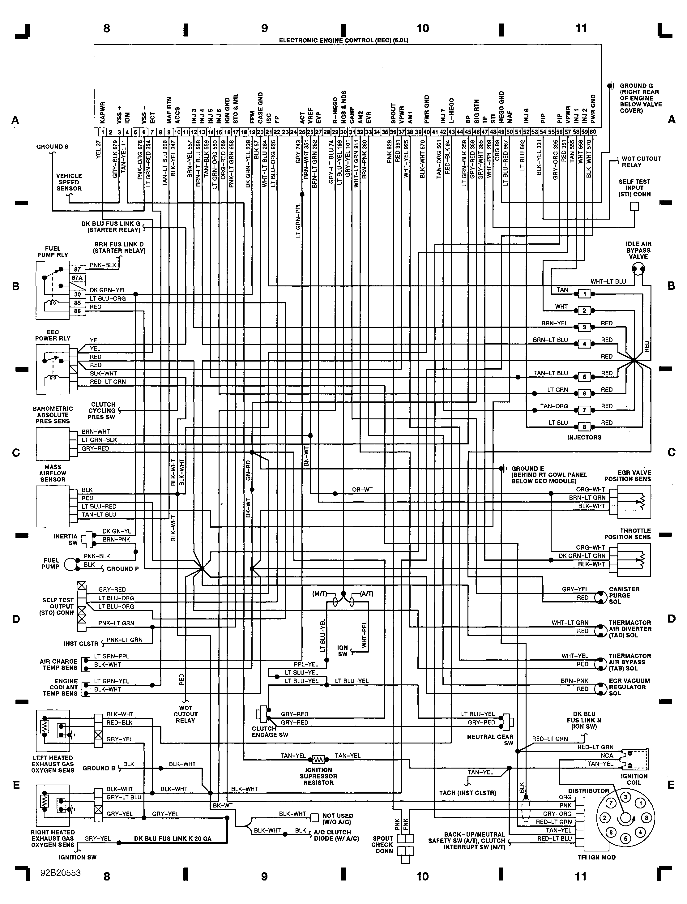

# 1992 Ford Mustang 5.0

| Connector/ Pin Number | OEM Color | Name / Function |
| --------------------- |------- |---------------- |
| 1 | YEL     | +12V Hot all times      |
| 2 |      |  |
| 3 | GRY-BLK     | VSS+ |
| 4 | TAN-YEL     | Tach signal |
| 5 |      |  |
| 6 | PNK-ORG | VSS- |
| 7 | LT GRN-RED     | coolant temp signal      |
| 8 |      |  |
| 9 | TAN-LT BLU     | Signal Ground |
| 10 | BLK-YEL     | AC Clutch Signal |
| 11 |      |       |
| 12 | BRN-YEL     | Injector 3 |
| 13 | BRN-LT BLU     | Injector 4 |
| 14 | TAN-BLK     | Injector 5 |
| 15 | LT GRN-ORG     | Injector 6      |
| 16 | ORG-RED     | TFI Signal Ground |
| 17 | PNK-LT GRN     | Check Engine Light |
| 18 |      |  |
| 19 | DK GRN-YEL     | Fuel Pump Monitor      |
| 20 | BLK     | Case Ground |
| 21 | WHT-LT BLU     | Idle Air Bypass |
| 22 | LT BLU-ORG     | Fuel Pump Relay Signal |
| 23 |      |       |
| 24 |      |  |
| 25 | GRY     | Air Charge Temp Sensor |
| 26 | BRN-WHT     | 5V Reference |
| 27 | BRN-LT GRN     | EGR Signal      |
| 28 |      |  |
| 29 | GRY-LT BLU     | Right O2 Sensor Signal |
| 30 | LT BLU-YEL     | Neutral Safety Switch |
| 31 | GRY-YEL     | Canister Purge Solenoid     |
| 32 |      |  |
| 33 | BRN-PNK     | EGR Vacuum Regulator Solenoid |
| 34 |      |  |
| 35 |      |       |
| 36 | PNK     | SPOUT Signal |
| 37 | RED     | +12V Hot on Run and Start |
| 38 | WHT-YEL     | Thermactor Air Bypass Solenoid |
| 39 |      |      |
| 40 | BLK-WHT     | GND Ground |
| 41 |      |  |
| 42 | TAN-ORG     | Injector 7 |
| 43 |      |  |
| 44 |      |  |
| 45 | LT GRN-BLK     | Baro Sensor Signal |
| 46 | GRY-RED     | 5V Sensor GND      |
| 47 | GRY-WHT     | TPS Signal |
| 48 |     |  |
| 49 | ORG     | O2 Sensor GND |
| 50 |      |   |
| 51 |      |  |
| 52 | LT BLU     | Injector 8 |
| 53 |      |  |
| 54 | BLK-YEL     | WOT Cutout Relay      |
| 55 |      |  |
| 56 | GRY-ORG    | PIP Signal |
| 57 | RED     | +12V Hot on Run and Start |
| 58 | TAN     | Injector 1      |
| 59 | WHT     | Injector 2 |
| 60 | BLK-WHT     | GND Ground |
