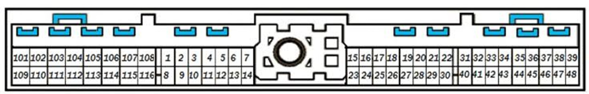

# Nissan 121 pin ECU: variations across vehicles (2000s to 2010s)

**Summary:** Nissan and Infiniti used one Bosch-style 121 pin ECU header on most VQ V6, VK V8 and QR/QG 4 cylinder vehicles from about 2000 to 2015, and [Hellen 121 Nissan](Hellen-121-Nissan) targets that connector. Power, ground, CAN and most engine I/O sit on the same pins everywhere; the differences are in O2/A-F sensor pins (2003 350Z narrowband vs 2005+ wideband), extra V8 outputs (injectors/coils 7-8, knock 2, VTC position), Maxima-only EGR and engine mount pins, and a few 4 cylinder inputs. The Euro Almera N16 (and likely Micra K12) shifts several pins by one position and needs a modified board. 2007+ VQ35HR and VQ37VHR cars, later Altima/Sentra/Versa, and the early 2002-2004 Altima V6 and 2002-2003 Maxima use different connectors. See the pin table below for the exact per-vehicle differences.

This page collects what is known about the single-connector 121 pin Nissan/Infiniti engine ECU used from roughly 2000 to the mid 2010s, which vehicles use it, and how the pinout differs from vehicle to vehicle. It exists to support [Hellen 121 Nissan](Hellen-121-Nissan), the rusEFI plug-and-play board for this connector.

Companion pages: [Vault-Of-Nissan-OEM](Vault-Of-Nissan-OEM), [Nissan-Xterra-2011](Nissan-Xterra-2011), [Hellen-76-Nissan](Hellen-76-Nissan) for the older 76 pin family.

The per-pin comparison is maintained in the [Hellen 121 Nissan Google Sheet](https://docs.google.com/spreadsheets/d/1mhGITGrEsXB65xr1dcxLFLKIrD0TVu754hoxm6RZHCA). This page summarizes that sheet plus OEM diagrams in this repo, the [rusEFI forum thread](https://rusefi.com/forum/viewtopic.php?f=4&t=1935), the [issue tracker](https://github.com/rusefi/hellen121nissan-issues/issues) and community pinout postings. Anything marked *unverified* has not been checked against a factory wiring diagram.

## The connector

* One 121 position connector, pins numbered 1 to 121. Nissan service manuals draw the harness-side face with the numbering in groups (the 101-116 group sits at one end, then 1 upwards). Two slightly different OEM drawings of the face are in [Vault-Of-Nissan-OEM](Vault-Of-Nissan-OEM); use the terminal number, not the position in the drawing, when comparing vehicles.
* Physically it is the same Bosch 121 pin ECU header used by Bosch ME7 ECUs on 2001-2006 Audi/VW/Skoda/Seat. Aftermarket vendors list the same header for "Nissan 350Z 03-06, among others" ([Tuning Technology](https://www.tuningtechnology.net/ecu-headers/bosch-121-pin-ecu-connector)). This is why Hellen 121 Nissan and Hellen 121 VAG share a board outline.
* The OEM ECUs are Hitachi units marked `MECxx-xxx` (see the hardware section below). Photos of a 121 pin Hitachi board are in [nissan121front.jpg](OEM-Docs/Nissan/nissan121front.jpg) and [nissan121back.jpg](OEM-Docs/Nissan/nissan121back.jpg).

Power and ground positions are the same on every 121 pin variant seen so far: pin 1, 115 and 116 are power ground, 119 and 120 are switched 12 V from the ECM relay, 121 is permanent battery, 109 is ignition switch input, 111 drives the ECM relay (self shut-off) and 113 drives the fuel pump relay. CAN is on 86 (low) and 94 (high), K-line diagnostics on 85.

## Which vehicles use it

### Confirmed against wiring diagrams

These have a filled column in the comparison sheet or a diagram in this repo.

| Vehicle | Years | Engine | Notes | Source |
|---|---|---|---|---|
| Nissan Xterra (N50) | 2005-2015 (2011 verified) | VQ40DE V6 | Reference vehicle for Hellen 121 Nissan. The sister 2017 Frontier is not 121 pin, so 2013+ Xterras should be checked before assuming they are | [Nissan-Xterra-2011](Nissan-Xterra-2011), [2011 pinout](OEM-Docs/Nissan/2011_Xterra/2011-Nissan-Xterra-VQ40DE-ECM-pinout.md) |
| Nissan 350Z (Z33) | 2003-2006 | VQ35DE V6 | 2003 has a different O2 sensor scheme than 2005-2006; 2006 adds exhaust cam sensors | [2005 pinout](OEM-Docs/Nissan/2005-Nissan-350Z-VQ35DE-ECM-pinout.md), [2003](OEM-Docs/Nissan/2003-350z-ecu.png), [2005](OEM-Docs/Nissan/2005-350z-ecu.png), [2005 diagram](OEM-Docs/Nissan/2005-350z.pdf) |
| Nissan Sentra (B15) SE-R / Spec V | 2002-2006 | QR25DE I4 | 4 cylinder variant, bank 2 pins unused | [2005 Sentra](OEM-Docs/Nissan/2005-sentra-2.5-ecu.png) |
| Nissan Maxima (A34) | 2004-2006 | VQ35DE V6 | Adds EGR stepper, EGR temp sensor, electronic engine mounts. The 2002-2003 A33 is NOT 121 pin, see below | [2005 Maxima](OEM-Docs/Nissan/2005-maxima-ecu.png) |
| Nissan Altima (L31) V6 | 2005-2006 only (unverified) | VQ35DE V6 | Sheet column says same as Maxima minus engine mounts. The 2002-2004 car is NOT 121 pin, see below; whether 2005-2006 moved to the 121 pin ECM like the 2004 Maxima has not been checked | Sheet, FSM EC-740 |
| Nissan Altima (L31) I4 | 2002-2006 (2004 verified) | QR25DE I4 | Crank on 13 and cam on 14 like the V6 (the sheet's swap note is wrong); uses pin 92 as a TCM wire | [2004 pinout](OEM-Docs/Nissan/2004-Nissan-Altima-QR25DE-ECM-pinout.md), Sheet, FSM EC-120 |
| Infiniti G35 (V35) | 2003-2004 (2004 verified) | VQ35DE V6 | Narrowband front O2 sensors like the 2003 350Z (pins 2/16/24/35, A/F pins 56-58 and 75-77 unused). ALLDATA article is titled "early production coupe" although pulled for a sedan | [2004 pinout](OEM-Docs/Nissan/2004-Infiniti-G35-VQ35DE-ECM-pinout.md) |
| Nissan Pathfinder (R51) | 2005-2012 (2011 verified) | VQ40DE V6 | Identical to the 2011 Xterra, same harness connectors | [2011 pinout](OEM-Docs/Nissan/2011-Nissan-Pathfinder-VQ40DE-ECM-pinout.md) |
| Nissan Titan | 2004-2015 (2011 verified) | VK56DE V8 | Adds injectors 7/8, coils 7/8, knock 2, VTC position sensors, battery current sensor | Sheet, FSM EC-91/EC-101 (2011), [issue 5](https://github.com/rusefi/hellen121nissan-issues/issues/5) |
| Nissan Armada / Infiniti QX56 | 2004-2015 (2010 and 2011 verified) | VK56DE V8 | Same ECU family as Titan; single PHASE cam sensor on pin 14, pin 33 unused, VTC position sensors on 53/72 | [2011 pinout](OEM-Docs/Nissan/2011-Nissan-Armada-VK56DE-ECM-pinout.md), [2010 pinout](OEM-Docs/Nissan/2010-Nissan-Armada-VK56DE-ECM-pinout.md) (identical) |
| Infiniti M35 | 2006-2008 | VQ35DE V6 | 121 pin naming, plus fuel pump control module pins 38/39 | [2007 M35](OEM-Docs/Nissan/2007-m35-1.png) |
| Nissan Almera (N16, Europe) | 2000-2006 (2003 tested) | QG15DE / QG18DE I4 | Same connector, but several pins are shifted by one position; needs board modification | [Almera N16](OEM-Docs/Nissan/Almera-N16-ECU.pdf), [issue 13](https://github.com/rusefi/hellen121nissan-issues/issues/13) |

### Reported to share the connector, not yet verified pin by pin

| Vehicle | Years | Engine | Evidence |
|---|---|---|---|
| Infiniti G35 2005-2006, Nissan Skyline V35 | 2005-2006 | VQ35DE | 2003-2004 is verified above. 2005-2006 presumably follows the 2005 350Z wideband scheme. Community pinout at [allpinouts](https://allpinouts.org/pinouts/connectors/car/2003-2005-infiniti-g35-sedan-and-coupe-ecu/) lists 121 terminals; AT cars put ATF temperature sensors on pins 8 and 17. The reported 2003-2004 sedan versus coupe difference is not visible in the 2004 diagram, whose article header says coupe |
| Infiniti FX35 / FX45 | 2003-2008 | VQ35DE / VK45DE | Hitachi MEC33 ECU; repair shops list it alongside 350Z, Murano, Quest and M35 as the same ECU family |
| Nissan Murano (Z50) | 2003-2007 | VQ35DE | Same ECU family per repair vendors; pin 121 is battery per forum reports |
| Nissan Quest (V42) | 2004-2009 | VQ35DE | Column exists in the sheet but is empty |
| Nissan Pathfinder (R51) V8 | 2008-2012 | VK56DE | The VQ40DE Pathfinder is verified above. The V8 should follow the Armada/Titan layout; [issue 5](https://github.com/rusefi/hellen121nissan-issues/issues/5) asks about it |
| Nissan Frontier (D40) | 2005 to about 2012 | VQ40DE | Same family as the Xterra and Pathfinder for the early years (2011 Pathfinder verified). The 2017 truck is NOT 121 pin, see below; the changeover year between 2011 and 2017 is unknown |
| Infiniti Q45 (F50), M45 (Y34) | 2002-2006, 2003-2004 | VK45DE V8 | Same era V8; unverified |
| Nissan Micra K12 (Euro OBD), Primera P12, X-Trail T30 | 2003-2010 | CR/QG/QR I4 | Forum thread says the Micra with Euro OBD looks the same as the Almera ([diagram](OEM-Docs/Nissan/nissan-micra-n12-with-euro-obd.pdf)); Almera N16 ECU part numbers are listed as fitting P12 and T30 |
| Nissan Urvan / Caravan (E25), Rogue (S35), Sentra (B16) with QR25DE | 2007+ | QR25DE | A Scribd "121 terminales" document claims Urvan, Rogue, Sentra, Frontier and X-Trail. Conflicting: B16 Sentra service data names two ECM connectors (F24/F25). Treat as unverified |
| Nissan Patrol (overseas) | | VK56DE | Column exists in sheet, empty |

### Same era, but NOT the 121 pin connector

* 2007-2008 350Z and G35 with VQ35HR. The facelift moved to a Hitachi MEC100 ECU with a different connector ([2007 350Z diagram](OEM-Docs/Nissan/2007-350z-ecu.png), [forum](https://rusefi.com/forum/viewtopic.php?f=4&t=1935)).
* 370Z, G37, M37, Q50 with VQ37VHR: three connectors, 48 + 48 + 32 pins, terminals 1-128 ([2013 370Z pinout](OEM-Docs/Nissan/2013-Nissan-370Z-VQ37VHR-ECM-pinout.md)).
* 2007-2012 Altima (L32), 2007-2012 Sentra (B16), Versa/Tiida with HR/MR engines: newer split-connector ECMs (unverified for every trim, but none have been found with the 121 pin header).
* 2017 Frontier (D40, still VQ40DE): three-connector ECM, 48 + 48 + 32 pins, terminals 1-128, the same format as the 370Z but with its own assignment; adds an intake manifold runner control valve and an oil temperature sensor ([2017 Frontier pinout](OEM-Docs/Nissan/2017-Nissan-Frontier-VQ40DE-ECM-pinout.md)). The 23710-EA010 part number quoted below for 2013-2016 suggests the change came with the 2013 model year, but that is not verified.
* 2013+ Pathfinder (R52), 2020+ Frontier (VQ38DD): different ECM part numbers and connectors.
* 2002-2003 Maxima (A33) and 2002-2004 Altima (L31) with VQ35DE: a different Hitachi ECM with terminals numbered 1-116 and a completely different assignment (injectors on 1-3, BATT on 67, VB on 110/112, CAN on 109/113). Both the [2003 Maxima diagram](OEM-Docs/Nissan/2003%20Nissan-Datsun%20Maxima.pdf) and the transcribed [2004 Altima V6 diagram](OEM-Docs/Nissan/2004-Nissan-Altima-VQ35DE-ECM-pinout.md) show it. Earlier versions of this page listed the 2003 Maxima as a confirmed 121 pin vehicle; that was wrong.
* Pre-2000 Nissans: 64 or 76 pin ECUs, see [Hellen-76-Nissan](Hellen-76-Nissan).

## Pin level differences between vehicles

The pins below are the ones that change meaning between vehicles in the comparison sheet. Pins not listed (injectors 1-6 on 21/22/23/40/41/42, coils 1-6 on 62/61/60/81/80/79, throttle motor on 4/5 with 12 V feed on 3 and relay drive on 104, TPS on 50/69, pedal on 106/98, MAF on 51, IAT 34, CLT 73, knock 15, EVAP purge 45, vent valve 117, tank pressure 32, fuel temp 107, brake 101, PNP 102 (printed as VMOT on the 2005 350Z Mitchell sheet, but wired to the park/neutral switch), cruise switches 99/108, A/C pressure 70, power steering pressure 12, and the power/ground/CAN pins already listed) are the same everywhere except on the Almera.

| Pin | VQ V6 (350Z 2005, Xterra, Pathfinder, Maxima 2004+) | 350Z 2003, G35 2004 | QR25DE I4 (Sentra, Altima I4) | VK56DE V8 (Titan, Armada) | Other |
|---|---|---|---|---|---|
| 2 | A/F sensor 1 heater bank 1 | O2 heater front left | A/F sensor 1 heater | same as V6 | |
| 6 | HO2S 2 heater bank 2 | O2 heater rear left | NC | same as V6 | |
| 8, 9 | NC (2006 350Z: exhaust cam retard solenoids, community pinout) | NC | NC | NC | G35 AT: ATF temp sensors on 8 and 17 (unverified) |
| 10 | Intake VTC solenoid bank 2 | same | NC | same | |
| 11 | Intake VTC solenoid bank 1 | same | CVTC (single) | same | |
| 13 | Crank sensor (POS) | same | POS (2004 Altima I4 diagram; the sheet's swap note is wrong) | same as V6 | |
| 14 | Cam sensor bank 2 (PHASE LH) | same | PHASE (single cam sensor) | PHASE (the only cam sensor on the 2011 Armada) | |
| 16 | A/F sensor 1 bank 1 (AF UN1) | O2 signal front left | A/F sensor 1 | A/F +2 | |
| 17-20 | NC | NC | NC | NC | Maxima 2002-2005: EGR stepper coils 1-4 |
| 24 | A/F heater bank 2 | O2 heater front right | HO2S1 heater | AF-H2 | |
| 25 | HO2S 2 heater bank 1 | O2 heater rear right | HO2S1 heater | same | |
| 29 | VIAS solenoid (Xterra) or NC (350Z) | NC | CDVC (swirl / intake valve control) | NC | Maxima: VIAS solenoid |
| 33 | Cam sensor bank 1 (PHASE RH) | same | NC | NC (2011 Armada) | |
| 35 | A/F sensor 1 bank 1 (AF VM1) | O2 signal front right | HO2S1 | A/F +1 | |
| 36 | NC | NC | NC | Knock sensor 2 | |
| 38, 39 | NC | NC | NC | NC | M35: fuel pump control module (FPCMCK, FPCM) |
| 43 | NC | NC | NC | AF-H2 | |
| 44 | NC | NC | NC | Injector 7 | Maxima: electronic engine mount 1 |
| 46 | NC | NC | NC | Coil 7 | |
| 47 | 5 V for TPS (AVCC2) | same | AVCC3 | same | |
| 48 | 5 V for tank pressure sensor (AVCC) | same | same | same | |
| 49 | 5 V for refrigerant pressure sensor | same | AVCC4 | same | |
| 53 | NC (2006 350Z: exhaust cam sensor bank 1) | NC | NC | VTC position sensor bank 2 | |
| 54 | NC | NC | NC | NC | Maxima: EGR temperature sensor |
| 55 | HO2S 2 signal bank 2 | NC | NC | same | |
| 56, 57, 58 | A/F sensor 1 IP1, VM2, IP2 (wideband current pins) | NC | 56 only | 56 = A/F-1 | 2003 350Z has narrowband style sensors, 2005+ has current-output A/F sensors |
| 63 | NC | NC | NC | Injector 8 | Maxima: electronic engine mount 2 |
| 65 | NC | NC | NC | Coil 8 | |
| 66, 67 | Sensor ground | same | same | same | |
| 68 | 5 V for power steering pressure sensor (Xterra, Maxima, Altima) | listed as sensor ground on 2003 and 2005 350Z diagrams | AVCC5 (5 V) | 5 V (PSPRES) | See jumper note below |
| 71 | NC | NC | NC | Battery current sensor | |
| 72 | NC (2006 350Z: exhaust cam sensor bank 2) | NC | NC | VTC position sensor bank 1 | |
| 74 | HO2S 2 signal bank 1 | same | HO2S2 | same | |
| 75, 76, 77 | A/F sensor 1 IA1, UN2, IA2 | NC | 75 only | 75 = A/F-2 | |
| 84, 93, 96 | NC (96 = heater fan switch on 350Z, community pinout) | NC | Electrical load inputs LOAD1/3/2 | NC | |
| 89, 97 | NC | NC | RFRH / RFRL | NC | Sentra only |
| 92 | NC | NC | Altima I4: TV00, a wire to the TCM | NC | |
| 114 | NC | NC | Sentra sheet shows a second FPR entry | NC | Probably a transcription error, verify |

### Pin 68 and the R7/R8 jumper

Early Hellen 121 Nissan boards (rev B) had jumpers R7/R8 because the 350Z diagrams show pin 68 as a sensor ground while the Xterra, Maxima and Altima diagrams show it as a 5 V supply for the power steering pressure sensor. [Issue 3](https://github.com/rusefi/hellen121nissan-issues/issues/3) compared the 2003/2005 350Z, 2011 Xterra, 2005 Altima and 2005 Maxima diagrams and concluded that all of these sensors share ground on pin 67 and pin 68 is a 5 V output on every vehicle. The transcribed [2005 350Z](OEM-Docs/Nissan/2005-Nissan-350Z-VQ35DE-ECM-pinout.md), [2004 G35](OEM-Docs/Nissan/2004-Infiniti-G35-VQ35DE-ECM-pinout.md) and [2004 Altima I4](OEM-Docs/Nissan/2004-Nissan-Altima-QR25DE-ECM-pinout.md) diagrams all confirm this: each labels pin 68 GND A, and each wires it to the power steering pressure sensor's third pin while the sensor's actual ground goes to the pin 67 sensor-ground splice. The label is the error. From rev C onward pin 68 is hard-wired as 5 V and R8 was removed. The [Hellen 121 Nissan](Hellen-121-Nissan) jumper table (R7 populated, R8 not) is the rev B carry-over.

### Euro 4 cylinder (Almera N16, QG engines)

The 2003 Almera test in the forum thread found the same connector but a different assignment on several pins. From the sheet's Almera column:

* TPS1 on 49 and TPS2 on 68 (one position off from 50/69), MAF on 50.
* Coils: 60 = coil 3, 61 = coil 1, 79 = coil 4, 80 = coil 2; pin 62 is a solenoid. On other vehicles the 4 cylinder coils are on 61/62/80/81.
* Injectors match the others (23 = 1, 42 = 2, 22 = 3, 41 = 4).
* Crank and cam sensor grounds come back into the ECU on pins 29 and 30 (on the Xterra they are grounded in the harness, and pin 29 has another use on the Sentra).
* Knock ground on 54, analog ground on 57, IAT ground on 75, CLT possibly on 72 instead of 73.
* Canister solenoid on 19, tacho output for TCU and gauge on 103.

The forum summary was "six mismatched pins" after removing several 0 R links on the board. A Hellen board for the Almera therefore needs the modifications tracked in [issue 13](https://github.com/rusefi/hellen121nissan-issues/issues/13). The Micra K12 with Euro OBD is believed to be the same layout.

### V8 (Titan, Armada, QX56)

The 2011 Titan diagram matched the Hellen 121 Nissan pinout except for the extra V8 outputs and inputs listed above: injectors 7 and 8 on 44 and 63, coils 7 and 8 on 46 and 65, second knock sensor on 36, VTC position sensors on 53 and 72, battery current sensor on 71, second A/F heater on 43. The [2011 Armada transcription](OEM-Docs/Nissan/2011-Nissan-Armada-VK56DE-ECM-pinout.md) agrees on all of these and adds that the V8 has a single camshaft position sensor (pin 14, pin 33 unused) and that the ALLDATA drawing calls the left bank "bank 1" on this engine, the reverse of the VQ. None of those extra pins are driven by the stock Hellen board, so a V8 needs the extension pads wired up.

### Automatic vs manual

The 121 pin ECU does not contain the transmission controller; the TCM is a separate unit talking over CAN (from 2004.5 on the G35 it is inside the transmission). The connector is the same for AT and MT. The practical difference for a replacement ECU is that AT cars expect engine data over CAN and the TCM may refuse to shift without it. The [Xterra CAN notes](Nissan-Xterra-2011-CAN) and [issue 28](https://github.com/rusefi/hellen121nissan-issues/issues/28) (Nissan buses have three terminators) cover this.

### Immobilizer

NATS pairs the ECM with the BCM. Forum note: the BCM may not authorize cranking until the ECM authenticates, so a rusEFI install either wires the starter relay directly or keeps the OEM ECU on the bus during cranking.

## OEM ECU hardware (Hitachi MEC series)

The MEC number identifies the Hitachi hardware generation, not the connector, so check the header before buying a replacement.

| Hitachi family | Seen on | 121 pin? |
|---|---|---|
| MEC32, MEC37 | Almera N16, Sentra, QG/QR 4 cylinder | yes |
| MEC33 | Infiniti FX35 2003-2008 | yes (unverified) |
| MEC35 | Maxima 2004-2005 | yes |
| MEC36 | QX56 2004 (VK56DE) | yes |
| MEC60, MEC61 | 350Z / G35 2005-2006 (MEC61-520 is a 2005 350Z MT) | yes |
| MEC73 | Titan 2007 | yes |
| MEC150 | Pathfinder 2011 (VQ40DE) | yes (unverified) |
| MEC100 | 350Z 2007-2008 (VQ35HR) | no, different connector |
| MEC80 | later Nissan/Renault | no (different pinout family) |

Nissan part numbers for the ECM start with 23710 (for example 23710-EA010 for a 2013-2016 Frontier VQ40DE, 23710-VZ06A for a QR25DE Urvan). The suffix letters follow the vehicle platform, which is a quick hint that two vehicles share an ECU family.

## Open items

* Fill the empty sheet columns: early D40 Frontier, Quest, Rogue, Patrol, G35 2005-2006, FX35/FX45, Q45, QX56. Pathfinder and G35 2004 now have transcriptions.
* Confirm whether the reported 2003-2004 G35 sedan difference is a pinout change or only a harness/immobilizer change. The 2004 ALLDATA diagram in the repo carries a "coupe" article header, so a sedan-specific sheet is still needed.
* Check whether the 2005-2006 Altima V6 uses the 121 pin ECM (the 2002-2004 car does not), and whether the B15 Sentra matches the 2004 Altima I4 diagram.
* Find the model year the D40 Frontier changed from the 121 pin ECM to the three-connector one (2011 Pathfinder is 121 pin, 2017 Frontier is not).
* Resolve the Urvan/Rogue/B16 Sentra question: 121 pin or two-connector ECM.

## Sources

* [Hellen 121 Nissan comparison sheet](https://docs.google.com/spreadsheets/d/1mhGITGrEsXB65xr1dcxLFLKIrD0TVu754hoxm6RZHCA)
* [rusEFI forum: Hellen 121 Nissan](https://rusefi.com/forum/viewtopic.php?f=4&t=1935) and [my350z thread](https://my350z.com/forum/tuning/625760-rusefi-hellen-121-nissan.html)
* [hellen121nissan-issues](https://github.com/rusefi/hellen121nissan-issues/issues): [#3 pin 68](https://github.com/rusefi/hellen121nissan-issues/issues/3), [#5 V8](https://github.com/rusefi/hellen121nissan-issues/issues/5), [#13 Almera](https://github.com/rusefi/hellen121nissan-issues/issues/13), [#28 CAN terminators](https://github.com/rusefi/hellen121nissan-issues/issues/28)
* [Tuning Technology: Bosch 121 pin ECU connector](https://www.tuningtechnology.net/ecu-headers/bosch-121-pin-ecu-connector)
* [allpinouts: 2003-2005 G35 ECU](https://allpinouts.org/pinouts/connectors/car/2003-2005-infiniti-g35-sedan-and-coupe-ecu/)
* ECU part number listings: [Redline Auto Parts 2007 350Z MEC100](https://www.redlineautoparts.com/nissan/2003-2008-350z/2007-nissan-350z-vq35hr-ecu-engine-control-module-automatic-mec100-270-c1-6z01-113k-5z019/), [Importapart Titan MEC73](https://www.importapart.com/product/07-nissan-titan-truck-vk56de-4x2-ecu-ecm-pcm-engine-computer-mec73-271-a1-2880/), [Importapart QX56 MEC36](https://www.importapart.com/product/04-infiniti-qx56-5-6l-vk56de-4x4-ecu-ecm-pcm-engine-computer-mec36-251-a1-3561/), [Importapart Pathfinder MEC150](https://www.importapart.com/product/11-pathfinder-4-0l-v6-vq40de-4x2-ecu-ecm-pcm-engine-computer-mec150-240-b1-1393/), [Circuit Board Medics FX35](https://circuitboardmedics.com/2003-2008-infiniti-fx35-ecm-ecu-repair/)
* [Scribd: ECU Nissan Urvan 121 pines Hitachi](https://www.scribd.com/document/692350545/Ecu-Nissan-Urvan-121-Pines-Hitachi) (unverified)
* OEM diagrams in this repo under [OEM-Docs/Nissan](OEM-Docs/Nissan); transcribed pinouts: [2011 Xterra](OEM-Docs/Nissan/2011_Xterra/2011-Nissan-Xterra-VQ40DE-ECM-pinout.md), [2005 350Z](OEM-Docs/Nissan/2005-Nissan-350Z-VQ35DE-ECM-pinout.md), [2011 Armada](OEM-Docs/Nissan/2011-Nissan-Armada-VK56DE-ECM-pinout.md), [2010 Armada](OEM-Docs/Nissan/2010-Nissan-Armada-VK56DE-ECM-pinout.md), [2004 G35](OEM-Docs/Nissan/2004-Infiniti-G35-VQ35DE-ECM-pinout.md), [2004 Altima I4](OEM-Docs/Nissan/2004-Nissan-Altima-QR25DE-ECM-pinout.md), [2004 Altima V6 (not 121 pin)](OEM-Docs/Nissan/2004-Nissan-Altima-VQ35DE-ECM-pinout.md), [2011 Pathfinder](OEM-Docs/Nissan/2011-Nissan-Pathfinder-VQ40DE-ECM-pinout.md), [2017 Frontier (not 121 pin)](OEM-Docs/Nissan/2017-Nissan-Frontier-VQ40DE-ECM-pinout.md)
