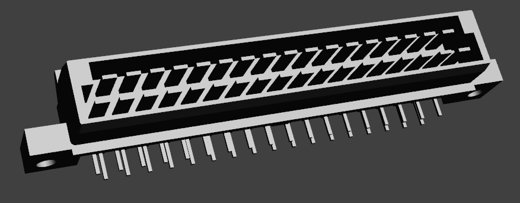
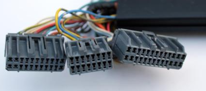
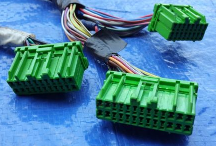
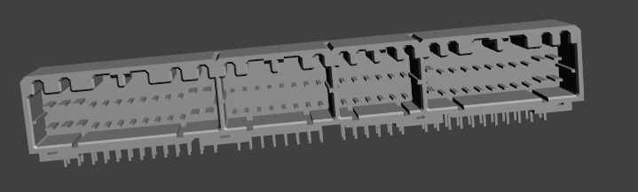
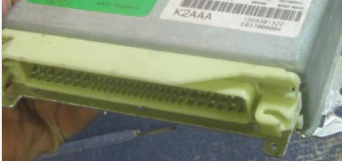
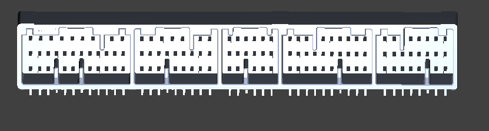
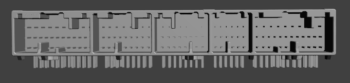
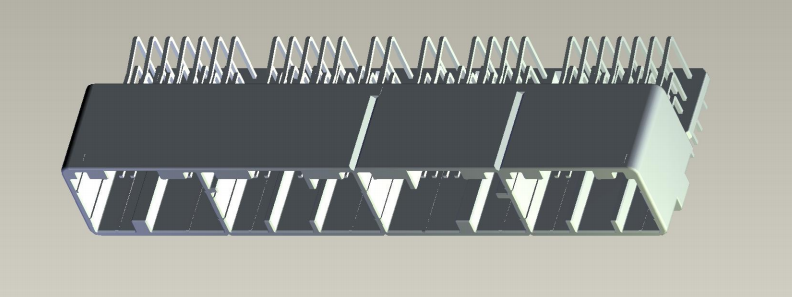

# Table of Contents  

[30 pin](#30-pin)

[60 pin superseal](#60-pin)

[64 pin](#64-pin)

[72 pin](#72-pin)

[80 pin](#80-pin)

[88 pin](#88-pin)

[104 pin Ford](#104-pin-ford)

[104 pin Honda OBD2a OBD2b](#honda-obd2a-obd2b-connector)

[112 pin](#112-pin)

[121 pin](#121-pin)

[122 pin](#122-pin)

[125 pin](#125-pin)

[132 pin](#132-pin)

[134 pin](#134-pin)

[154 pin](#154-pin)

Do you know part numbers for any other OEM connectors? Please let us know!

Here are some OEM connector part numbers. Bosch & Siemens, German and Japanese, Mazda Toyota BMW Volkswagen:

## 24 pin

Popular aftermarket connector

APTIV (FORMERLY DELPHI) HCCPHPE24BKA90F

## 30 pin

[TE 172491-1](https://www.te.com/global-en/product-172491-1.html)

18+12

ADM 22RE

## 34 pin

Superseal 6437288-1 and 6437288-2 male

female 1437290-7 Haltech 2500

[TE 6437288-1](https://www.te.com/usa-en/product-6437288-1.html)
[TE 6437288-2](https://www.te.com/usa-en/product-6437288-2.html)

Suzuki GSXR1300 Hayabusa ECU (99'-07')

Yamaha YZF-R1 2009-2011 ECU

Many aftermarket ECUs

## 35 pin

[TE 825213-1](http://www.te.com/catalog/pn/en/825213-1)

Volkswagen
0 261 200 220
0 261 200 862

BMW and Citroen/Peugeot



## 38 pin

Chrysler Next Generation Controller NGC

Female wire side

INDEX A 9-1326726-8

INDEX B 9-1326727-8

INDEX C 9-1326728-8

INDEX D 9-1326729-8

PCB side unavailable Mates to
05087006AB
05087007AB
05087008AA
05087009AA

## 42 pin two piece

26+16

[TE 175446-1](https://www.te.com/usa-en/product-175446-1.html)

## 42 pin three piece

172489-7

[TE 172489-7](http://www.te.com/usa-en/product-172489-7.html)

10+18+14

Toyota Camry, early 22R(T)E and 4AGE

See also [Pulse Lock Connector Product Specification](https://www.te.com/commerce/DocumentDelivery/DDEController?Action=showdoc&DocId=Specification+Or+Standard%7F108-5157%7FB%7Ftif%7FEnglish%7FENG_SS_108-5157_B.tif%7F172315-7)

## 48 pin

[TE 174917-6](http://www.te.com/catalog/pn/en/174917-6)
Escort GT, Ford Festiva, Miata NA6 manual

The larger plugs are the same as on [the 64 pin](OEM-connectors.md#64-pin).

## 52 pin

[TE 172319-1](http://www.te.com/usa-en/product-172319-1.html)

[52 pin ECU connector ONLY breakout PCB toyota mitsubishi galant eclipse](https://www.ebay.com/itm/334285307897)

[52 pin 52 ECU connector - Toyota Mitsubishi Galant Eclipse DSM](https://www.ebay.com/itm/333848385837)

10+18+24
18 pin housing 172316-7
10 pin housing 172315-7
contacts 170353-1

Toyota early 3SGE, 7MGTE and 4AGZE

Galant VR4, Eclipse 1G

[13B ETC](http://www.13betc.com/19861988-rx7-ecu-connector-52-pin-p-12.html) says

```text
1991-1992 Dodge Stealth (SOHC Engine)
1990-1994 Eagle Talon (All)
1989 Ford Probe (F2T Engine)
1986-1989 Mazda 323 (All)
1986-1989 Mazda 626 (FE Turbo and F2T Engines)
1986-1988 Mazda RX7 (Except for some European or JDM models)
1988-1989 Mazda MX6 (F2T Engine)
1991-1994 Mercury Capri (B6T Turbo Engine)
1990-1994 Mitsubishi Eclipse (All)
1988-1992 Mitsubishi Galant (All)
1991-1992 Mitsubishi Galant VR4 (4G63 Engine)
1990-1994 Plymouth Laser (All)
1988-1989 Toyota Celica All-Trac (3SGTE Engine)
1983-1986 Toyota Celica Supra (All)
1988-1989 Toyota MR2 (4AGZE Engine)
1983-1986 Toyota Supra (5MGE Engine)
1986.5 - 1990 Toyota Supra (7MGE & 7MGTE Engines)
1989-1994 Suzuki Swift (GTI Engine)
```

## 54 pin

175448-6

26+16+12

last 22RE, 4AGE, 4/7AFE

## 55 pin

[TE 963063-1](https://www.te.com/usa-en/product-963063-1.html)

[TE 963063-2](http://www.te.com/catalog/pn/en/963063-2)

[55 pin connector 963063-1 963063-2 - Forum](http://rusefi.com/forum/viewtopic.php?f=4&t=616)

ECU connector for 1990-1995 Porsche 911

ECU connector for 1987-1988 Porsche 944 S

ECU connector for 1992-1995 Hyundai Scoupe

ECU connector for 1987-1992 BMW

harness side - 292096-1
harness side - 963532
terminals 144431-3 and 144431-1

some Audi around 1990

Citroen Berlingo m49, Citroen Xara

Lada Samara


For sale @ [eBay Store](http://www.ebay.com/usr/rusefi)

## 2 row 55 pin

Sagem/Renault

[TE 828763-1](https://www.te.com/usa-en/product-828763-1.html)

Female side 85193-2
[TE 85193-2](https://www.te.com/usa-en/product-85193-2.html)

## 56 pin

Aptiv Delphi 12020756

GM cars in 80s late ’80s Jeeps

## 60 pin

Ford todo :)

Terminals are E7EB-14488-GA (18 ga) and E7EB-14488-NA (14 ga)

## 60 pin superseal

26 + 34

terminal 1447221

[TE 6437288-3](https://www.te.com/usa-en/product-6437288-3.html) Haltech 2500

[TE 6437288-5 upside down](https://www.te.com/usa-en/product-6437288-5.html)

[26 pin plug 3-1437290-7](https://www.te.com/usa-en/product-3-1437290-7.html) Haltech 2500

[26 pin plug 1473416](https://www.te.com/usa-en/product-1473416-1.html)

Motec Haltech DTAfast

See `Todo: [26 pin] ToDo: add reference`
See [34 pin](#34-pin)

Suzuki Hayabusa
99-07 Gen I GSX1300R

2006 Yamaha R6

## 64 pin Nissan center lock

Center bolt

[TE 174836-5](https://www.te.com/usa-en/product-174836-5.html)

[64 pin ECU connector nissan breakout](https://www.ebay.com/itm/334139955900)

90-94

[Wiring Specialties](https://www.wiringspecialties.com/nissan-64-pin-ecu-connector/) says

```text
Silvia S15 SR20DET
Silvia S14 SR20DET Kouki & Silvia S14 SR20DE non-turbo
Silvia S13 SR20DET & SR20DE non-turbo
180SX Type X S13 SR20DET & non-type X SR20DET
 

Bluebird U14, U13 & SR-equipped U12
Pulsar N15 & N14
Primera P11 & P10
Primera Wagon W#P11
Avenir W11 & W10
Sunny B14 & B13
NX Coupe S13
March K11
Cube Z10
Terrano YD21
```

## 64 pin

[TE 176122-6](http://www.te.com/catalog/pn/en/176122-6)

[TE 4-174518-7](http://www.te.com/usa-en/product-4-174518-7.html)

-1, -6 and -7 are color options


[64 pin 176122 ECU connector board - Forum](http://rusefi.com/forum/viewtopic.php?f=4&t=507)

Mating plugs:
16p [TE 175109-6](http://www.te.com/catalog/pn/en/175109-6)

16p  [TE 174514-6](http://www.te.com/usa-en/product-174514-6.html)

22p [TE 175110-6](http://www.te.com/catalog/pn/en/175110-6)

22p  [TE 174515-6](http://www.te.com/usa-en/product-174515-6.html)

26p [TE 175111-6](http://www.te.com/catalog/pn/en/175111-6)

26p [TE 174516-6](http://www.te.com/usa-en/product-174516-6.html)

[TE 174515-6](http://www.te.com/usa-en/product-174515-6.html)

terminal [TE 173634-1](http://www.te.com/usa-en/product-173634-1.html)

terminal 173681




mitsubishi colt/mirage 1991-1995 year for 1.3, 1.6 and 1.8 engine

See also [the 48 pin](OEM-connectors.md#48-pin).

For sale @ [eBay Store](http://www.ebay.com/usr/rusefi)

## 4 row 64 pin

Used on 5SF, Bosch 7.3H4, 7.3.1

Mating harness connector 1-284272-5

284331-1 64+64 header

## 68 pin

[68pin VW connector - Forum](https://rusefi.com/forum/viewtopic.php?f=4&t=1303)

Volkswagen
0 261 204 281/282
1997 Jetta

0 261 200 497/498

[TE 963356-1](http://www.te.com/catalog/pn/en/963356-1)


[TE 966595-1](http://www.te.com/catalog/pn/en/966595-1)

VW Jetta, Passat

See [http://faculty.ccp.edu/faculty/dreed/Campingart/jettatech/techset/index.htm](http://faculty.ccp.edu/faculty/dreed/Campingart/jettatech/techset/index.htm)

## 72 pin

31+24+17=72

[TE 353830-5](http://www.te.com/usa-en/product-353830-5.html) [octopart](https://octopart.com/search?q=353830)

[TE 1123038-2](http://www.te.com/catalog/pn/en/1123038-2) [octopart](https://octopart.com/search?q=1123038)


Oem ECU `Todo: find [Miata 2001 - 2005](/Mazda-Miata-2001)`

pins 316836?
pins 316838

## 76 pin

[TE 3-178780-6](http://www.te.com/usa-en/product-3-178780-6.html)
178780-6 AMP maybe also 174915-6

Vehicle:Subaru SVX 1995

Vehicle:Subaru Impreza 1991-1996

26 pins (10 hi-current + 16 low-current) 174516-6

16 pins (all low current) 174514-6

12 pins (all low current) 174913-1

22 pins (6 hi-current + 16 low-current) 174515-6

And terminals 173716-1 or 173716-2 and 173630-1 or 173630-2



## 76 pin center lock

See also [64 pin nissan center lock](OEM-connectors.md#64-pin-nissan-center-lock)

[TE 5-174385-5](https://www.te.com/usa-en/product-5-174385-5.html)

Nissan 1992 Skyline R32 GT-S 4 RB20DET

## 80 pin

LS1 LS6

52+28

[TE 8-1393476-0](http://www.te.com/catalog/pn/en/8-1393476-0)


Audi
VW Jetta Golf VR6 Turbo

1997 1998 Audi 4D0 907 551 A

Passat B6 TCU uses 52 pin portion

## 80 pin molex

48+32
Nissan

## 81 pin

unknown part number used by Chinese vehicles, google for DJ7811-1-3.5-10

[81 pin connector - Forum](https://rusefi.com/forum/viewtopic.php?f=4&t=1501)

## 88 pin

[TE 185785-1](http://www.te.com/catalog/pn/en/185785-1)



98-01 KIA SEPHIA

## 93 pin


MX7-93PL-C4

35+28+30
Subaru 22611AE670
SUBARU IMPREZA 2000-2003 ENGINE CONTROL MODULE UNIT ECU 22611AF634

1998 to 2001 SUBARU

mitsubishi evo9

## 94 pin

31+24+17+22=94

[TE 1123794-2](https://www.te.com/usa-en/product-1123794-2.html)
[TE 1473181-1](https://www.te.com/usa-en/product-1473181-1.html)

maybe not used by OEM but relayed to 72 pin NB2

22 position for PN# 353028-1
17 position for PN# 353027-1
24 position for PN# 353029-1
31 position for PN# 353031-1

## 96 pin

Dodge Hemi

Chrysler

header

brown tyco 2035160-2

header
13784962 grey Micro HVT

13784963 brown

13784964 green

harness side 1924939-1 [3-1924939-5](https://www.te.com/usa-en/product-3-1924939-5.html) [1924941-2](https://www.te.com/usa-en/product-1924941-2.html)

## 100 pin

34-22-16-28 pins

Toyota 1MZ-FE 3RZ-FE 5VZ
1-5178203-6

1-178203-6

## 104 pin Ford

ToDo: add reference

## 104 pin

[TE 179686-6](https://www.te.com/usa-en/product-179686-6.html)

Honda Accord 96-2002

Honda Insight 99-2006

## Honda OBD2a OBD2b connector

OBD2B
• 2000-2001 Acura Integra
• 1999-2000 Honda Civic
• 1998-2002 Honda Accord

OBD2A
• 1996-1999 Acura Integra
• 1996-1998 Honda Civic
• 1996-2001 Honda Prelude
• 1996-1997 Honda Accord

`Todo: find [Vault-Of-Honda-OEM](Vault-Of-Honda-OEM)`

## 105 pin

31+24+gap+28+22

3-353016-1

subaru 6 cylinder BE/BH

a subset of 122 pin connector

## 108 pin

[TE 1318613-1](https://www.te.com/usa-en/product-1318613-1.html)

Honda K Series
relayed to 72 pin NB2 but only two plugs are shared

## 112 pin

Molex 64333-0100

32+48+32

32 pin female = 643193211
48 pin female = 643203319

[Molex 643330100](https://www.molex.com/molex/products/part-detail/pcb_headers/0643330100)

2010 Nissan Versa

## 112 pin 64+48

F01R 20D 067 2050900-1

## 112 pin 56+56

56+56 Suzuki ALTO Jimny Swift

Suzuki Vitara 2015 33910-61M00

SX4 2010 33920-55L40

POLARIS 2011-2019 BRUTUS RZR RANGER 1000 850 570 CREW

2284486488

KTM 125 DUKE 2013-2016

Fiat 500 1.4T

me17.3.0

1 928 405 216 Bosch

harness side 1928405160
             1928405161

## 120 pin

[TE 1-178405-6](http://www.te.com/usa-en/product-1-178405-6.html)

Toyota Supra ECU connector 120 pin

JZ

## 121 pin

[TE 1241434-1](http://www.te.com/catalog/pn/en/1241434-1)

[TE 368255-2](http://www.te.com/catalog/pn/en/368255-2)

[Breakout 121pin 368255-2 Connector](https://github.com/rusefi/rusefi/tree/master/hardware/Breakout_121pin_368255-2-Connector)

[TE 1473244-1](https://www.te.com/global-en/product-1473244-1.html)

[TE 1473252-1](https://www.te.com/global-en/product-1473252-1.html)


[121 pin connector 368255-2 (same as 1241434-1) - Forum](http://rusefi.com/forum/viewtopic.php?t=208)

Currently used by Nissan, Hyundai and Kia. Also Audi, VW and Mini Cooper

2005 Altima 2.5

2003 VW Passat

[121 pin main page](OEM-121-pin-connectors.md)

## 122 pin



[122 pin ECU connector Toyota Mazda harness breakout PCB board](https://www.ebay.com/itm/334058887716)

[TE 8-5353015-1](http://www.te.com/catalog/pn/en/8-5353015-1)

31+24+17+28+22

Mazda RX-8

see also 105 pin variation

maybe the most common Aristo 2JZ ECU connector?
1999 TOYOTA CAMRY 3.0L V6
89666-20041

Subaru Legacy 2002

## 125 pin



[125 pin ECU connector Honda harness breakout PCB board](https://www.ebay.com/itm/333855911372)

[TE 1318612-1](https://www.te.com/usa-en/product-1318612-1.html)

Honda D17 Honda K

31+24+22+17+31=125

1318682-6 = ECU A 31

353029-1 = ECU B 24

353028-1 = ECU C 22

353027-1 = ECU D 17

353826-1 = ECU E 31

Terminal 175180-1
175180-2
173681-1
173681-2
175062-1
175062-2

See `Todo: find [Vault of Honda OEM](/Vault-Of-Honda-OEM)`

## 126 4 row

[TE 1-353222-6](https://www.te.com/usa-en/product-1-353222-6.html)

1123338-1 35 pin plug

2000s Mazda 6 ?

06-07 Subaru ?

## 128/145 pin

Mercedes M111 [eBay](https://www.ebay.com/itm/333791544427)


`Todo: find [Vault-Of-Mercedes-OEM](Vault-Of-Mercedes-OEM)`

A=8
B=4
C=40
D=24
E=48
F=21

8+4+40+24+48+21=145

In reality

8+4+23+24+48+21=128

A0235459732
A0225452732
A0275457932

## 132 pin

[TE 1717139-1](https://www.te.com/usa-en/product-1717139-1.html)

This appears to be used on **many** 08-14ish Honda and Acura ECUs.  The harness connectors are 3 different keyed 44 pin connectors.  More info:

Connector A (White) 44 Position Plug Assembly (Female): 1717138-6
Connector A (White) 44 Position Wire Cover: 1827108-1
Connector B (Grey) 44 Position Plug Assembly (Female): 1717138-5
Connector B (Grey) 44 Position Wire Cover: 1827109-1
Connector C (Green) 44 Position Plug Assembly (Female): 1717138-4
Connector C (Green) 44 Position Wire Cover: 1674419-2
Cavity Plug: 1612108-4
Wire Cover V Type: 1746089-1
132 Position Cap Assembly (Male) (Part of the ECM assembly): 1717139-1
44 Position Wire Cover Type-IV: 1903287-1

## 134 pin

[TE 7-967288-1](https://www.te.com/usa-en/product-7-967288-1.html)

Also known as 965497-1

9+24+52+40+9

`Todo: find [Vault-BMW-Info](Vault-BMW-Info)`

bmw e38 e46 e65 e66

02-03 Hyundai Santa

2002-2005 Land Rover

## 135 pin

[TE 1-1376430-0](http://www.te.com/catalog/pn/en/1-1376430-0)



Honda
2003-2008
02 through 08 corolla/matrix/vibe

harness side connectors:

E 3 Engine Control Module Toyota 90980-12144

E 4 Engine Control Module Toyota 90980-12145

E 5 Engine Control Module Toyota 90980-12529

E 6 Engine Control Module Toyota 90980-12525

## 145 pin

Mercedes 145 pin

M111

8+4+40+24+48+21

part number?

individual plugs 1685450828 2205459428

## 152 pin

Chrysler NGC ECU connector

38 pin plugs:

[TE 9-1326726-8](http://www.te.com/catalog/pn/en/9-1326726-8)

[TE 9-1326727-8](http://www.te.com/catalog/pn/en/9-1326727-8)

[TE 9-1326728-8](http://www.te.com/catalog/pn/en/9-1326728-8)

[TE 9-1326729-8](http://www.te.com/catalog/pn/en/9-1326729-8)

## 154 pin

60+94

EDC16 EDC17

09 10 11 12 HYUNDAI ELANTRA 2.0L

2011 2012 Kia Sorento 2.4L 39133-2G120 K17 019

[TE 284617-1](http://www.te.com/catalog/pn/en/284617-1)

[TE 936524-2](http://www.te.com/catalog/pn/en/936524-2)

[TE 936762-2](http://www.te.com/catalog/pn/en/936762-2)

[TE 936762-2](https://www.te.com/global-en/product-936762-2.html)


[Breakout 154pin 284617-1 Connector](https://github.com/rusefi/rusefi/tree/master/hardware/Breakout_154pin_284617-1-Connector)

[154 pin connector 284617-1 - Forum](http://rusefi.com/forum/viewtopic.php?f=4&t=582)

96+58

1 264 486 513

Honda Ford Mercedes

me9.7

Aptiv Delphi 13830808

## 154 pin Molex

48 + 53 + 53

[Molex 0347630001](https://www.molex.com/molex/products/part-detail/pcb_headers/0347630001)

## 167

4 row

1318813

## 170

TE 1717313-8

110+60

Toyota Camry 2008 Yaris 2008

## 186 pin

Toyota/Lexus 2013

## 186 pin small

114+72

Subaru 2018 2019 BRZ

GR86

Molex 5601381861 560138-1861

## 196 pin

Delphi 35043766

1928405455 105 plug

91 pin plug female Bosch 1928405452

91 pin plug [TE 1-2208709-1](https://www.te.com/usa-en/product-1-2208709-1.html)

Bosch 91 & 105

2011 2012 2013 Kia Optima

HYUNDAI SONATA 2011 2012 2013 2014 39111-2G667 2.4L ECM PCM OEM

Maybe Mercedes M157 1779007904

<https://www.ebay.com/itm/334192244682>

## 198 pin

Ford 2014-2017, Volvo V90 T5 2.0T

<https://www.ebay.com/itm/334331453305>

## 200 pin

[TE 6473649-1](http://www.te.com/catalog/pn/en/6473649-1)


31+35+33+32+35+34

Toyota

## Random links

[broken link](http://www.autosoftsys.com/supra/ecuext/)

[Speeduino - ECU Connectors](https://speeduino.com/wiki/index.php/ECU_Connectors)
