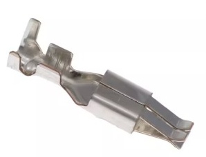
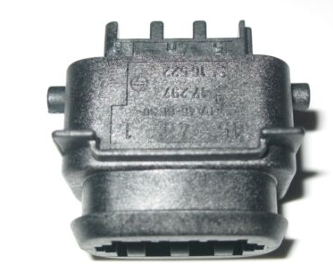
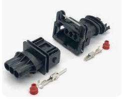

# Miscellaneous Harness Connectors

See also [Vault-Of-Misc-Supplies](Vault-Of-Misc-Supplies).  
ForECU headers, see [OEM-connectors](OEM-connectors).

## Denso

Coils 7282-8120-40

## BMW

88 pin female cover 1928402028 housing 1928401587

25 pin 61131387108

flat 3 pin coil female 1724478 12521724478

triangle 3 pin coil female [depin](https://www.youtube.com/watch?v=jhwKWWc7YvM)

3 pin male 962581 female 282191

10 pole round 12521740615 50290743 [replica](https://www.hdconnectorstore.com/productdetail/7415.html)

relay mount 1389113 61131389111

## MEFI

metri-pack 5 pin 12084891

## Mercedes

VVT actuator

https://www.fcpeuro.com/products/mercedes-electrical-pin-connector-genuine-mercedes-mer-0125450428

Terminal 0035452626

https://www.fcpeuro.com/products/mercedes-plug-contact-female-genuine-mercedes-0035452626

KOSTAL 9430403 BC3041A 094304

CLT 968405-1/1-967644-1/8K0973202

1-967081-1

### Camshaft position sensor

368161-1 [replica](https://www.hdconnectorstore.com/productdetail/1923.html)

### 99+ crank

09441212/1685453028 [replica](https://www.hdconnectorstore.com/productdetail/541.html)

Also used as 09441212 on Ford

Inboard cable harness plug-connection. 13-pin LKS1.5

033-545-11-28
https://www.mboemparts.com/oem-parts/mercedes-benz-plug-335451128
Accelerator Pedal Socket Benz BMW

9-967081-1

## Volkswagen

ETB LSU 4.9 1J0973713 1813139-1 42121700

LSU ADV 1J0973705

VAG COP 1J0973724 4B0973724 [disassembly](https://youtu.be/uRPc3cJRNx4?t=290)

[replica](https://www.hdconnectorstore.com/productdetail/9276.html)

[NOT replica NOT COP](https://www.hdconnectorstore.com/productdetail/9236.html)

## GM

Map+IAT

1928404627 [replica](https://www.hdconnectorstore.com/productdetail/4035.html)

3 bar 12015793 [replica](https://www.hdconnectorstore.com/productdetail/10602.html)

GM DISTRIBUTOR MODULE AND IDLE AIR CONTROL

HEI Ignition Coil 23079 grey

HEI Ignition Coil 23080 black

GM 12102748 Throttle Position Sensor

## Mazda

22 pin ECU
174515-6 368135-6 https://www.hdconnectorstore.com/productdetail/10019.html

26 pin ECU

368136-6 174516-6 https://www.hdconnectorstore.com/productdetail/3415.html

## Hyundai

ETB 1-967616-1 [replica](https://www.hdconnectorstore.com/productdetail/9515.html)

battery negative terminal sensor MG644146

## Injectors

https://www.hdconnectorstore.com/productdetail/459.html

aptiv 12185025

amp 928516 [re](https://www.hdconnectorstore.com/productdetail/1067.html)

## Catalogs

https://www.bwdbrand.com/media/2827/bw11211-illustrated-connector-guide.pdf

https://www.michiganmotorsports.com/fuel-injector-connectors-and-adapters/fuel-injector-connector-adapters/delphi-engine-harness/

https://eficonversions.com/collections/big-block-chevy-gen-vi

## rusEFI channel color convention

injector/coil/etc 1: green

2: white

3: blue

4: orange/brown

5: grey

6: yellow
