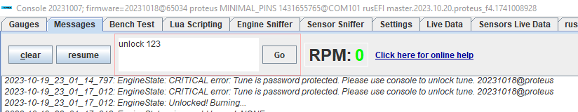

# Password Protection

Tuner has an option to hide calibration from the end user and prohibit tune adjustment behind a password. Once non-zero password is burned into tune, TS loose ability to read and write calibration for everyone including the tuner who has local copy of the tune on his/her tuning device.

The only way to unlock tune for read and write is via rusEFI console.

## Unlocking

Please use ``unlock 123`` command in console to unlock, here is how things would look like:

