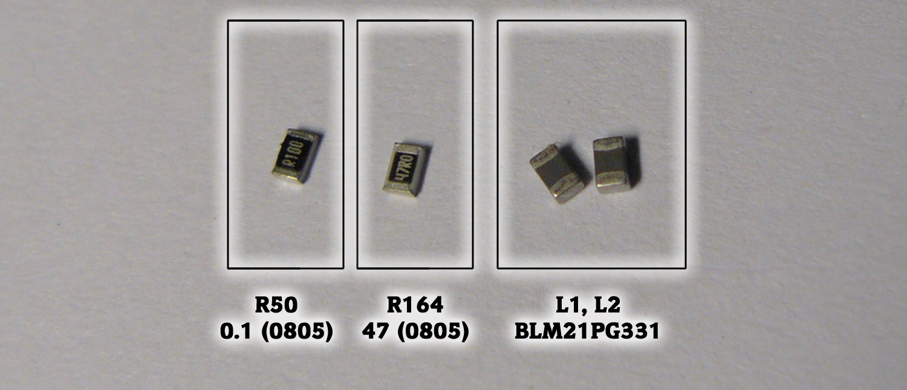
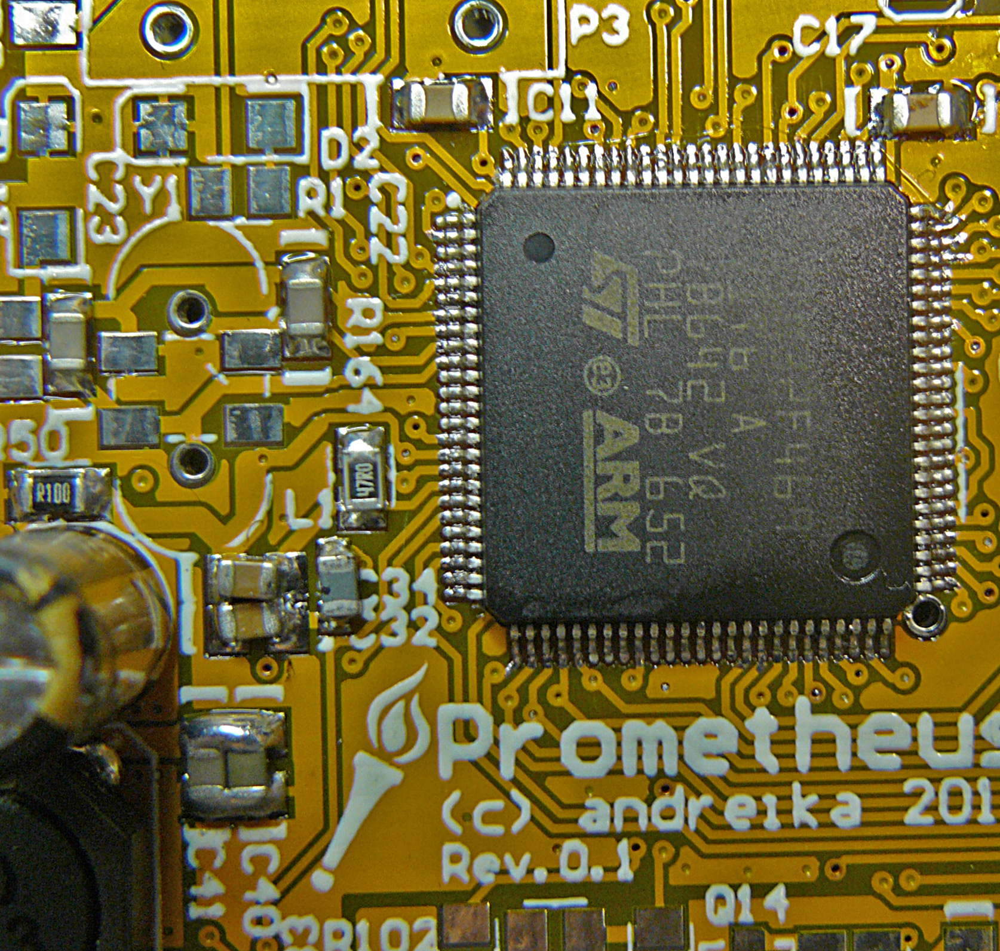
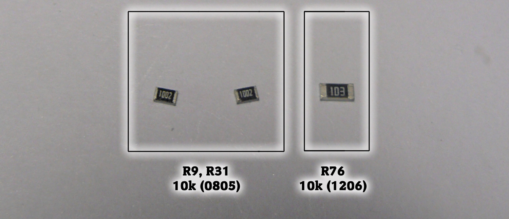
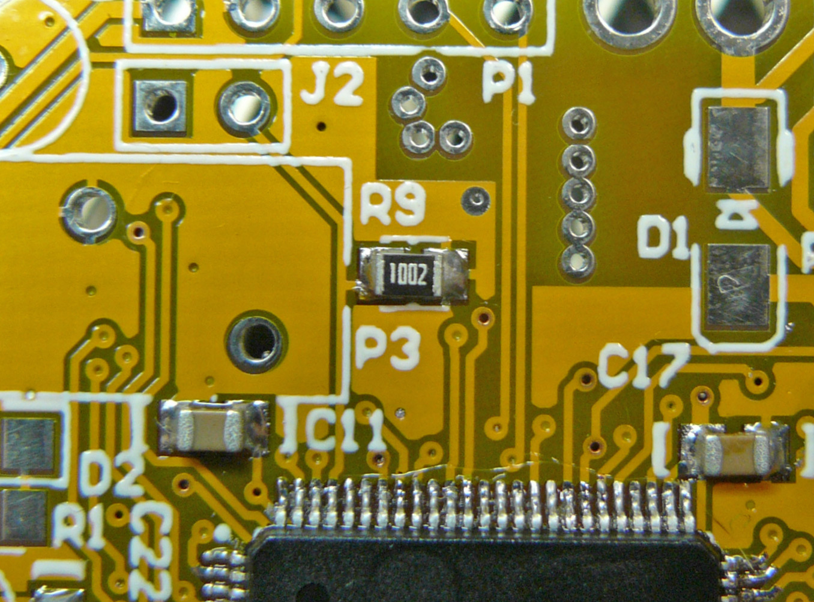

## 2 MCU block

## (a) - MCU:

### Component List:

### PCB Top Side:

## (b) - ground/power connections

### Component List:

### PCB Top Side:

## (c) - minimal circuitry:
### Component List:

### PCB Top Side:

### PCB Bottom Side:

**Warning for Rev0.1!** Be careful when soldering C42 and C43 - they should not be in contact!

## (d) - pull-up resistors:
### Component List:

### PCB Top Side:

### PCB Bottom Side:

## (e) - crystal:
### Component List:

### PCB Top Side:

The 1st pin is marked with a little dash:

## (f) - LED and programmer connector:
### Component List:

### PCB Top Side:

## Connecting the programmer:

**Now check if MCU works using ST-Link/V2 programmer:**

Make sure that an external +12V power supply is always connected when using the board:

### SWD Connector pinout:
The programmer connector pinout (from left to right):
1 - the first pin is not used
2 - GND (ground)
3 - NRST (reset)
4 - SWCLK
5 - SWDIO

