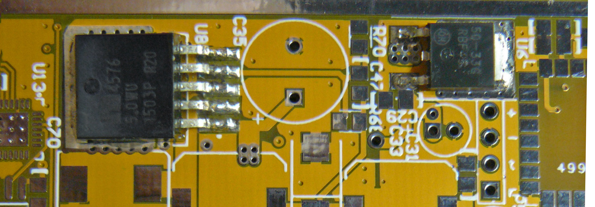
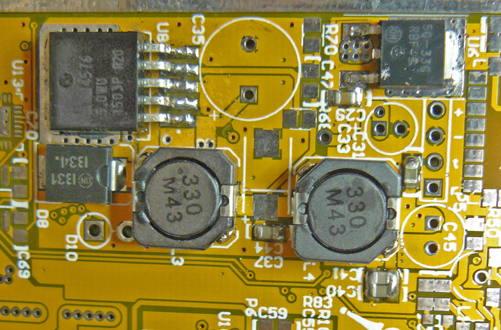
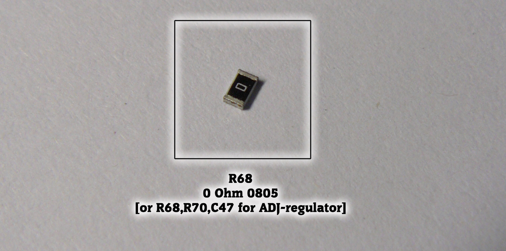
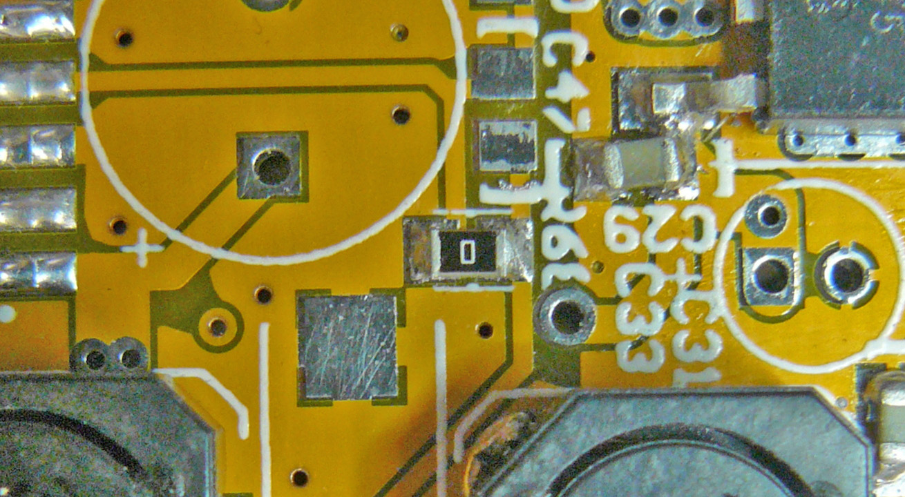

## 1 Power supply block

## (a) - regulator circuits: 

### Component List:

### PCB Top Side:

## (b) - minimal circuitry:

### Component List:

### PCB Top Side:

## (c) - feedback:
### Component List:

### PCB Top Side:

## (d) - electrolytic capacitors & protection (observe the polarity!):
### Component List:

### PCB Top Side:

### PCB Bottom Side:

**Now check voltages: +5В, +3.3В!**
