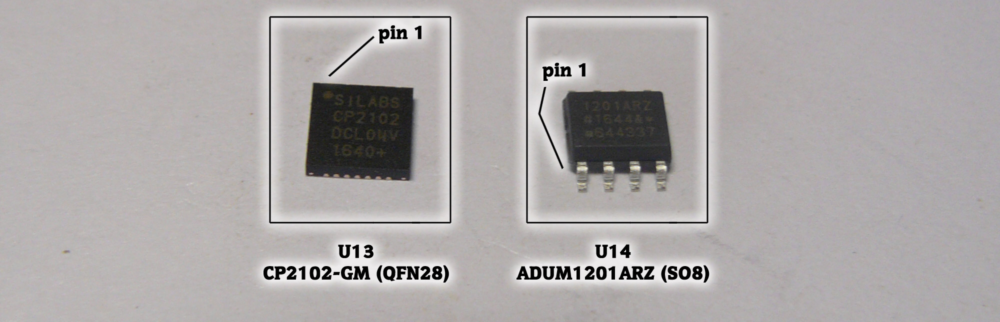
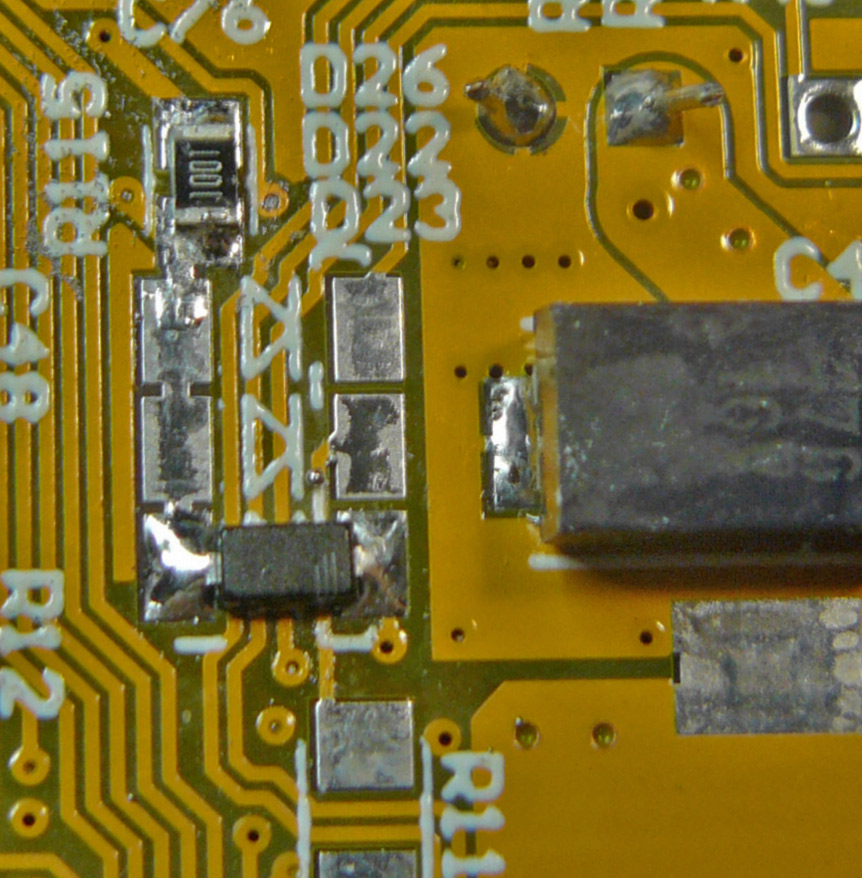
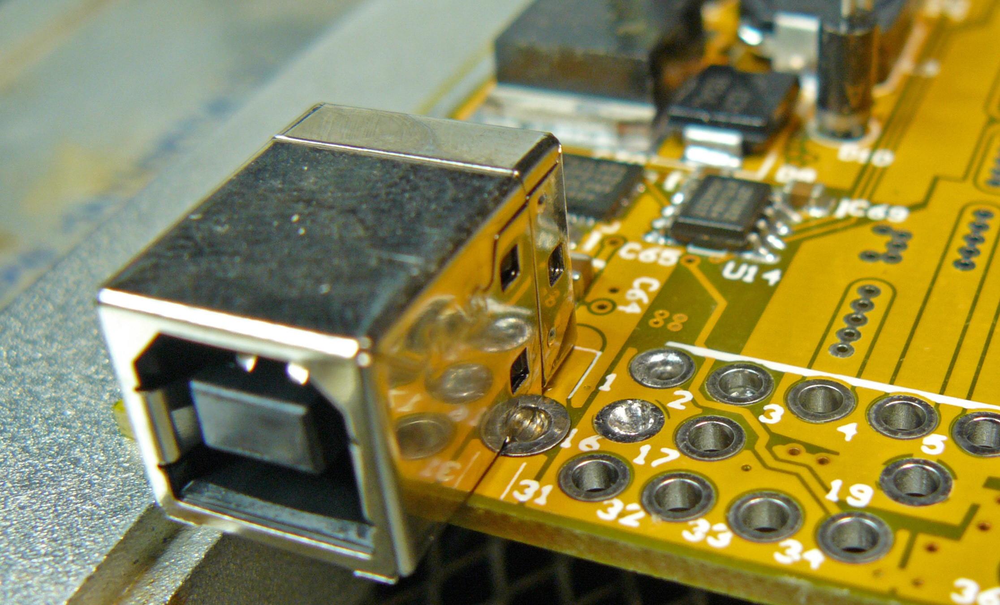

## 3 USB block

## (a) - driver & isolation

### Component List

### PCB Top Side

## (b) - minimal circuitry & protection

### Component List

### PCB Top Side

### PCB Bottom Side

## (c) - USB connector

### Component List

### PCB Top Side

**Now check if USB works by connecting to your PC!**
