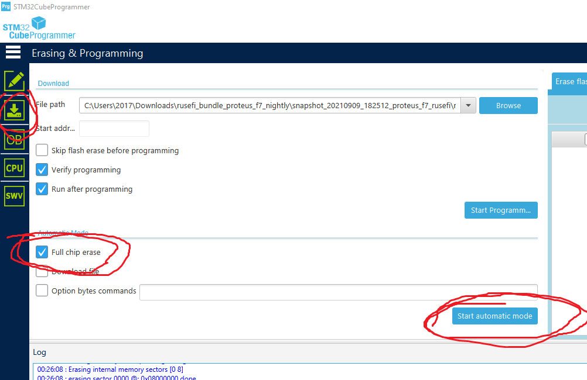
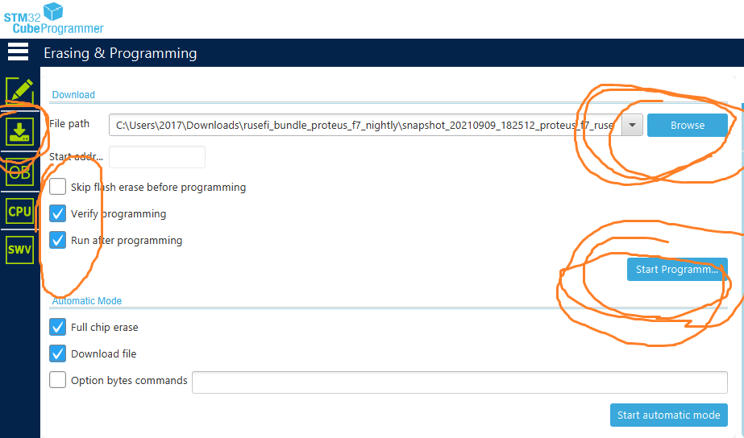

# Proteus F767 Programming Instructions

Too many of Proteus 0.6 with F767 are behaving strangely in terms of SWD programming. Maybe we have a hardware design issue? Maybe we are missing something?

Anyway looks like there is a working procedure, using DFU and STM32CubeProgrammer

## Command line option

1. use STM32CubeProgrammer software [STM32CubeProgrammer](https://www.st.com/en/development-tools/stm32cubeprog.html)

2. connect via USB while holding PROG button

3. make sure you have "STM32 BOOTLOADER" driver not "STM Device in DFU Mode". If necessary update/install driver from C:\Program Files\STMicroelectronics\STM32Cube\STM32CubeProgrammer\Drivers\DFU_Driver

4. Enter cmd.exe, enter C:\Program Files\STMicroelectronics\STM32Cube\STM32CubeProgrammer\bin folder

   ``` shell
   STM32_Programmer_CLI.exe -c port=usb1 -ob nDBANK=0
   ```

5. from same command line prompt

   ``` shell
   STM32_Programmer_CLI.exe -c port=usb1 -e all
   ```

6. download [Proteus F7 Firmware bundle 2021.10.08](https://github.com/rusefi/rusefi/releases/download/2021.10.08_release/rusefi_bundle_proteus_f7.zip) and un-compress and copy rusefi.hex to C:\Program Files\STMicroelectronics\STM32Cube\STM32CubeProgrammer\bin folder

7. from same command line prompt

   ``` shell
   STM32_Programmer_CLI.exe -c port=usb1 -w rusefi.hex -v -s
   ```

Done!

## GUI option

1. use STM32CubeProgrammer software [STM32CubeProgrammer](https://www.st.com/en/development-tools/stm32cubeprog.html)

2. connect via USB while holding PROG button

3. make sure you have "STM32 BOOTLOADER" driver not "STM Device in DFU Mode". If necessary update/install driver from C:\Program Files\STMicroelectronics\STM32Cube\STM32CubeProgrammer\Drivers\DFU_Driver

4. connect STM32CubeProgrammer via USB, follow [this guide](HOWTO-nDBANK) to reset nDBANK flag

5. close STM32CubeProgrammer, unplug USB cable, plug USB cable, open STM32CubeProgrammer. STM32CubeProgrammer is finicky you really have to restart it between steps

6. erase using "Full Chip Erase"

   

7. close STM32CubeProgrammer, unplug USB cable, plug USB cable, open STM32CubeProgrammer.

8. program like on the picture

   
