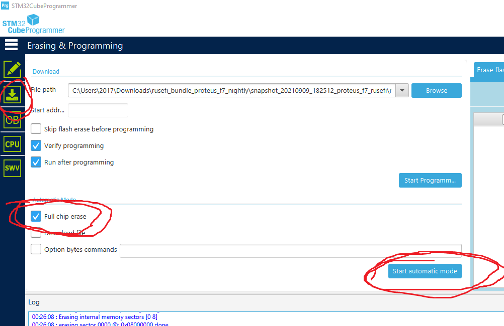
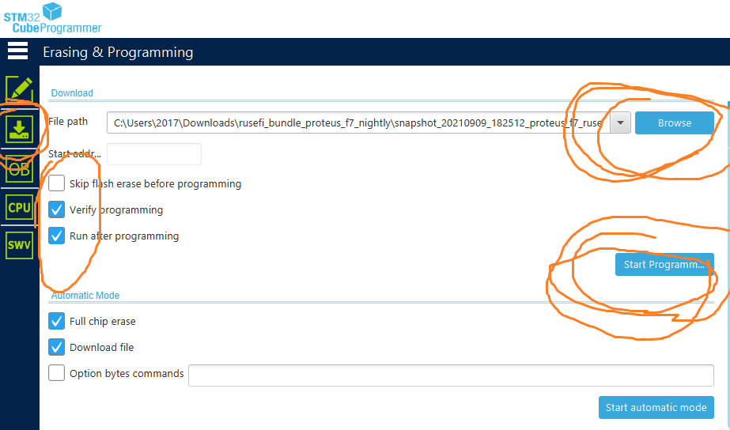

# Proteus F767 Programming Instructions

Too many of Proteus 0.6 with F767 are behaving strangely in terms of SWD programming. Maybe we have a hardware design issue? Maybe we are missing something?

Anyway, it looks like there is a working procedure, using DFU and STM32CubeProgrammer.

## Command line option

1. Use [STM32CubeProgrammer software](https://www.st.com/en/development-tools/stm32cubeprog.html)

2. Connect via USB while holding PROG button

3. Make sure you have "STM32 BOOTLOADER" driver not "STM Device in DFU Mode". If necessary, update/install the driver from C:\Program Files\STMicroelectronics\STM32Cube\STM32CubeProgrammer\Drivers\DFU_Driver

4. In cmd.exe, from the C:\Program Files\STMicroelectronics\STM32Cube\STM32CubeProgrammer\bin folder, execute:

   ``` shell
   STM32_Programmer_CLI.exe -c port=usb1 -ob nDBANK=0
   ```

5. From the same command line prompt, execute:

   ``` shell
   STM32_Programmer_CLI.exe -c port=usb1 -e all
   ```

6. Download the [Proteus F7 Firmware bundle 2021.10.08](https://github.com/rusefi/rusefi/releases/download/2021.10.08_release/rusefi_bundle_proteus_f7.zip), extract and copy rusefi.hex to the C:\Program Files\STMicroelectronics\STM32Cube\STM32CubeProgrammer\bin folder

7. From the same command line prompt, execute:

   ``` shell
   STM32_Programmer_CLI.exe -c port=usb1 -w rusefi.hex -v -s
   ```

Done!

## GUI Option

1. Use [STM32CubeProgrammer software](https://www.st.com/en/development-tools/stm32cubeprog.html)

2. Connect via USB while holding PROG button

3. Make sure you have "STM32 BOOTLOADER" driver not "STM Device in DFU Mode". If necessary, update/install the driver from C:\Program Files\STMicroelectronics\STM32Cube\STM32CubeProgrammer\Drivers\DFU_Driver

4. Connect STM32CubeProgrammer via USB, follow [this guide](HOWTO-nDBANK) to reset nDBANK flag

5. Close STM32CubeProgrammer, unplug the USB cable, re-insert the USB cable, and open STM32CubeProgrammer. STM32CubeProgrammer is finicky; you really have to restart it between steps.

6. Erase using "Full Chip Erase"

   

7. Close STM32CubeProgrammer, unplug the USB cable, re-insert the USB cable, and open STM32CubeProgrammer.

8. Program as shown in this picture:

   

## Related pages

- [Proteus Manual](Proteus-Manual) - the Proteus board manual, including which revision uses which chip.
- [How to Update Firmware](HOWTO-Update-Firmware) - main firmware update procedure (Windows and Linux, OpenBLT and DFU).
- [HOWTO DFU](HOWTO-DFU) - DFU (Device Firmware Update) mode: auto vs. manual, drivers, and troubleshooting.
- [HOWTO Flash using STM32CubeProgrammer](HOWTO-flash-using-Stm32CubeProgrammer) - advanced / last-resort flashing via STM32CubeProgrammer (DFU or ST-Link).
- [How to nDBANK](HOWTO-nDBANK) - resetting the nDBANK option byte on F7 chips.
- [F7 Requires Full Erase](F7-requires-full-erase) - some F7 Proteus units require a full erase before a firmware update.
- [4chan F7 Initial Programming](4chan-F7-initial-programming) - one-time initial programming for AlphaX 4chan F7 boards.
