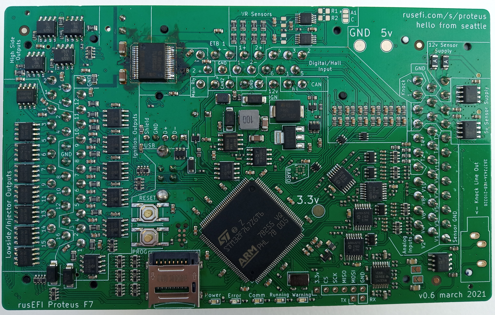

[Proteus Manual](Proteus-Manual)

Q: where can I buy a Proteus?

A: As of Feb 2022 please DM Andrey on the forum, Proteus is in stock just not listed on eBay!

With fabrication files for Proteus you can get a 80% assembled unit from JLCPCB. QTY 2 price XXX, QTY 10 price YYY.
While the most complicated main chip is soldered you would still solder a few dozens of surface mount components.

  

Forum thread [here](https://rusefi.com/forum/viewtopic.php?f=4&t=1646)

Source & production files [here](https://github.com/mck1117/proteus/)

[Fabrication](Hardware-Proteus-Fabrication)

### TE Ampseal Connectors

[Ampseal tutorial video](https://www.youtube.com/watch?v=24bNFu7a9lc)

[Ampseal application specification (instruction manual)](https://www.te.com/commerce/DocumentDelivery/DDEController?Action=showdoc&DocId=Specification+Or+Standard%7F114-16016%7FM%7Fpdf%7FEnglish%7FENG_SS_114-16016_M.pdf%7FN-A): This document includes how to crimp connectors, how to install them in to headers, and how to remove pins from a header.

[Image showing mod for V0.3 DFU problem](Images/Proteus_DFU_Hack.jpg)

<a name="3d_cases"/>

## 3D cases

[vented/unvented by Kneelo](Hardware/Proteus/Proteus_0.3_case_by_kneelo.zip)

[by OrchardPerformance](https://rusefi.com/forum/download/file.php?id=7242)

[by Kon](https://github.com/ksmola/proteus-case)

We have a plastic CNCed case [here](https://www.ebay.com/itm/333958050504)

McM 90417A118
black oxide, #4 3/8" long screws recommended

<a name="dev"/>

## Dev Access

Most boards will need a debug header installed if you want to attach a debugger (not used for normal users).  The recommended connector is Samtec PN `FTSH-105-01-F-DV-007-K`.  When soldering the connector, the keying notch goes towards the center of the board, nearer to the 23p center connector.

Any debugger compatible with the standard 10-pin Cortex Debug Header should work, though the [STLINK-V3 Mini](https://www.st.com/en/development-tools/stlink-v3mini.html) is recommmended.  It's available for $10-12 US from normal distributors like Mouser/Digikey.  A ribbon cable is included so the connector and programmer are all that's required to debug on Proteus.

# Wiring

20A Power GND

10A 12V_MR

5A ETB

2A Low side, High side

0.5A 12V_IGN

# Adapters DONE

[Proteus Honda K 125 Adapter](https://github.com/rusefi/proteus-Honda-K-125-adapter)

[Proteus M73TU Adapter](https://github.com/rusefi/proteus-m73tu-adapter)

[Proteus Honda OBD2A Adapter](https://github.com/rusefi/proteus-Honda-OBD2A-adapter)

[Proteus M54 Adapter](https://github.com/rusefi/proteus-M54-adapter)

[Proteus Ford](https://github.com/rusefi/proteus-mustang5.0-60-pin)

[Proteus Mitsubishi 76 adapter](https://github.com/rusefi/proteus-mitsubishi76-adapter)

# Adapters WIP

[Proteus 80pin VAG adapter](https://github.com/rusefi/proteus-80-pin-vag-adapter)

[Proteus 2004 STI Adapter](https://github.com/rusefi/proteus-2004sti-adapter)

[Proteus Honda OBD1 Adapter](https://github.com/rusefi/proteus-Honda-OBD1-adapter/)

[Proteus N73 Adapter](https://github.com/rusefi/proteus-N73-adapter/)

[Proteus 68pin VAG adapter](https://github.com/rusefi/proteus-68-pin-vag-adapter)

# Adapters maybe NOT

[Proteus RX8 Adapter](https://github.com/rusefi/proteus-rx8-adapter)
