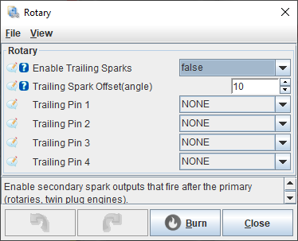

# Rotary Engines

TL,DR: they say we totally support rotary on [all our universal ECUs](Hardware). As of September 2025 rusEFI has tested trailing coil logic.

A lot of sweet TODO at [https://github.com/rusefi/rusefi/issues/3247](https://github.com/rusefi/rusefi/issues/3247)

{: style="width: 374px; height: 303px;" }
