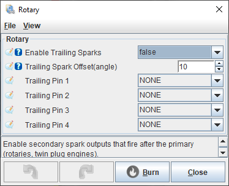

# Rotary Engines

We support running a rotary engine on [all our universal ECUs](Hardware). We have tested trailing coil logic.

A Wankel rotary is mostly an ordinary engine as far as the ECU is concerned — it wants fuel and spark at the right moment like anything else. The one thing that genuinely differs is ignition: each rotor housing has **two spark plugs**, a leading and a trailing, and the trailing plug fires a short time after the leading one. rusEFI handles this with trailing sparks.

## Trailing sparks

The setting is `enableTrailingSparks` — *"Enable secondary spark outputs that fire after the primary (rotaries, twin plug engines)"*.

With it enabled, rusEFI drives a second set of ignition outputs that follow the primary ones. The delay between leading and trailing is not a single number: it comes from a **4 by 4 table** (`TRAILING_SPARK_SIZE` and `TRAILING_SPARK_RPM_SIZE` are both 4 in the firmware), so the split can vary with engine speed.

Note that this is not rotary-only. Any twin-plug engine — some twin-plug piston heads use the same idea — can use the same feature.

Do not confuse this with `twoWireBatchIgnition`, which is a different setting for running individually wired coils in wasted-spark mode. See [Ignition Modes](Ignition-Modes).

The rotary settings live under Controller in TunerStudio:

{: style="width: 374px; height: 303px;" }

[Rotary - TunerStudio Guide](https://rusefi.com/docs/guide/#menu_Controller_Rotary)

## Fuelling

Nothing about rotary fuelling is special to rusEFI, but two ordinary features come up a lot on these engines:

- Rotaries commonly run **primary and secondary injectors** per rotor, with the secondaries only coming in under load. That is [Staged Injection](Staged-Injection).
- Injector count adds up quickly — a two-rotor with primaries and secondaries is already four channels, and six-injector setups exist. Check the channel count on the [ECU Comparison](ECU-Comparison) before committing to a board.

## What a real build involves

An open RX-8 knowledge dump, [rusefi/rusefi#3247](https://github.com/rusefi/rusefi/issues/3247), inventories what one Series 1 RX-8 conversion actually needed beyond fuel and spark:

* drive-by-wire throttle — see [Electronic Throttle Body Configuration Guide](Electronic-Throttle-Body-Configuration-Guide)
* dual ignition timing, as above
* intake runner solenoids and an auxiliary intake port motor
* an oil metering stepper — see [Stepper Motor](Stepper-Motor)
* a six-injector configuration

Some control hardware still needs attention. That issue records the part outstanding at the time of writing: **RX-8 gauge cluster CAN support** is only partial. If you need the factory dash to work, check the current state of the issue before planning. Sending data to a dash generally is covered by [CAN Broadcast for Dashboards and Gauges](CAN-Broadcast-for-Dashboards).

## Related pages

* [Ignition Modes](Ignition-Modes) — how coils are wired and fired
* [Ignition](Ignition) — timing, dwell and corrections
* [Staged Injection](Staged-Injection) — primary and secondary injectors
* [Knock Sensing](knock-sensing)
* [ECU Comparison](ECU-Comparison) — channel counts per board
* [Lua Scripting](Lua-Scripting) — for the oddities a rotary swap tends to need

## Technical sources

`enableTrailingSparks` and its quoted description, along with `TRAILING_SPARK_SIZE` and `TRAILING_SPARK_RPM_SIZE`, are from `firmware/integration/rusefi_config.txt` in the [rusEFI firmware](https://github.com/rusefi/rusefi).
