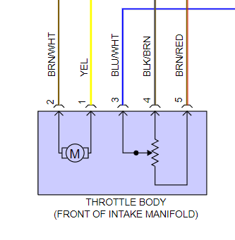

# SENT Electronic Throttle Body

See also [Vault of Electronic Throttle Bodies](Vault-Of-Electronic-Throttle-Bodies-ETB)

GM uses SENT since 2015ish and Ford uses SENT ETBs/DBW since around 2019ish.

Large [Ford 0280750688](https://youtu.be/AqfWQeWSuPA) 2019 Mustang and Godzilla.

Large GM 12617792 for instance 2014-2019 Chevrolet Silverado 1500 Throttle Body

Smaller GM 12639457AA for instance 2012 Buick regal and Opel Insignia 2.0 turbo A20NFT.

All three use same pinout with different colors obviously.

1. motor +
2. motor -
3. TPS Signal (sent)
4. low reference (sensor ground)
5. 5 volt reference
6. not used.

## Harness

harness-side connector TE 1-1419168-1
pins 1393365-2
kit <https://www.bmotorsports.com/shop/product_info.php/products_id/4479>

## See also

<https://github.com/rusefi/rusefi/labels/SENT-protocol> for dev notes.

[SAE J2716-2016.pdf](https://github.com/rusefi/rusefi_documentation/blob/master/PDFs/SAE%20J2716-2016.pdf) is the standard.

## Hardware

At the moment only microRusEFI has SENT capable pins

See https://github.com/rusefi/rusefi/tree/master/firmware/hw_layer/drivers/sent
