# SUPERSEAL Adapters

## Index by pin count

Pin counts refer to the OEM vehicle connector. Adapters are listed in ascending order.

- [Nissan Sentra SR20DE — 64 pins](#nissan-64-sentra-sr20de)
- [Suzuki G13BB — 72 pins](#suzuki-72-g13bb)
- [Nissan Skyline GTS-T ECR33 — 76 pins](#nissan-76-skyline-gts-t-ecr33)
- [Mitsubishi Mirage — 119 pins](#mitsubishi-mirage)
- [Mazda Miata NC — 120 pins](#mazda-miata-nc)
- [Toyota Supra A80 — 120 pins](#toyota-120-supra-a80)
- [Nissan Xterra VQ40DE / Armada VK56DE — 121 pins](#nissan-121-xterra-vq40de-armada-vk56de)
- [Toyota Aristo JZS161 — 122 pins](#toyota-122-aristo-jzs161)
- [Subaru Impreza WRX / WRX STI — 135 pins](#subaru-135-impreza-wrx-wrx-sti)
- [Kawasaki Ninja ZX-4R reference — 136 pins](#kawasaki)
- [BMW N52 — 146 pins](#bmw)
- [Ford Mustang Coyote — 198 pins](#ford-198-mustang-coyote)

## BMW

N52

[🚗 Vehicle pinout 🚗](https://rusefi.com/docs/pinouts/BMW-N52-146/) | [🔌Adapter board pinout🔌](https://rusefi.com/docs/pinouts/BMW-N52-adapter/)

[adapter schematics](https://github.com/rusefi/rusefi_documentation/blob/master/Hardware-files/adapters/BMW-N52-adapter/BMW-N52-146-superseal.pdf)

[Reference wiring — 2011 BMW 328i N52](https://github.com/rusefi/rusefi_documentation/blob/master/OEM-Docs/Bmw/2011%20BMW%20328i%20n52.pdf)

## Ford

[Ford ECU schematic transcription index](OEM-Docs/Ford/README-ford.md)

### Ford 198 — Mustang Coyote

The Ford Mustang 198 Superseal adapter connects the 198-pin vehicle harness (103-pin and 95-pin sections) to 60-pin and 34-pin Superseal connectors.

- **2015 and 2016 Mustang 5.0L Coyote:** closest reference wiring matches to revision 0.2, with C175B (103 pins) and C175E (95 pins). The power, ground, injector and ignition assignments below agree with the adapter. This comparison does not establish a tested model-year range or complete plug-and-play compatibility.
- **2016 and 2020 Mustang 5.2L naturally aspirated:** 198-terminal references with different injector, ignition and auxiliary assignments; require remapping. The 2020/2022 supercharged GT500 references use 309 terminals and are outside this adapter layout.
- **Ignition:** revision 0.2 includes eight ignition-driver circuits. The Superseal side carries logic-level ignition inputs; the vehicle side carries power outputs to the coil primaries when the drivers are populated. Check the assembly configuration against the schematics.

[📄 Adapter schematics (PDF)](https://github.com/rusefi/rusefi_documentation/blob/master/Hardware-files/adapters/Ford-Mustang-198-adapter/Ford-mustang-198-superseal-adapter.pdf)

[🚗 Vehicle pinout 🚗](https://rusefi.com/docs/pinouts/hellen/coyote/) | [🔌 Adapter board pinout 🔌](https://rusefi.com/docs/pinouts/Ford-Mustang-198-adapter/)

[Reference wiring — 2015 Mustang 5.0L](https://github.com/rusefi/rusefi_documentation/blob/master/OEM-Docs/Ford/2015-mustang-v8.pdf) | [Reference pinout — connector A](https://github.com/rusefi/rusefi_documentation/blob/master/OEM-Docs/Ford/Coyote-175b-pinout-A.png) | [Reference pinout — connector B](https://github.com/rusefi/rusefi_documentation/blob/master/OEM-Docs/Ford/Coyote-175e-pinout-B.png)

The adapter schematic calls the 103-pin vehicle section **A** and the 95-pin section **B**. In the Mustang 5.0L diagrams these correspond to **C175B** and **C175E**, respectively. The comparison below uses the OEM connector names.

| Reference | Connector layout | Result |
|---|---|---|
| [2015 Mustang 5.0L](OEM-Docs/Ford/2015-Ford-Mustang-5.0-PCM-pinout.md) | C175B 103 + C175E 95 | Closest match: power/ground and all eight injector and coil assignments agree. The PDF's V6/3.7L export header conflicts with its V8 circuitry; see the transcription's scope note. |
| [2016 Mustang 5.0L](OEM-Docs/Ford/2016-Ford-Mustang-5.0-PCM-pinout.md) | C175B 103 + C175E 95 | Same matching core assignments. Printed upstream oxygen-sensor bank labels differ from the adapter at E-50/E-51; verify sensor routing and auxiliary circuits. |
| [2016 Mustang 5.2L](OEM-Docs/Ford/2016-Ford-Mustang-5.2-PCM-pinout.md) | C175B 103 + C175E 95 | Related layout; injector and coil assignments differ as listed below. |
| [2020 Mustang 5.2L naturally aspirated](OEM-Docs/Ford/2020-Ford-Mustang-5.2-naturally-aspirated-PCM-pinout.md) | C1381B 103 + C1381E 95 | Same injector/coil differences as the 2016 5.2L reference. Connector identification differs; mechanical fit/keying is not established by these circuit diagrams. |

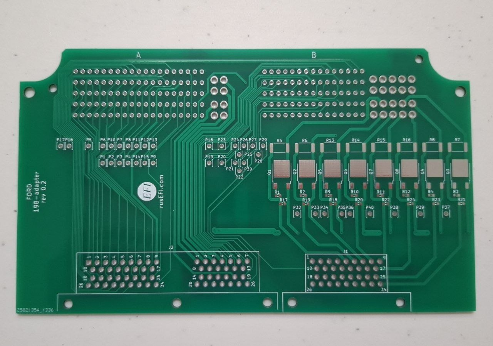

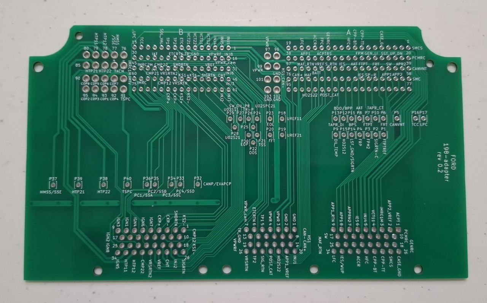

## Kawasaki

136 pin like Ninja ZX-4R and similar

[Reference wiring — Ninja ZX-4R service manual, chapter 17](https://github.com/rusefi/rusefi_documentation/blob/master/OEM-Docs/Kawasaki/Ninja%20ZX-4R%20Service%20Manual.pdf)

## Mazda

### Mazda Miata NC

The Mazda Miata NC Superseal adapter connects the 120-pin vehicle harness (two 60-pin connectors) to 60-pin and 26-pin Superseal connectors.

- **Mazda MX-5 / Miata NC:** intended application. The adapter is listed as not yet tested on a vehicle. Check the harness version against the vehicle pinout and adapter schematics.

[💲Buy Mazda Miata NC💲](https://www.shop.rusefi.com/shop/p/mazda-miata-nc-superseal-adapter) | [📄 Adapter schematics (PDF)](https://github.com/rusefi/rusefi_documentation/blob/master/Hardware-files/adapters/Mazda-Miata-NC-adapter/Mazda-Miata-NC-superseal-adapter.pdf)

[🚗 Vehicle pinout 🚗](https://rusefi.com/docs/pinouts/miata-nc/) | [🔌 Adapter board pinout 🔌](https://rusefi.com/docs/pinouts/miata-nc-adapter/)

[Reference wiring — 2009 MX-5 NC2](https://github.com/rusefi/rusefi_documentation/blob/master/OEM-Docs/Mazda/2009%20NC2.pdf) | [Reference terminal voltages — 2009 MX-5 NC2](https://github.com/rusefi/rusefi_documentation/blob/master/OEM-Docs/Mazda/2009%20NC2%20Pin%20Voltages.pdf)

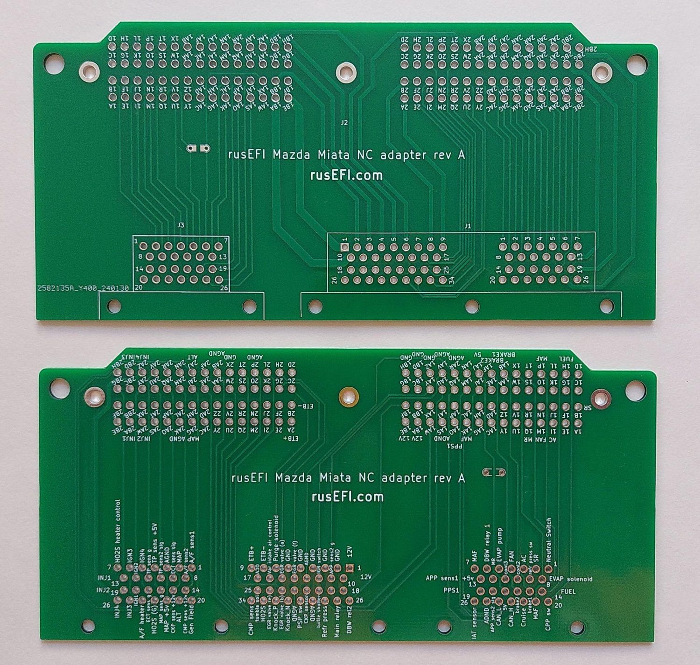

## Mitsubishi

### Mitsubishi Mirage

The Mitsubishi Mirage Superseal adapter connects the 119-contact vehicle connector to a 60-pin Superseal connector, routing 50 contacts.

- **Mitsubishi Mirage 1.2L:** intended application. The vehicle pinout follows the 2014 Mirage ES reference. Check the exact harness and equipment; a tested model-year range has not been established.

[📄 Adapter schematics (PDF)](https://github.com/rusefi/rusefi_documentation/blob/master/Hardware-files/adapters/Mitsubishi-Mirage-adapter/Mitsubishi-Mirage-superseal-adapter-0.3.pdf)

[🚗 Vehicle pinout 🚗](https://rusefi.com/docs/pinouts/Mitsubishi-Mirage/) | [🔌 Adapter board pinout 🔌](https://rusefi.com/docs/pinouts/Mitsubishi-Mirage-adapter/)

[Reference wiring — 2014 Mirage](https://github.com/rusefi/rusefi_documentation/blob/master/OEM-Docs/Mitsubishi/2014-mirage.pdf) | [Reference wiring — 2020 Mirage](https://github.com/rusefi/rusefi_documentation/blob/master/OEM-Docs/Mitsubishi/2020-mirage.pdf)

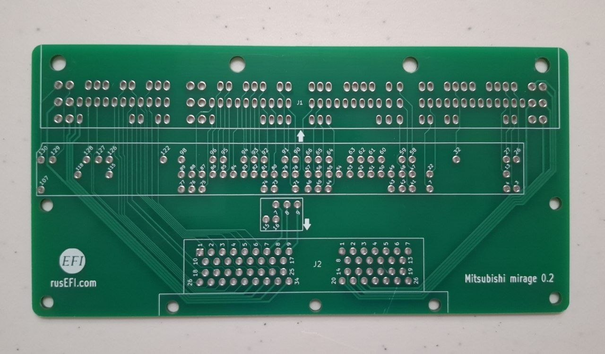

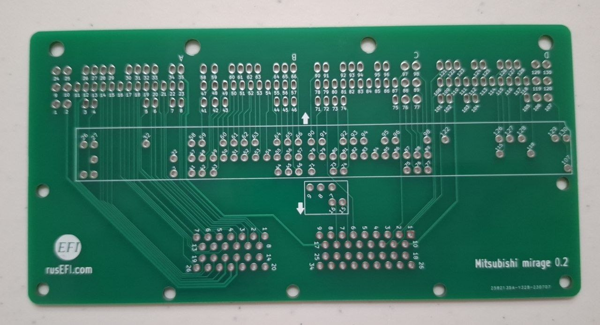

## Nissan

### Nissan 64 — Sentra SR20DE

The Nissan 64 Superseal adapter connects the early 64-terminal E.C.C.S. vehicle connector (terminals 1–48 and 101–116) to a 60-pin Superseal connector (1A–34A and 1B–26B).

- **1993 Nissan Sentra 2.0L SR20DE:** reference application. The wiring diagram includes manual/automatic transmission and equipment variants; check the exact harness against the pinouts and schematics. Vehicle operation has not been validated.
- **Other Nissan applications with a 64-terminal connector:** compatibility is not established by connector shape alone. Functions not identified in the reference are marked as such in the pinouts.

[📄 Adapter schematics (PDF)](https://github.com/rusefi/rusefi_documentation/blob/master/Hardware-files/adapters/Nissan-64-adapter/Nissan-64-superseal-adapter.pdf)

[🚗 Vehicle pinout 🚗](https://rusefi.com/docs/pinouts/nissan64/) | [🔌 Adapter board pinout 🔌](https://rusefi.com/docs/pinouts/nissan64-adapter/)

[Reference wiring — 1993 Sentra SR20DE](https://github.com/rusefi/rusefi_documentation/blob/master/OEM-Docs/Nissan/1993%20Nissan-Datsun%20Sentra%202.0%20ECU.pdf)

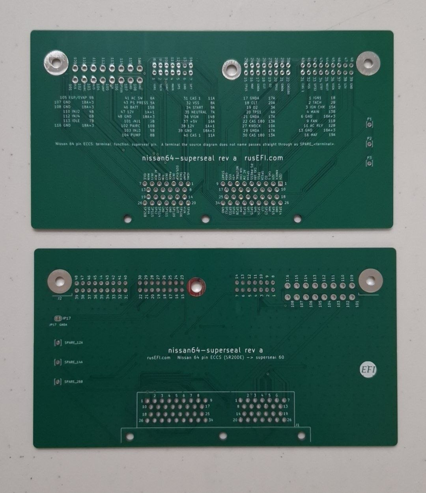

### Nissan 76 — Skyline GTS-T ECR33

The Nissan 76 Superseal adapter connects the 76-pin vehicle harness to a 60-pin Superseal connector.

- **Nissan Skyline GTS-T ECR33, RB25DET:** intended application. Check the harness version against the vehicle pinout and adapter schematics.

[💲Buy Nissan 76💲](https://www.shop.rusefi.com/shop/p/superseal-nissan-76) | [📄 Adapter schematics (PDF)](https://github.com/rusefi/rusefi_documentation/blob/master/Hardware-files/adapters/Nissan-76-adapter/Nissan76-superseal-adapter.pdf)

[🚗 Vehicle pinout 🚗](https://rusefi.com/docs/pinouts/nissan76/) | [🔌 Adapter board pinout 🔌](https://rusefi.com/docs/pinouts/nissan-76-adapter/)

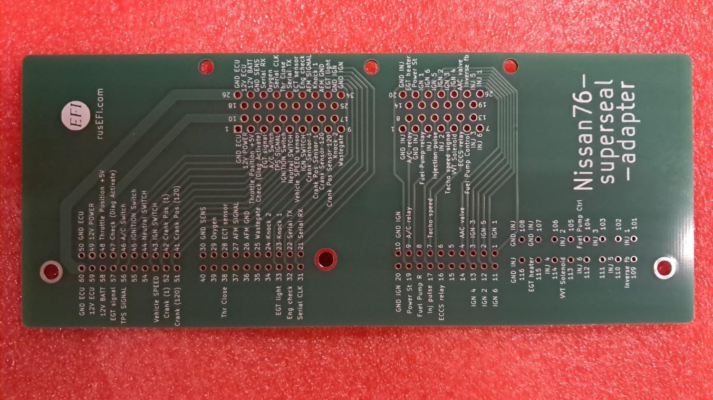

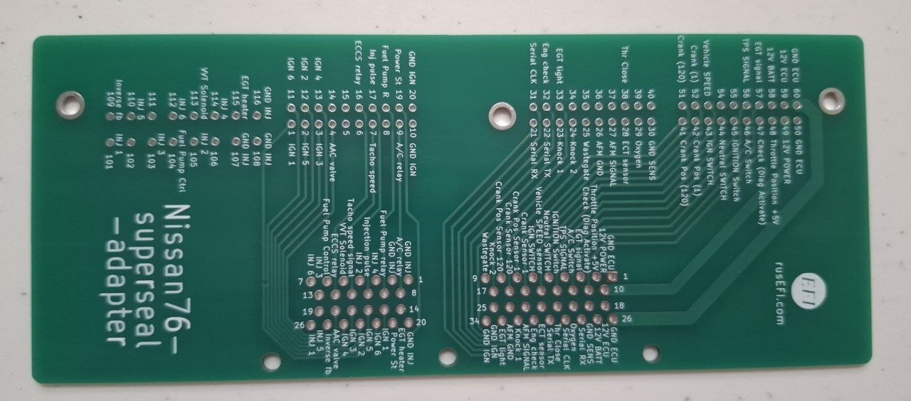

### Nissan 121 — Xterra VQ40DE / Armada VK56DE

The Nissan 121 Superseal adapter connects the 121-pin vehicle harness (TE 368255-2) to 60-pin and 26-pin Superseal connectors (1A–34A, 1B–26B and 1D–26D).

- **2011 Nissan Xterra 4.0L VQ40DE and 2011 Nissan Armada 5.6L VK56DE:** reference applications. The pinouts identify engine-specific functions. Vehicle operation has not been validated.
- **Related Nissan/Infiniti applications:** a matching 121-pin connector alone does not establish compatibility. Check the exact engine, model year and wiring against the [Nissan 121 variations](Nissan-121-variations.md) before using this adapter.

[📄 Adapter schematics (PDF)](https://github.com/rusefi/rusefi_documentation/blob/master/Hardware-files/adapters/Nissan-121-adapter/Nissan-121-superseal-adapter.pdf)

[🚗 Vehicle pinout 🚗](https://rusefi.com/docs/pinouts/nissan121/) | [🔌 Adapter board pinout 🔌](https://rusefi.com/docs/pinouts/nissan121-adapter/)

[Reference wiring — 2011 Xterra VQ40DE](https://github.com/rusefi/rusefi_documentation/blob/master/OEM-Docs/Nissan/2011_Xterra/2011_Xterra_ECU.png) | [Reference wiring — 2011 Armada VK56DE](https://github.com/rusefi/rusefi_documentation/blob/master/OEM-Docs/Nissan/2011%20Nissan-Datsun%20Truck%20Armada%204WD%20ECU.pdf)

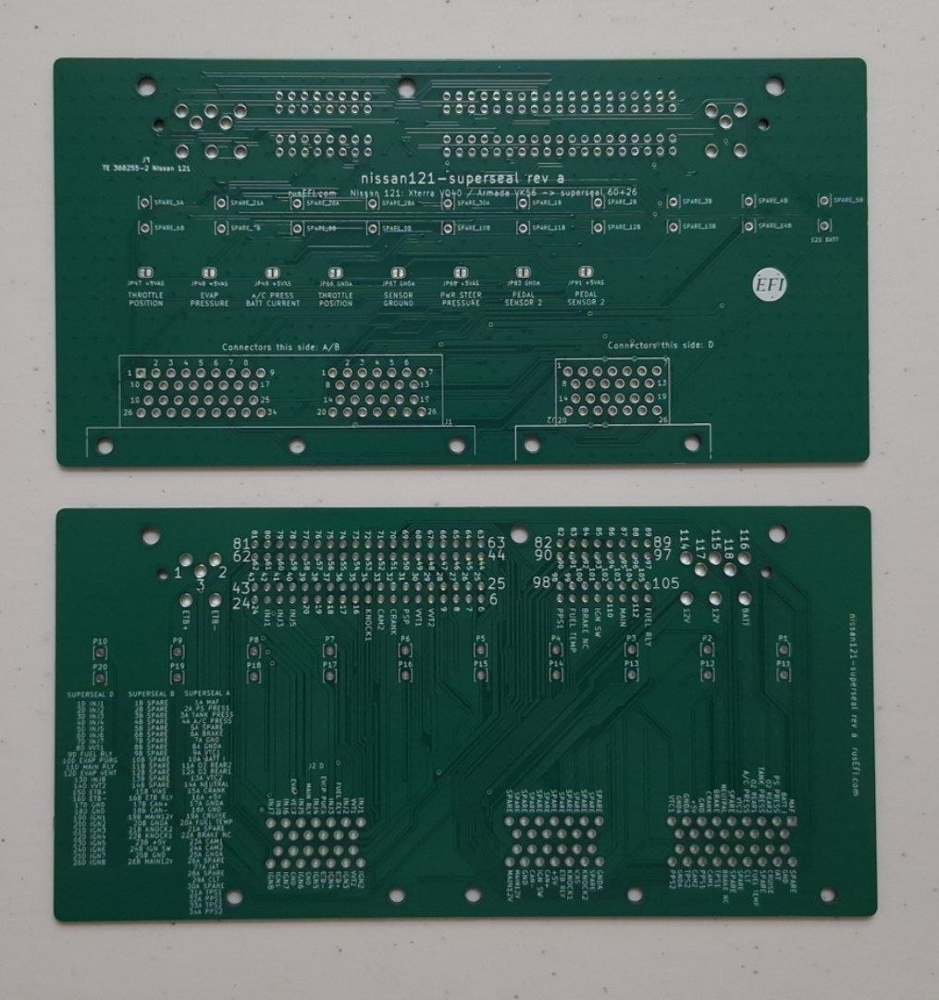

## Subaru

### Subaru 135 — Impreza WRX / WRX STI

The Subaru 135 Superseal adapter connects the four-section 135-pin vehicle harness to 60-pin, 34-pin and 26-pin Superseal connectors. It routes 110 contacts.

- **Subaru Impreza WRX / WRX STI with the 135-pin ECM connector:** intended application. The vehicle pinout follows the 2013 WRX EJ255 reference with SI-Drive. Check the specific harness before installation; compatibility across the previously listed 2011–2021 range has not been established.
- **2017 WRX STI EJ257:** use the STI references to check differences. Contact 6-4 is part of the neutral-position switch circuit, whereas the 2013 WRX pinout identifies it as ground. Do not ground it or close JP3 for that STI circuit. Starter wiring also differs between key and push-button versions.

[📄 Adapter schematics (PDF)](https://github.com/rusefi/rusefi_documentation/blob/master/Hardware-files/adapters/Subaru-135-adapter/Subaru-135-superseal-adapter.pdf)

[🚗 Vehicle pinout 🚗](https://rusefi.com/docs/pinouts/subaru-2011/) | [🔌 Adapter board pinout 🔌](https://rusefi.com/docs/pinouts/subaru%20adapter/)

[Reference wiring — 2013 WRX](https://github.com/rusefi/rusefi_documentation/blob/master/OEM-Docs/Subaru/2013%20Subaru%20Impreza%20WRX.pdf) | [Reference wiring — 2017 WRX STI](https://github.com/rusefi/rusefi_documentation/blob/master/OEM-Docs/Subaru/2017%20Subaru%20WRX%20STI.pdf) | [STI starting — key](https://github.com/rusefi/rusefi_documentation/blob/master/OEM-Docs/Subaru/2017%20Subaru%20WRX%20STI-starting-with-key.pdf) | [STI starting — push button](https://github.com/rusefi/rusefi_documentation/blob/master/OEM-Docs/Subaru/2017%20Subaru%20WRX%20STI-starting-with-push-button.pdf)

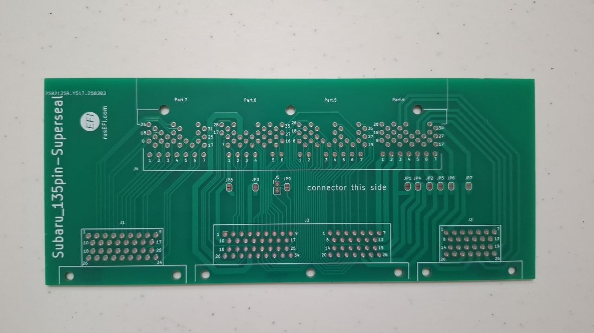

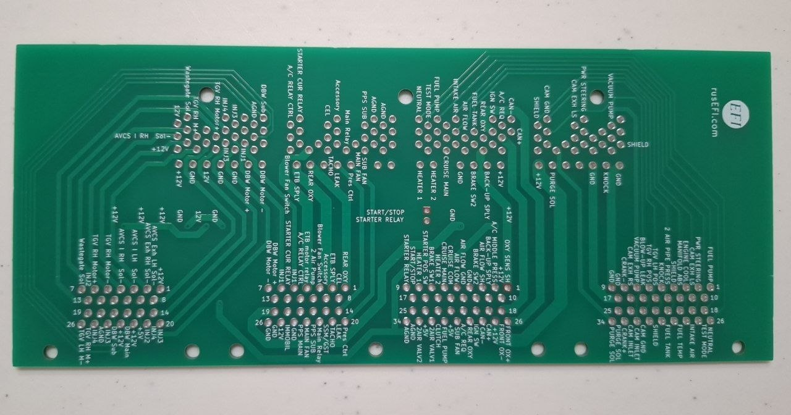

## Suzuki

### Suzuki 72 — G13BB

The Suzuki 72 Superseal adapter connects a 72-terminal vehicle connector (31+24+17 sections) to one 60-terminal Superseal connector (1A–34A and 1B–26B). It routes 34 vehicle terminals to 32 Superseal contacts; the remaining terminals have individual solder access pads.

- **Engine: Suzuki G13BB, with a 72-terminal ECU connector.** The reference pinout includes Samurai-specific notes. Check the exact harness against both pinouts and the schematics; a tested vehicle/model-year range has not been established.
- **Configuration:** revision a has four open solder jumpers for configurable ground connections. Follow the [connection and configuration instructions](Suzuki-72-adapter.md) before installation.

[📄 Adapter schematics (PDF)](https://github.com/rusefi/rusefi_documentation/blob/master/Hardware-files/adapters/Suzuki-72-adapter/Suzuki-72-superseal-adapter.pdf)

[🚗 Vehicle pinout 🚗](https://rusefi.com/docs/pinouts/suzuki72/) | [🔌 Adapter board pinout 🔌](https://rusefi.com/docs/pinouts/suzuki72-adapter/)

[Reference wiring — Jimny workshop manual, pages 614–619 (comparison; assignments differ)](https://www.carmanualsonline.info/suzuki-jimny-2005-3-g-service-workshop-manual/62)

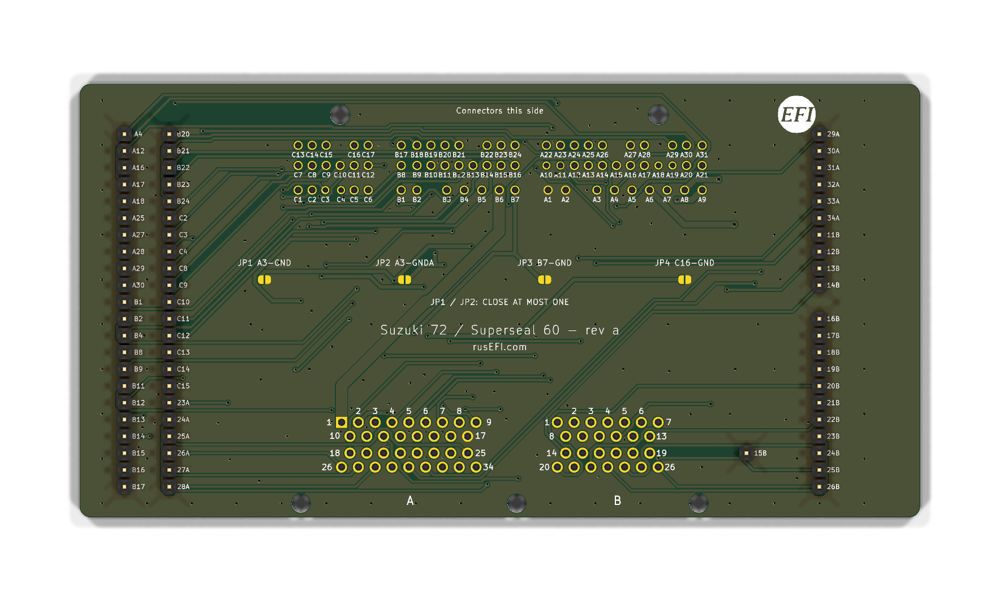

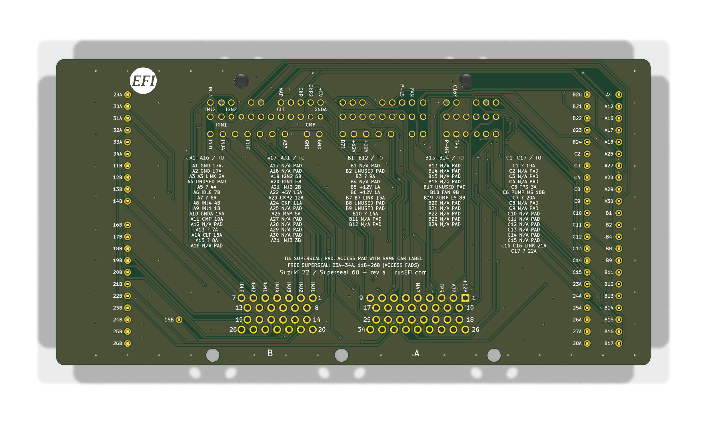

## Toyota

### Toyota 120 — Supra A80

The Toyota 120 Superseal adapter connects the 120-pin vehicle harness to 60-pin and 26-pin Superseal connectors.

- **Toyota Supra A80 (Mk IV), 2JZ-GTE:** intended application. The adapter is listed as untested. Check the harness version against the vehicle pinout and adapter schematics.

[💲Buy Toyota 120💲](https://www.shop.rusefi.com/shop/p/superseal-toyota-120) | [📄 Adapter schematics (PDF)](https://github.com/rusefi/rusefi_documentation/blob/master/Hardware-files/adapters/Toyota-120-adapter/Toyota-120-superseal.pdf)

[🚗 Vehicle pinout 🚗](https://rusefi.com/docs/pinouts/Toyota-JZA80/) | [🔌 Adapter board pinout 🔌](https://rusefi.com/docs/pinouts/Toyota-120-adapter/)

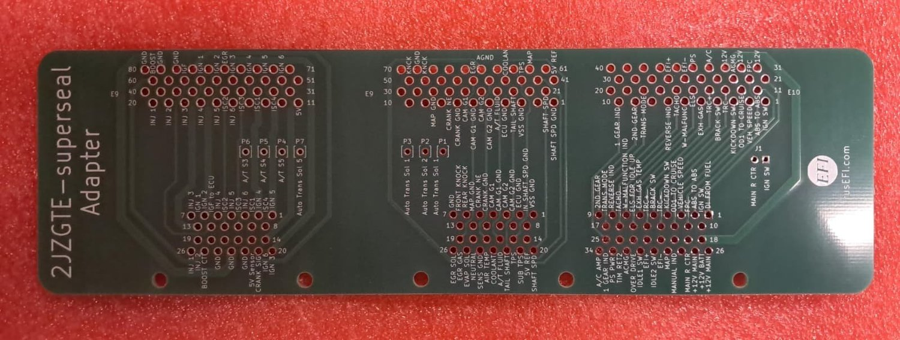

### Toyota 122 — Aristo JZS161

The Toyota 122 Superseal adapter connects the 122-pin vehicle harness to 60-pin and 26-pin Superseal connectors.

- **Toyota Aristo JZS161, 2JZ-GTE VVT-i:** intended application. Check the harness version against the vehicle pinout and adapter schematics; a fully tested model-year range has not been established.
- **Lexus GS300 S160, 2JZ-GE:** related application, compared against the 1998 wiring diagram. Pin functions differ from Aristo, so wiring verification is required; plug-and-play compatibility is not confirmed.

[💲Buy Toyota 122💲](https://www.shop.rusefi.com/shop/p/superseal-toyota-122) | [📄 Adapter schematics (PDF)](https://github.com/rusefi/rusefi_documentation/blob/master/Hardware-files/adapters/Toyota-122-adapter/Toyota-122-superseal.pdf)

[🚗 Vehicle pinout 🚗](https://rusefi.com/docs/pinouts/Toyota-JZS161/) | [🔌 Adapter board pinout 🔌](https://rusefi.com/docs/pinouts/jza161-adapter/)

[Reference wiring — 1998 Lexus GS300 (2JZ-GE; differs from Aristo)](https://github.com/rusefi/rusefi_documentation/blob/master/OEM-Docs/Toyota/1998%20Lexus%20GS300%20ECU%20Wiring%20Diagram.pdf)

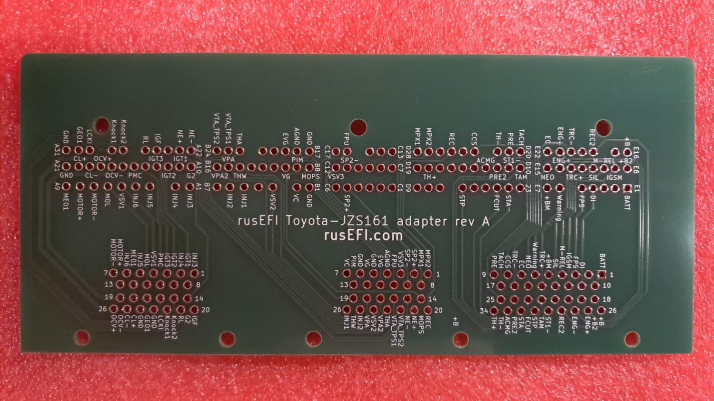

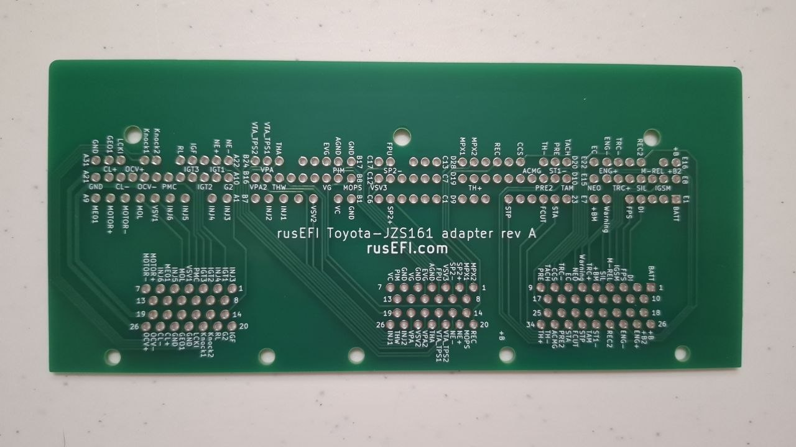
