# SUPERSEAL Adapters

## BMW

N52

[🚗 Vehicle pinout 🚗](https://rusefi.com/docs/pinouts/BMW-N52-146/) | [🔌Adapter board pinout🔌](https://rusefi.com/docs/pinouts/BMW-N52-adapter/)

[adapter schematics](https://github.com/rusefi/rusefi_documentation/blob/master/Hardware-files/adapters/BMW-N52-adapter/BMW-N52-146-superseal.pdf)

[Reference wiring — 2011 BMW 328i N52](https://github.com/rusefi/rusefi_documentation/blob/master/OEM-Docs/Bmw/2011%20BMW%20328i%20n52.pdf)

## Ford

[2014 Fusion 2.0T](https://github.com/rusefi/rusefi_documentation/blob/master/OEM-Docs/Ford/2014%20Ford%20Fusion%20FWD%20L4-2.0L%20Turbo.pdf)

### Ford 198 — Mustang Coyote

The Ford Mustang 198 Superseal adapter connects the 198-pin vehicle harness (103-pin and 95-pin sections) to 60-pin and 34-pin Superseal connectors.

- **Ford Mustang 5.0L Coyote with the 198-pin PCM connector:** intended application. Check the harness against the vehicle pinout and adapter schematics; a tested model-year range has not been established.
- **5.2L variants:** injector, ignition and auxiliary functions differ in the reference pinouts. Plug-and-play compatibility is not confirmed.
- **Ignition:** revision 0.2 includes eight ignition-driver circuits. The Superseal side carries logic-level ignition inputs; the vehicle side carries power outputs to the coil primaries when the drivers are populated. Check the assembly configuration against the schematics.

[📄 Adapter schematics (PDF)](https://github.com/rusefi/rusefi_documentation/blob/master/Hardware-files/adapters/Ford-Mustang-198-adapter/Ford-mustang-198-superseal-adapter.pdf)

[🚗 Vehicle pinout 🚗](https://rusefi.com/docs/pinouts/hellen/coyote/) | [🔌 Adapter board pinout 🔌](https://rusefi.com/docs/pinouts/Ford-Mustang-198-adapter/)

[Reference wiring — 2015 Mustang 5.0L](https://github.com/rusefi/rusefi_documentation/blob/master/OEM-Docs/Ford/2015-mustang-v8.pdf) | [Reference pinout — connector A](https://github.com/rusefi/rusefi_documentation/blob/master/OEM-Docs/Ford/Coyote-175b-pinout-A.png) | [Reference pinout — connector B](https://github.com/rusefi/rusefi_documentation/blob/master/OEM-Docs/Ford/Coyote-175e-pinout-B.png)

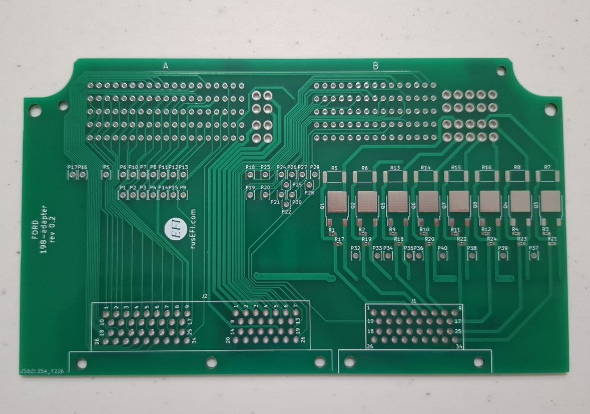

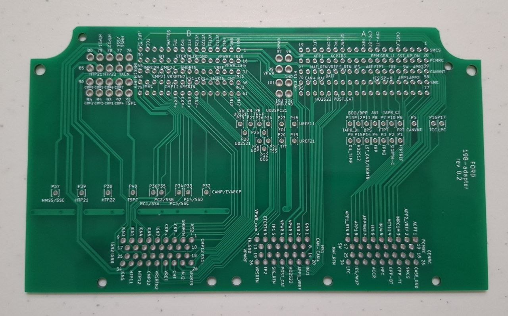

## Kawasaki

136 pin like Ninja ZX-4R and similar

[Reference wiring — Ninja ZX-4R service manual, chapter 17](https://github.com/rusefi/rusefi_documentation/blob/master/OEM-Docs/Kawasaki/Ninja%20ZX-4R%20Service%20Manual.pdf)

## Mazda

### Mazda Miata NC

The Mazda Miata NC Superseal adapter connects the 120-pin vehicle harness (two 60-pin connectors) to 60-pin and 26-pin Superseal connectors.

- **Mazda MX-5 / Miata NC:** intended application. The adapter is listed as not yet tested on a vehicle. Check the harness version against the vehicle pinout and adapter schematics.

[💲Buy Mazda Miata NC💲](https://www.shop.rusefi.com/shop/p/mazda-miata-nc-superseal-adapter) | [📄 Adapter schematics (PDF)](https://github.com/rusefi/rusefi_documentation/blob/master/Hardware-files/adapters/Mazda-Miata-NC-adapter/Mazda-Miata-NC-superseal-adapter.pdf)

[🚗 Vehicle pinout 🚗](https://rusefi.com/docs/pinouts/miata-nc/) | [🔌 Adapter board pinout 🔌](https://rusefi.com/docs/pinouts/miata-nc-adapter/)

[Reference wiring — 2009 MX-5 NC2](https://github.com/rusefi/rusefi_documentation/blob/master/OEM-Docs/Mazda/2009%20NC2.pdf) | [Reference terminal voltages — 2009 MX-5 NC2](https://github.com/rusefi/rusefi_documentation/blob/master/OEM-Docs/Mazda/2009%20NC2%20Pin%20Voltages.pdf)

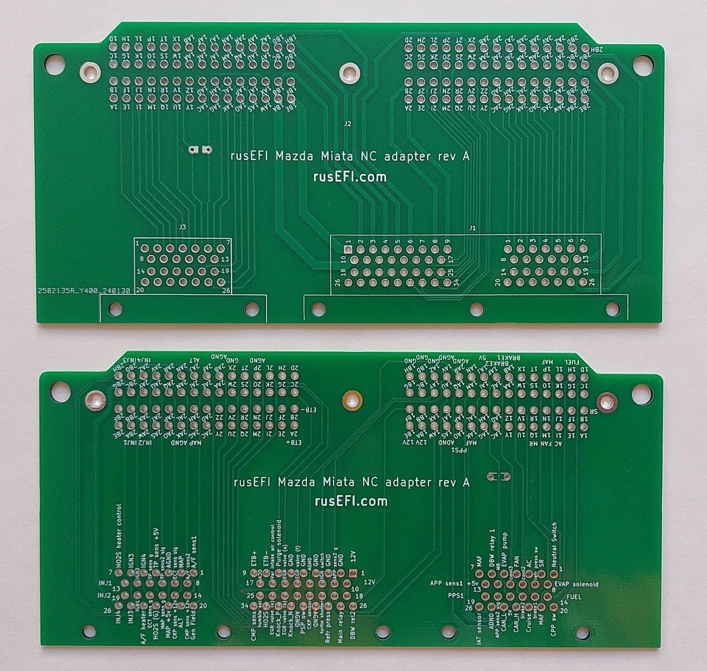

## Mitsubishi

### Mitsubishi Mirage

The Mitsubishi Mirage Superseal adapter connects the 119-contact vehicle connector to a 60-pin Superseal connector, routing 50 contacts.

- **Mitsubishi Mirage 1.2L:** intended application. The vehicle pinout follows the 2014 Mirage ES reference. Check the exact harness and equipment; a tested model-year range has not been established.

[📄 Adapter schematics (PDF)](https://github.com/rusefi/rusefi_documentation/blob/master/Hardware-files/adapters/Mitsubishi-Mirage-adapter/Mitsubishi-Mirage-superseal-adapter-0.3.pdf)

[🚗 Vehicle pinout 🚗](https://rusefi.com/docs/pinouts/Mitsubishi-Mirage/) | [🔌 Adapter board pinout 🔌](https://rusefi.com/docs/pinouts/Mitsubishi-Mirage-adapter/)

[Reference wiring — 2014 Mirage](https://github.com/rusefi/rusefi_documentation/blob/master/OEM-Docs/Mitsubishi/2014-mirage.pdf) | [Reference wiring — 2020 Mirage](https://github.com/rusefi/rusefi_documentation/blob/master/OEM-Docs/Mitsubishi/2020-mirage.pdf)

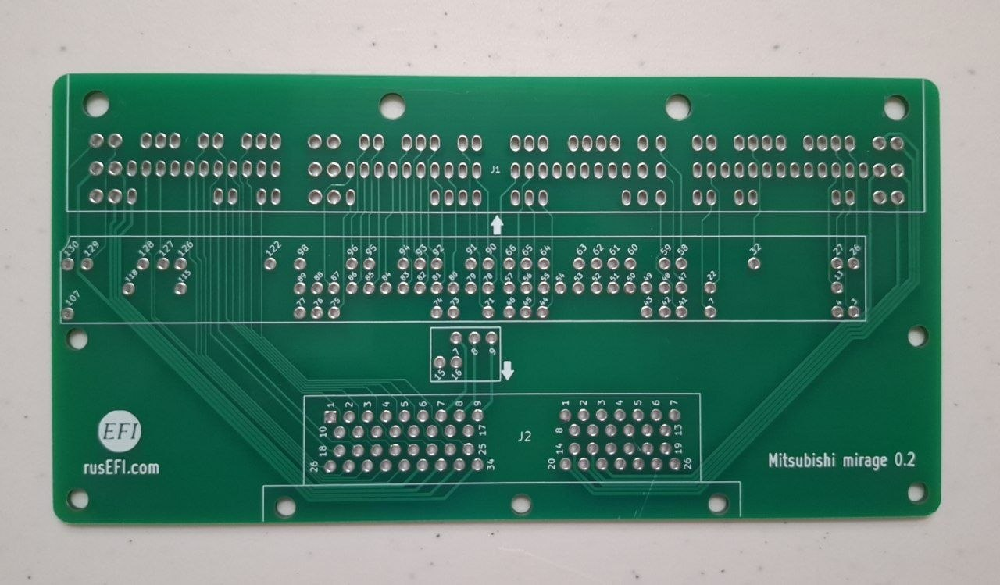

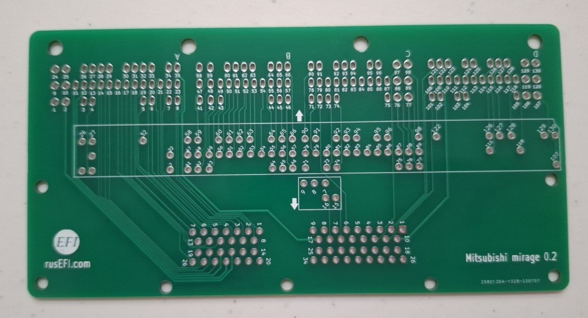

## Nissan

### Nissan 76 — Skyline GTS-T ECR33

The Nissan 76 Superseal adapter connects the 76-pin vehicle harness to a 60-pin Superseal connector.

- **Nissan Skyline GTS-T ECR33, RB25DET:** intended application. Check the harness version against the vehicle pinout and adapter schematics.

[💲Buy Nissan 76💲](https://www.shop.rusefi.com/shop/p/superseal-nissan-76) | [📄 Adapter schematics (PDF)](https://github.com/rusefi/rusefi_documentation/blob/master/Hardware-files/adapters/Nissan-76-adapter/Nissan76-superseal-adapter.pdf)

[🚗 Vehicle pinout 🚗](https://rusefi.com/docs/pinouts/nissan76/) | [🔌 Adapter board pinout 🔌](https://rusefi.com/docs/pinouts/nissan-76-adapter/)

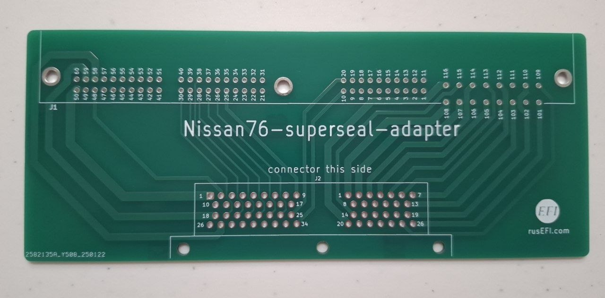

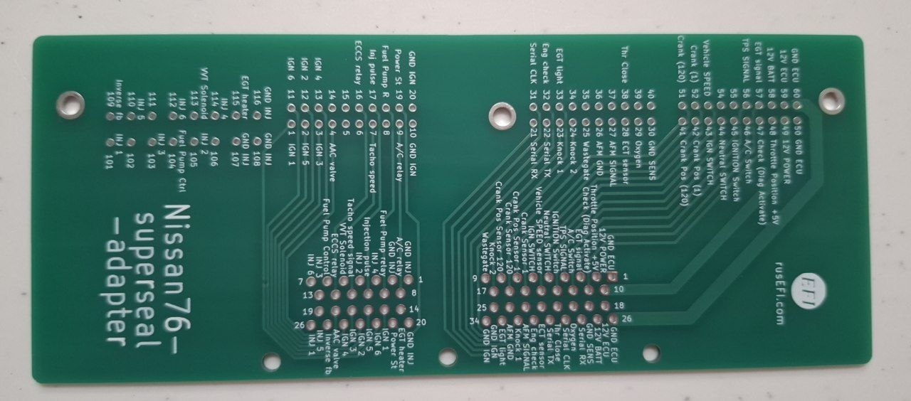

## Subaru

### Subaru 135 — Impreza WRX / WRX STI

The Subaru 135 Superseal adapter connects the four-section 135-pin vehicle harness to 60-pin, 34-pin and 26-pin Superseal connectors. It routes 110 contacts.

- **Subaru Impreza WRX / WRX STI with the 135-pin ECM connector:** intended application. The vehicle pinout follows the 2013 WRX EJ255 reference with SI-Drive. Check the specific harness before installation; compatibility across the previously listed 2011–2021 range has not been established.
- **2017 WRX STI EJ257:** use the STI references to check differences. Contact 6-4 is part of the neutral-position switch circuit, whereas the 2013 WRX pinout identifies it as ground. Do not ground it or close JP3 for that STI circuit. Starter wiring also differs between key and push-button versions.

[📄 Adapter schematics (PDF)](https://github.com/rusefi/rusefi_documentation/blob/master/Hardware-files/adapters/Subaru-135-adapter/Subaru-135-superseal-adapter.pdf)

[🚗 Vehicle pinout 🚗](https://rusefi.com/docs/pinouts/subaru-2011/) | [🔌 Adapter board pinout 🔌](https://rusefi.com/docs/pinouts/subaru%20adapter/)

[Reference wiring — 2013 WRX](https://github.com/rusefi/rusefi_documentation/blob/master/OEM-Docs/Subaru/2013%20Subaru%20Impreza%20WRX.pdf) | [Reference wiring — 2017 WRX STI](https://github.com/rusefi/rusefi_documentation/blob/master/OEM-Docs/Subaru/2017%20Subaru%20WRX%20STI.pdf) | [STI starting — key](https://github.com/rusefi/rusefi_documentation/blob/master/OEM-Docs/Subaru/2017%20Subaru%20WRX%20STI-starting-with-key.pdf) | [STI starting — push button](https://github.com/rusefi/rusefi_documentation/blob/master/OEM-Docs/Subaru/2017%20Subaru%20WRX%20STI-starting-with-push-button.pdf)

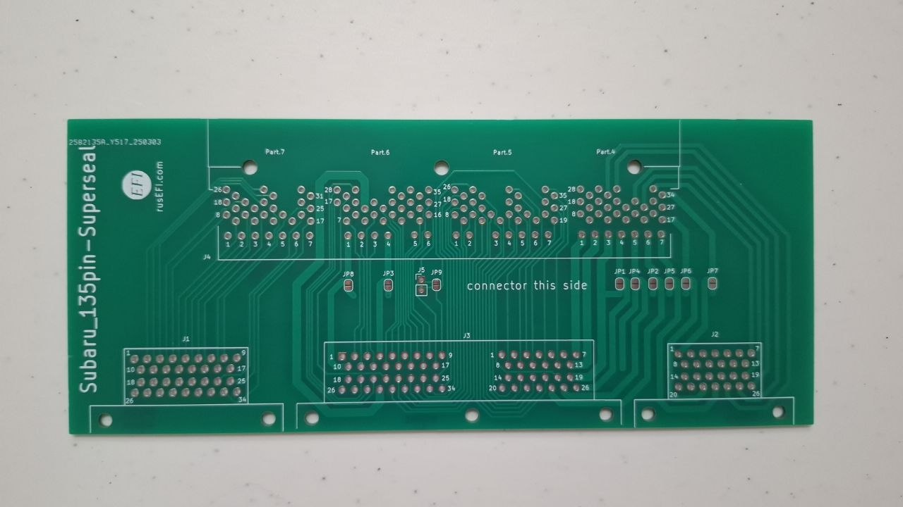

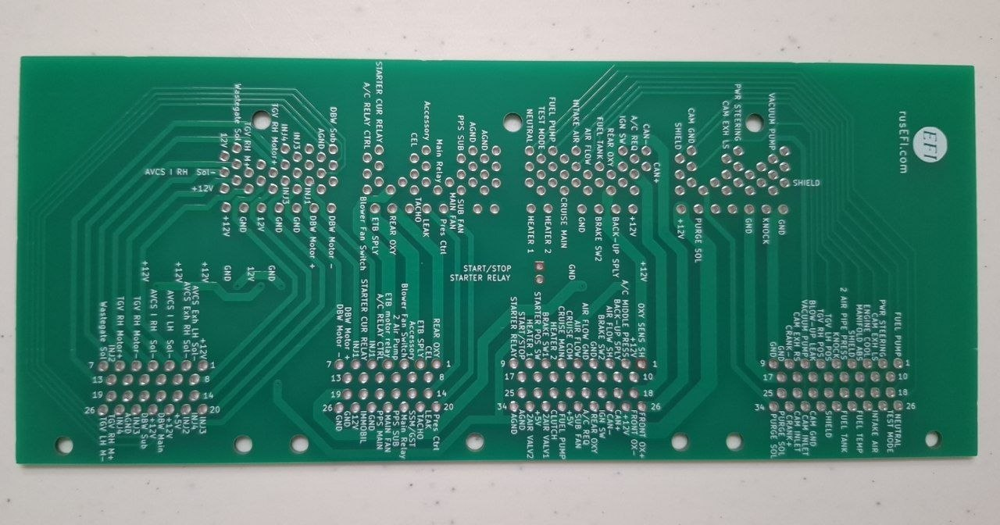

## Toyota

### Toyota 120 — Supra A80

The Toyota 120 Superseal adapter connects the 120-pin vehicle harness to 60-pin and 26-pin Superseal connectors.

- **Toyota Supra A80 (Mk IV), 2JZ-GTE:** intended application. The adapter is listed as untested. Check the harness version against the vehicle pinout and adapter schematics.

[💲Buy Toyota 120💲](https://www.shop.rusefi.com/shop/p/superseal-toyota-120) | [📄 Adapter schematics (PDF)](https://github.com/rusefi/rusefi_documentation/blob/master/Hardware-files/adapters/Toyota-120-adapter/Toyota-120-superseal.pdf)

[🚗 Vehicle pinout 🚗](https://rusefi.com/docs/pinouts/Toyota-JZA80/) | [🔌 Adapter board pinout 🔌](https://rusefi.com/docs/pinouts/Toyota-120-adapter/)

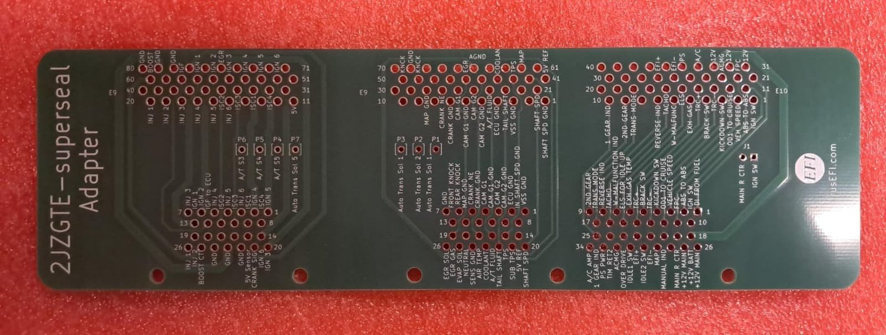

### Toyota 122 — Aristo JZS161

The Toyota 122 Superseal adapter connects the 122-pin vehicle harness to 60-pin and 26-pin Superseal connectors.

- **Toyota Aristo JZS161, 2JZ-GTE VVT-i:** intended application. Check the harness version against the vehicle pinout and adapter schematics; a fully tested model-year range has not been established.
- **Lexus GS300 S160, 2JZ-GE:** related application, compared against the 1998 wiring diagram. Pin functions differ from Aristo, so wiring verification is required; plug-and-play compatibility is not confirmed.

[💲Buy Toyota 122💲](https://www.shop.rusefi.com/shop/p/superseal-toyota-122) | [📄 Adapter schematics (PDF)](https://github.com/rusefi/rusefi_documentation/blob/master/Hardware-files/adapters/Toyota-122-adapter/Toyota-122-superseal.pdf)

[🚗 Vehicle pinout 🚗](https://rusefi.com/docs/pinouts/Toyota-JZS161/) | [🔌 Adapter board pinout 🔌](https://rusefi.com/docs/pinouts/jza161-adapter/)

[Reference wiring — 1998 Lexus GS300 (2JZ-GE; differs from Aristo)](https://github.com/rusefi/rusefi_documentation/blob/master/OEM-Docs/Toyota/1998%20Lexus%20GS300%20ECU%20Wiring%20Diagram.pdf)

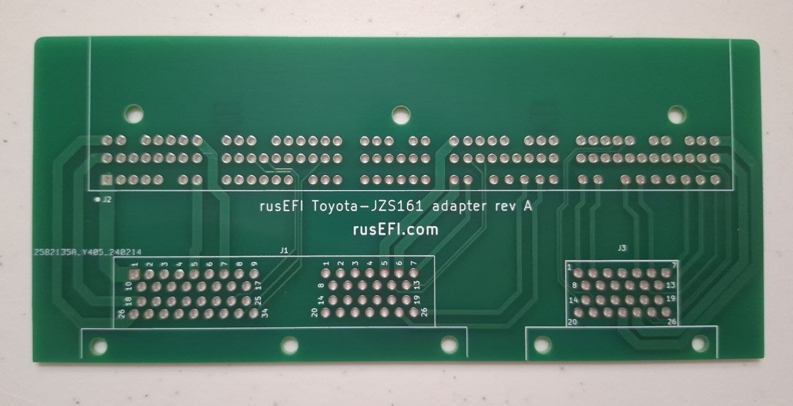

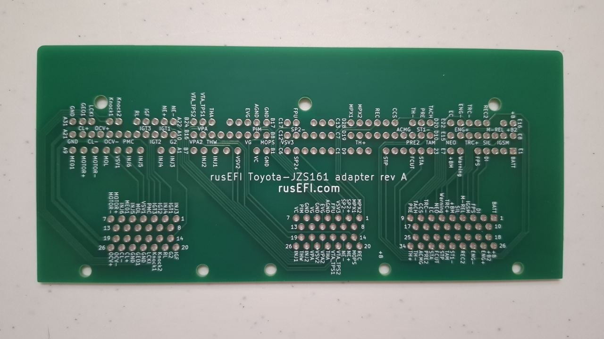
