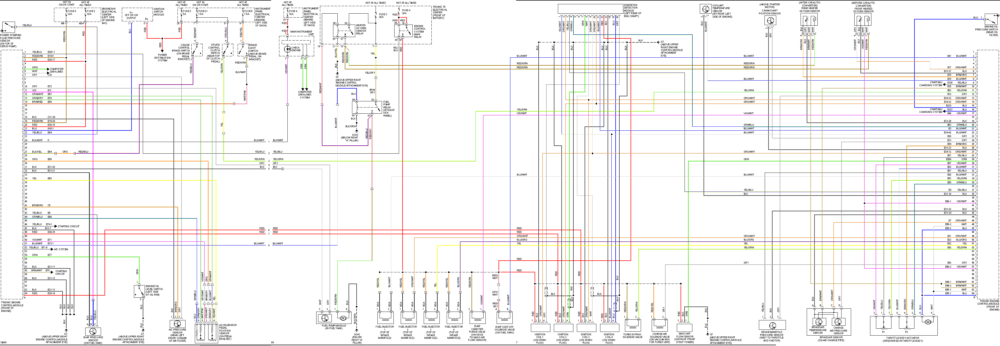

# 2005 Saab 9-3

[2002-2014 Saab 9-3 - Wikipedia]](<https://en.wikipedia.org/wiki/Saab_9-3#Second_generation_(2002%E2%80%932014>))

[Trionic 8 - Wikipedia]](<https://en.wikipedia.org/wiki/Trionic_8>)

[2005 Saab 9-3 ionization module replacement](https://www.youtube.com/watch?v=zJlU3QKkud0)

86 mm bore

## Ionization Detection Module 55352173

Harness side of detection module connector amp 1-962358-1

Individual coil-on-plug part number 12787707 H6T60271 - 4 wire connector

Spark plug AP 5503 R=6Kohm

(Connector similar to Cobalt SS but different coil?)

[Pull-ups reverse engineering on my Ion Mold test mule - Forum](https://rusefi.com/forum/viewtopic.php?f=4&t=963&p=30838#p30838)

**resistance measurments:**

**between knock signal pin on CDM connector and intake air sensor connector pin A (org/wht) - 0.8Kohm - 800R**

**between combustion detection pin on CDM connector and intake air sensor connector pin C (org/wht) - 5.0Kohm**

- CDM 12787708 (analogue output)

- CDM 55352173 (digital output)

for the first two years of T8 the analogue CDM was used before going digital with the same coils but the later CDM

The CDM does an initial signal processing of the ionization signals from each ignition coil. The CDM transmits three signals to the ECM:

Knock signal

Combustion signal 1 (cylinders 1 and 3)

Combustion signal 2 (cylinders 2 and 4)

These signals are used for knock control, synchronisation of ignition timing/fuel injection and for misfire detection.

Trionic T8 does not have a conventional knock sensor and instead uses the spark plugs as sensors for ionization current measurement.

A voltage of 120V is continuously applied across the spark plugs. As the pressure and temperature are very high in conjunction with combustion the gases in the combustion chamber will be electrically conductive so that electric current can flow across the spark plug gap without causing a spark.

The degree of ionization (current) is reflected in the conditions in the combustion chamber. By analyzing the ionization current ECM can determine whether combustion is normal or misfiring and whether there is knocking.

The ignition coils of the respective cylinders generate an ionization voltage= measure the ionization current and send the results to CDM for initial processing
of the ionization signal from the respective ignition coil-

CDM generates a knock signal from the ionization information from the four cylinders and the signal is used by ECM to determine whether the engine is knocking. Once the spark has ignited ECM will "listen" to the knock signal of each cylinder for a specific number of crankshaft degrees: a so called window.

## Identifying Piston Position

Suppose a spark has been generated in cylinder 1 and 4. CDM will detect this because it is connected to the ignition trigger line of the respective ignition
coils. CDM analyses the ionization signal from ignition coil pin 4 for cylinder 1 pin 16 and cylinder 4 pin 15 on CDM.

The cylinder in which combustion has taken place will produce a powerful ionization signal.

If combustion takes place in cylinder 1 then CDM will send a pulse from pin 4 to ECM pin 20(B) and from CDM pin 11 to ECM pin 21(B) if in cylinder 4.
With regard to cylinders 2 and 3: if combustion takes place in cylinder 2: a pulse will be sent from CDM pin 11 to ECM pin 21(B) and cylinder 3 a pulse
from CDM pin 4 to pin 20(B) on ECM.

When combustion signals arrive on ECM pins 20(B) and 21(B)= the firing order and fuel injection will be synchronized

## Knock detection

CDM analyses the ionization signals from pin 4 on the respective ignition coils.

CDM synchronizes the ionization current measurement with the firing order and generates a knock signal that is sent to ECM on pin #3.

| pos | color        | desc                                                        | type            | CDM body code |
| --- | ------------ | ----------------------------------------------------------- | --------------- | ------------- |
| 1   | Blue/White   | ignition trigger \#4                                        | ECU to CDM\&COP | E4            |
| 2   | Orange/White | ignition trigger \#3                                        | ECU to CDM\&COP | E3            |
| 3   | Yellow/Blue  | Knock signal                                                | CDM to ECU      | K             |
| 4   | Green/Blue   | combustion signal \#1: Cyl \#1 or Cyl \#3 combustion signal | CDM to ECU      | M1            |
| 7   | Green        | ionization signal \#2                                       | COP to CDM      | I2            |
| 8   | White        | ionization signal \#3                                       | COP to CDM      | I3            |
| 9   | Orange/White | ignition trigger \#1                                        | ECU to CDM\&COP | E1            |
| 10  | Orange/White | ignition trigger \#2                                        | ECU to CDM\&COP | E2            |
| 11  | Blue/White   | combustion signal \#2: Cyl \#2 or Cyl \#4                   | CDM to ECU      | M2            |
| 12  | Red          | power from engine main relay                                | \+12v           | B             |
| 13  | Black        | Ground                                                      | Ground          | G             |
| 15  | Blue         | ionization signal \#4                                       | COP to CDM      | I4            |
| 16  | Grey         | ionization signal \#1                                       | COP to CDM      | I1            |

## ECU

