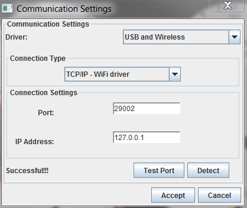
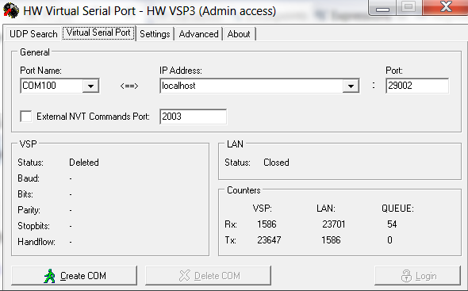
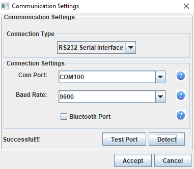

#RusEfi Simulator
#####If you don't have any rusEfi products and want to test out our controller you'll be able to do this here  

The simulator is an edited version of the code which is used on the rusEfi controllers, made to be usable on the Windows operating systems. The only thing that you'll need will be a computer. 

The application runs on Java, so we recommend you have it installed. [Download here](http://rusefi.com/build_server/rusefi_bundle.zip). To open the simulator you'll have double-click on the rusefie_console.jar file. 

##Connecting the simulator to TCP

There are two ways to connect our simulator to TCP, it all depends on the version of your TCP.
 
 With the paid version all you need to do is to go into the communication settings inside a created project, choose the USB and wireless driver and the WiFi driver connection type, write the port as 29002 and the Ip addres as 127.0.0.1
 
 
 
However if you only have the lite version of TPC the process will be different

##Emulating a serial port to connect to TCP lite

If you prefer using the free version of TCP you'll need to install a serial port emulator from [here](http://new.hwg.cz/files/download/sw/version/hw-vsp3-single_3-1-2.exe). You'll need to emulate a port on your PC. The only thing that you'll need to do is to choose a port name, COM100 for example amd to change the port address to 29002.

One of the quirks of emulating is that your rusEfi console has to be open. So now if you open the communication settings in TCP you'll be able to connect to your emulator.

 

Now your simulator is connected to TCP. 