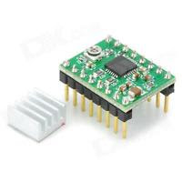

# Stepper Motor

microRusEFI can control 4 wire using on-board TLE8888 see https://github.com/rusefi/rusefi/pull/3749

uaEFI and Proteus can control 4 wire using two h-bridges/DC motor drivers

[Pololu A4988 Stepper Motor Driver Carrier](http://www.pololu.com/product/1182)

[A4988 DMOS Microstepping Driver With Translator datasheet](http://www.pololu.com/file/download/a4988_DMOS_microstepping_driver_with_translator.pdf?file_id=0J450)

Use a jumper or wire to connect SLEEP with RESET

For first test, leave ENABLE disconnected. Once tested, connect stepper enable to rusEFI 'stepper enable' pin

We do not have our own add-on board for a4988, we use ones from eBay like "stepper motor driver A4988 with Heat sinks"

[Stepper Motor Logic - Forum](http://rusefi.com/forum/viewtopic.php?f=5&t=767)

[pinout - Forum](http://rusefi.com/forum/viewtopic.php?f=5&t=767&start=30#p17671)

See [Frankenso: prototyping area stepper board install - Forum](http://rusefi.com/forum/viewtopic.php?f=4&t=1161)
