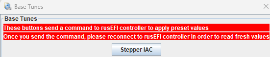

# Stepper Motor

Let's be clear: Stepper motors are our least favorite idle air valve option. We are not excited about them at all.

microRusEFI can control a 4-wire stepper motor using the on-board TLE8888 - see [this pull request](https://github.com/rusefi/rusefi/pull/3749).

uaEFI and Proteus can control a 4-wire stepper motor using two h-bridges/DC motor drivers.

{: style="width: 551px; height: 118px;" }

[proteus Toyota pinout](https://github.com/rusefi/rusefi/commit/89d55109178be92c79807f392503079463647d43)

## How rusEFI drives the coils

`useStepperIdle` tells the firmware you have a stepper idle valve at all - "This setting
should only be used if you have a stepper motor idle valve and a stepper motor driver
installed". Which output hardware moves the coils is then a separate choice:

| Setting | What the firmware says it does |
| --- | --- |
| `stepperStepPin` / `stepperDirectionPin` | step and direction signals to a dedicated stepper driver IC - the usual method |
| `useHbridgesToDriveIdleStepper` | "If enabled we use two H-bridges to drive stepper idle air valve" |
| `useRawOutputToDriveIdleStepper` | "If enabled we use four Push-Pull outputs to directly drive stepper idle air valve coils" |
| `useTLE8888_stepper` | drive the stepper from the on-board TLE8888 |

The two-H-bridge option is what makes the uaEFI and Proteus case above work, and the
TLE8888 option is the microRusEFI case. Boards using an H-bridge that inverts its inputs
need `stepperDcInvertedPins` - "Enable if DC-motor driver (H-bridge) inverts the signals
(eg. RZ7899 on Hellen boards)".

Wiring these up is covered on the Idle Control page under
[Stepper idle valve wiring](Idle-Control#stepper-idle-valve-wiring). Unipolar valves are
not supported.

## Motor settings

- `stepperNumMicroSteps` selects Full-Step (the default), Half-Step, 1/4 Micro-Step or
  1/8 Micro-Step. The firmware notes: "For micro-stepping, make sure that PWM frequency
  (etbFreq) is high enough".
- `stepperMinDutyCycle` - "Use to limit the current when the stepper motor is idle, not
  moving (100% = no limit)".
- `stepperMaxDutyCycle` - "Use to limit the max.current through the stepper motor (100% =
  no limit)".

## Travel and parking

At startup a stepper valve is retracted fully to reach a known position before moving to
the commanded one - see [Valve Initialization](Idle-Control#valve-initialization). Four
settings shape that movement. The firmware ships no descriptions for these, so only their
names, units and accepted ranges are given here; no values are prescribed:

| Setting | Unit | Range |
| --- | --- | --- |
| `idleStepperTotalSteps` | count | 5 - 3000 |
| `idleStepperReactionTime` | ms | 1 - 300 |
| `stepperParkingExtraSteps` | % | 0 - 3000 |
| `stepperForceParkingEveryRestart` | on/off | - |

Set these in TunerStudio and confirm the behaviour on a [log](Logging-Guide); the
"Stepper Idle Control" debug mode exists for exactly this.

## Related pages

- [Idle Control](Idle-Control) - idle strategy, valve initialization and stepper wiring.
- [Wiring & Connectivity Overview](FAQ-Basic-Wiring-and-Connections#idle-air-control-valve) - idle valve types.
- [ECU Comparison](ECU-Comparison) - which boards can drive a stepper, and how.
- [Logging](Logging-Guide) - capturing a log to check valve behaviour.

## Technical sources

- `firmware/integration/rusefi_config.txt` - `useStepperIdle`, `stepperStepPin`,
  `stepperDirectionPin`, `useHbridgesToDriveIdleStepper`,
  `useRawOutputToDriveIdleStepper`, `useTLE8888_stepper`, `stepperDcInvertedPins`,
  `stepperNumMicroSteps`, `stepperMinDutyCycle`, `stepperMaxDutyCycle`,
  `idleStepperTotalSteps`, `idleStepperReactionTime`, `stepperParkingExtraSteps`,
  `stepperForceParkingEveryRestart`.
