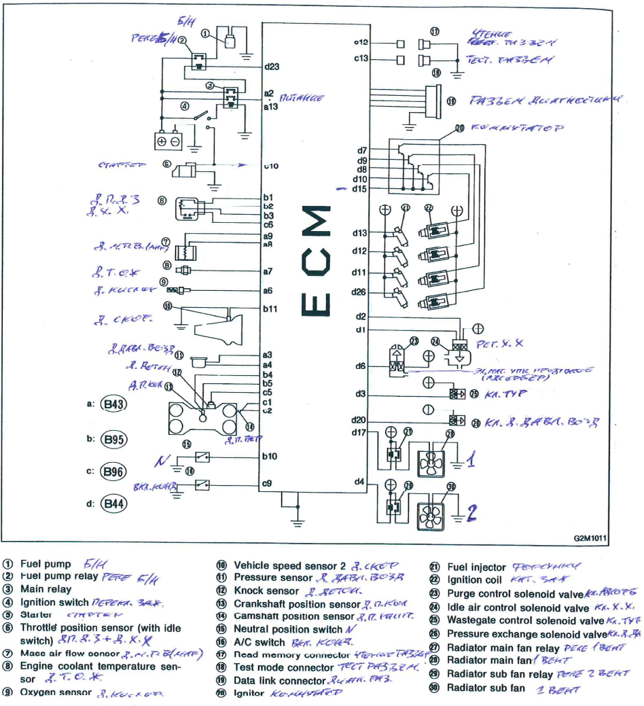
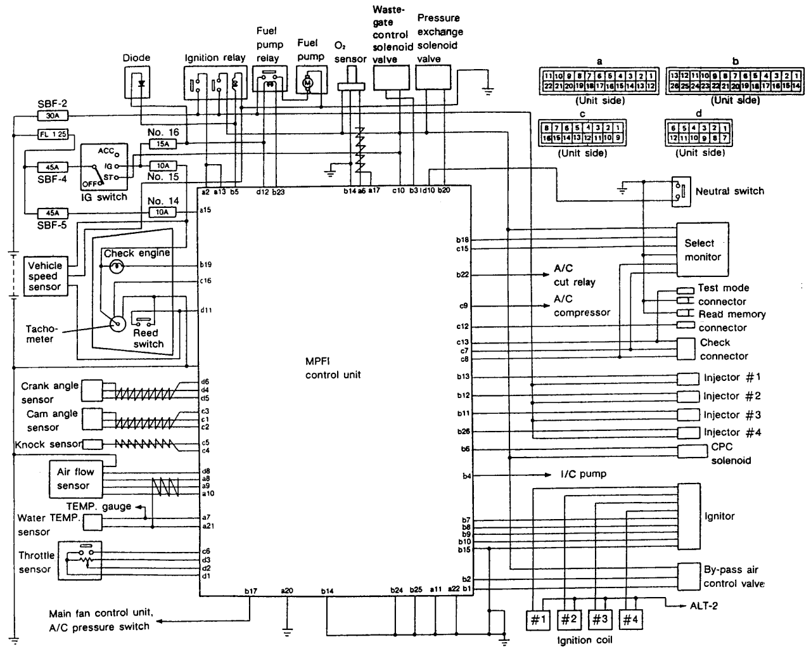

## Engine

Turbocharged oposite 4 cylinder EJ20G

## Stock ECU

A lot of useful info can be found at [<http://www.alcyone.org.uk/ssm/index.html> Diagnostics and Datalogging for Subaru SVX]

## ECU pinout

This pinout can be partially correct for other Subaru from early 90s (with same yellow ECU connector). Like Legacy/Liberty, SVX and so on.

Connector: Hardware:OEM_connectors#76_pin

**EDM connector B44 (JDM - B60)**

| Terminal | Type               | EDM Signal                           | JDM Signal                          | Note                                                                   | Wire color |
| -------- | ------------------ | ------------------------------------ | ----------------------------------- | ---------------------------------------------------------------------- | ---------- |
| 1        | OD output          | Idle air control solenoid: close end | same                                |                                                                        |            |
| 2        | OD output          | Idle air control solenoid: open end  | same                                |                                                                        |            |
| 3        | OD output          | Wastgate control solenoid            | same                                |                                                                        |            |
| 4        | OD output          | Radiator fan 1 control               | same                                | Ext relay                                                              |            |
| 5        | Open Emiter output | Self shutoff control                 | same                                | \+12 output to hold main relay on (serial diode protected on ECU side) |            |
| 6        | OD output          | **Purge control solenoid valve**     | **5th injector relay (RA-version)** |                                                                        |            |
| 7        | OD+Pull-up output  | Ignition control \#4                 | same                                |                                                                        |            |
| 8        | OD+Pull-up output  | Ignition control \#3                 | same                                |                                                                        |            |
| 9        | OD+Pull-up output  | Ignition control \#2                 | same                                |                                                                        |            |
| 10       | OD+Pull-up output  | Ignition control \#1                 | same                                |                                                                        |            |
| 11       | OD output          | Fuel injector \#3                    | same                                |                                                                        |            |
| 12       | OD output          | Fuel injector \#2                    | same                                |                                                                        |            |
| 13       | OD output          | Fuel injector \#1                    | same                                |                                                                        |            |
| 14       | Power              | GND (power supply)                   | same                                | (not sure)                                                             |            |
| 15       | Power              | Ignition GND                         | same                                | externaly connected to body                                            |            |
| 16       | Input              | Power steering pressure switch       | same                                | to GND                                                                 |            |
| 17       | OD output          | Radiator fan 2 control               | same                                | Ext relay                                                              |            |
| 18       | \-                 | No connection                        | same                                |                                                                        |            |
| 19       | OD output          | Jakie Chan lamp                      | same                                |                                                                        |            |
| 20       | OD output          | Pressure exchange solenoid valve     | same                                | Used to switch pressure sensor between intake and atmosphere           |            |
| 21       | \-                 | No connection                        | same                                |                                                                        |            |
| 22       | OD output          | AC cut relay                         | same                                |                                                                        |            |
| 23       | OD output          | Fuel pump relay                      | same                                |                                                                        |            |
| 24       | Power              | Injectors GND                        | same                                |                                                                        |            |
| 25       | Power              | Injectors GND                        | same                                |                                                                        |            |
| 26       | OD output          | Fuel injector \#4                    | same                                |                                                                        |            |

**EDM connector B96 (JDM B116)**

| Terminal | Type      | EDM Signal                         | JDM Signal  | Note                                                                         | Wire color |
| -------- | --------- | ---------------------------------- | ----------- | ---------------------------------------------------------------------------- | ---------- |
| 1        | Input     | Camshaft position sensor: signal + | same        |                                                                              |            |
| 2        | Input     | Camshaft position sensor: signal - | same        |                                                                              |            |
| 3        | Shield    | Camshaft position sensor: shield   | same        |                                                                              |            |
| 4        | Shield    | Knock sensor: shield               | same        |                                                                              |            |
| 5        | Input     | Knock sensor: signal               | same        |                                                                              |            |
| 6        | Input     | Idle switch                        | ?           | Throttle fully closed                                                        |            |
| 7        | Tx        | Subaru Select Monitor signal       | same        | 5V uart, 1953 baud, 8 data bits, 1 stop bit, Even Parity and no flow control |            |
| 8        | Rx        | Subaru Select Monitor signal       | same        | 5V uart, 1953 baud, 8 data bits, 1 stop bit, Even Parity and no flow control |            |
| 9        | Input     | AC switch                          | same        | to gnd                                                                       |            |
| 10       | Input     | Starter signal                     | same        |                                                                              |            |
| 11       | Input     | ?                                  | Idle switch | Throttle fully closed                                                        |            |
| 12       | Input     | Read memory connector              | same        | connect to GND                                                               |            |
| 13       | Input     | Test connector                     | same        | connect to GND                                                               |            |
| 14       | \-        | No connection                      | same        |                                                                              |            |
| 15       | \-        | No connection                      | same        |                                                                              |            |
| 16       | Output 5V | Engine tachometer output           | same        | 2 pulses per rev                                                             |            |

**EDM connector B95 (JDM B115)**

| Terminal | Type      | EDM Signal                           | JDM Signal | Note                                   | Wire color |
| -------- | --------- | ------------------------------------ | ---------- | -------------------------------------- | ---------- |
| 1        | Power OUT | Throttle position switch: GND/Shield | same       |                                        |            |
| 2        | Input     | Throttle position switch: Signal     | same       | Fully closed: 4.7V, Fully opened: 0.9V |            |
| 3        | Power OUT | Throttle position switch: 5V         | same       | 5V output                              |            |
| 4        | Input     | Crancshaft position sensor: signal + | same       |                                        |            |
| 5        | Input     | Crancshaft position sensor: signal - | same       |                                        |            |
| 6        | Shield    | Crancshaft position sensor: shield   | same       |                                        |            |
| 7        | \-        | No connection                        | same       |                                        |            |
| 8        | \-        | No connection                        | same       |                                        |            |
| 9        | \-        | No connection                        | same       |                                        |            |
| 10       | Input     | Neutral switch                       | same       |                                        |            |
| 11       | Input     | Vehicle speed                        | same       | 5V level from dashboard                |            |
| 12       | Input     | IGN signal                           | same       |                                        |            |

**EDM connector B43 (JDM B59)**

| Terminal | Type      | EDM Signal                           | JDM Signal           | Note                         | Wire color |
| -------- | --------- | ------------------------------------ | -------------------- | ---------------------------- | ---------- |
| 1        | \-        | No connection                        | same                 |                              |            |
| 2        | Power     | Power supply                         | same                 | Through main relay           |            |
| 3        | Power OUT | Pressure sensor: 5V                  | same                 | 5V output                    |            |
| 4        | Input     | Pressure sensor: signal              | same                 |                              |            |
| 5        | Input     | **No connection**                    | **EGT sensor input** |                              |            |
| 6        | Input     | O2 sensor: signal                    | same                 | Rich: 0.7-1.0, Leam: 0.0-0.2 |            |
| 7        | Input     | Engine coolant t                     | same                 |                              |            |
| 8        | Power OUT | MAF: 12V                             | same                 |                              |            |
| 9        | Input     | MAF: signal                          | same                 |                              |            |
| 10       | Power OUT | MAF: GND                             | same                 |                              |            |
| 11       | Power     | GND (control system)                 | same                 |                              |            |
| 12       | Output    | **No connection**                    | **IP light ses (?)** |                              |            |
| 13       | Power     | Power supply                         | same                 | Through main relay           |            |
| 14       | \-        | No connection                        | same                 |                              |            |
| 15       | Power     | Back-up power supply                 | same                 | Always on                    |            |
| 16       | \-        | No connection                        | same                 |                              |            |
| 17       | Input     | O2 sensor: shield                    | same                 |                              |            |
| 18       | \-        | No connection                        | same                 |                              |            |
| 19       | Power OUT | MAF: shield                          | same                 |                              |            |
| 20       | \-        | No connection                        | same                 |                              |            |
| 21       | Power OUT | Pressure, coolant T, EGT sensors GND | same                 |                              |            |
| 22       | Power     | GND (control system)                 | same                 |                              |            |

## ECU connection

Impreza 1991+

Liberty RS 1993

## Stock ECU internals

Output drivers:

4 x UPA1558H - 4 N-channel power MOSFETs

1 x 4AK19 - 4 N-channlel power MOSFETs (2.5 A) - seems to drive injectors

(2S)A1441 - 5A PNP transistors - seems to drive self-shutdown control output

## See also

[http://www.type-ra.com/](http://www.type-ra.com/)
