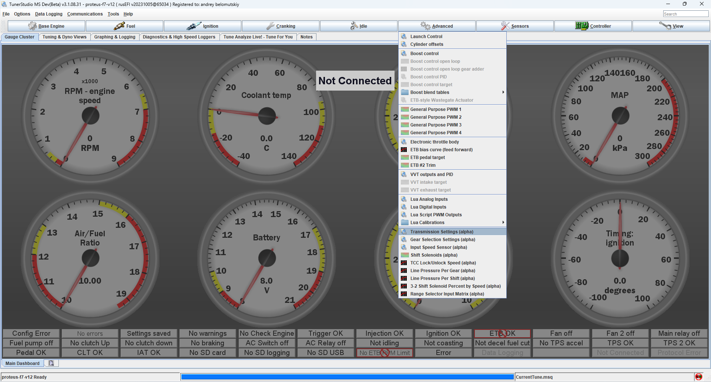

# TCU Status

## Terminology

First we need to establish good terminology.

### Transmission Control Module

Let's agree that control is applicable only if you are toggling transmission solenoids. TCU could be external or internal to bellhousing, but either way - TCU is wired directly to solenoids and speed sensors. Ford, Toyota and Honda love integrating TCU into ECU, those should be called PCM (powertrain control module)

### CANbus gateway

Let's agree that a separate device which sits between ECU and TCU is a CANbus gateway

### build-in CANbus integration

Some ECUs can talk to TCUs over CANbus or legacy signal wires.

## rusEFI has basic TCU logic

[A Ford 4R70W](https://rusefi.com/forum/viewtopic.php?f=2&t=2744) has driven under rusEFI TCU control.

We have code for GM 4Lxx transmissions, but zero or very little real life testing. We also have an alternative Lua firmware for direct control of older transmissions.

## Modern Stuff

Modern transmissions use clutch-to-clutch control, which means that one clutch is engaging as another is disengaging.

Some of these transmissions use an external TCU, some use a TCU built into the transmission, and some are controlled by the ECU.

For those we are focusing on CAN integration only, not looking to re-invent the TCU itself. Even if someone implements direct solenoid/actuator control, we doubt that anyone within the enthusiast realm would be able to meaningfully tune such a solution anyway. CAN bus integration with the OEM TCU is the only way for modern transmissions!

See also:

- [Sequential Transmission](Sequential-Transmission)
- [How To Make Your Own ECU Communicate with TCU](HOWTO-Make-Your-Own-ECU-Communicate-with-TCU)
- [NAG1---722.6](NAG1---722.6)
- [How To TCU A42DE on Proteus](HOWTO-TCU-A42DE-on-Proteus)
