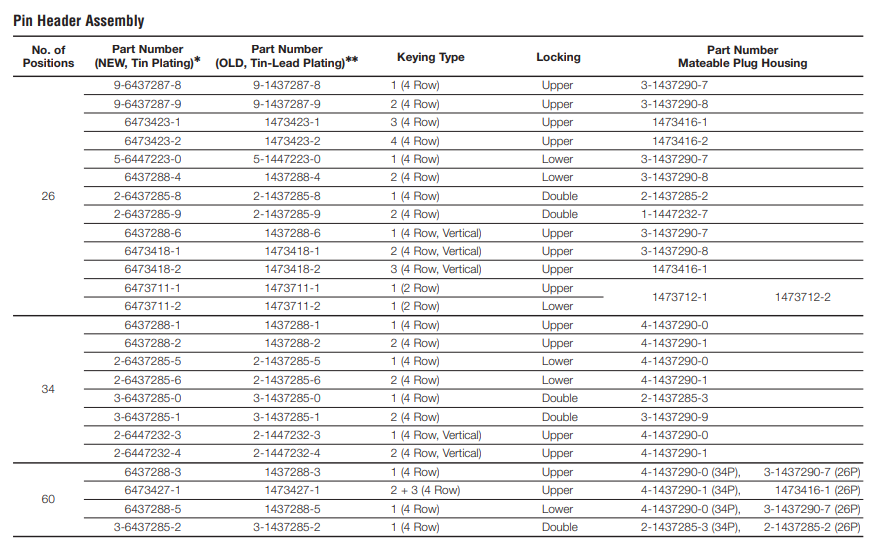

# TE/AMP Superseal

They are available in 26, 34, and 60-way arrangements and have an integrated latch for mating.

## 26 plugs

single, key 1: [3-1437290-8](https://www.te.com/usa-en/product-3-1437290-8.html)

single, key 2: [3-1437290-9](https://www.te.com/usa-en/product-3-1437290-9.html)

single, key 3: 1473416-1 [findchips](https://www.findchips.com/search/1473416-1)

single, key 4: 1473416-2 [findchips](https://www.findchips.com/search/1473416-2)

## 26 headers

[9-6437287-8](https://www.te.com/usa-en/product-9-6437287-8.html) [findchips](https://www.findchips.com/search/9-6437287-8)

[9-6437287-9](https://www.te.com/usa-en/product-9-6437287-9.html) [findchips](https://www.findchips.com/search/9-6437287-9)

[6473423-1](https://www.te.com/usa-en/product-6473423-1.html) [findchips](https://www.findchips.com/search/6473423-1)

[6473423-2](https://www.te.com/usa-en/product-6473423-2.html) [findchips](https://www.findchips.com/search/6473423-2)

## 34 headers

[2-6437285-5](https://www.te.com/usa-en/product-2-6437285-5.html)

<https://docs.rs-online.com/b600/0900766b816627da.pdf>

