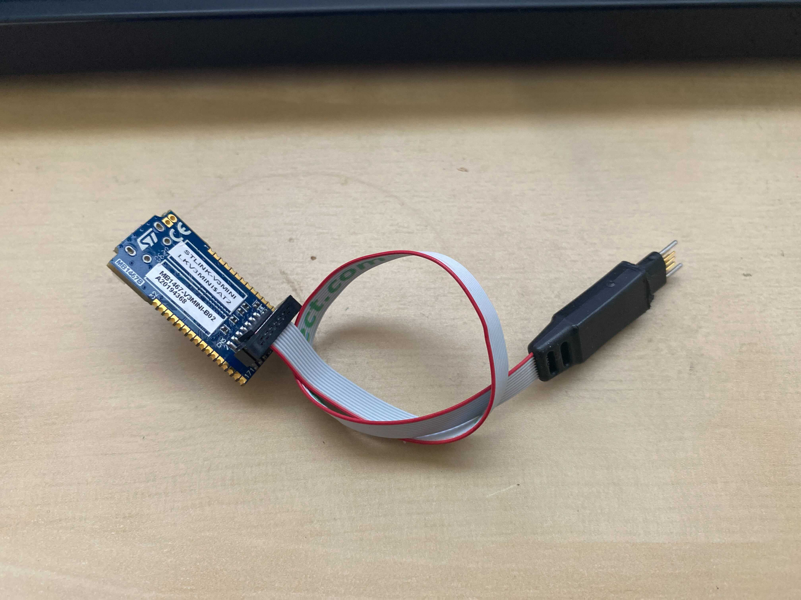
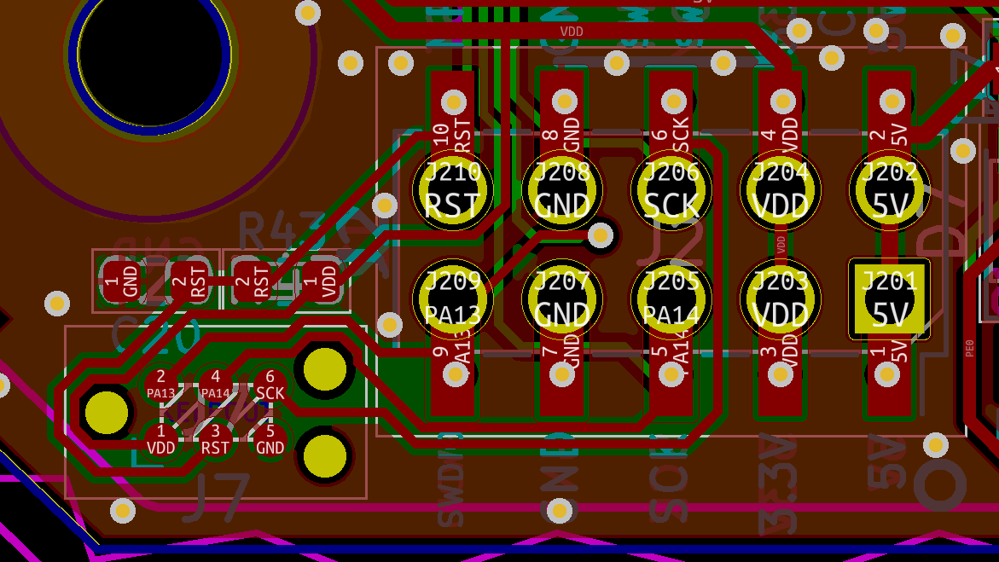

# Tag Connect

rusEFI likes Tag Connect so many boards have that small TC2030 footprint - microRusEFI, Hellen, Proteus and wideband etc.

* STLINK-V3MINI $11 everywhere
* [https://www.tag-connect.com/product/tc2030-ctx-nl-stdc14-for-use-with-stm32-processors-with-stlink-v3](https://www.tag-connect.com/product/tc2030-ctx-nl-stdc14-for-use-with-stm32-processors-with-stlink-v3) cable (old part number: TC2030-CTX-NL-STDC14)
* TC2030-CLIP-3PACK

Way more ghetto option would be based on TC2030-MCP-NL off eBay with phone jack cut off and wires soldered

The image above is a bit confusing https://github.com/rusefi/hw_microRusEfi/issues/234

* Three more important wires are: GND (black on TC2030)
* Three more important wires are: 13-swdio (yellow on TC2030)
* Three more important wires are: 14-swclk (red on TC2030)
* nice to have +3.3v pin 1(blue on TC2030)
* nice to have RESET pin (green on TC2030)

Offtopic:
STLINK-V3MINI also works with FTSH-105-01-F-DV-007-K on Proteus

A DIY option https://www.thingiverse.com/thing:5819952

## Segger

Same pinout https://www.segger.com/products/debug-probes/j-link/accessories/adapters/6-pin-needle-adapter/

## Hacks

