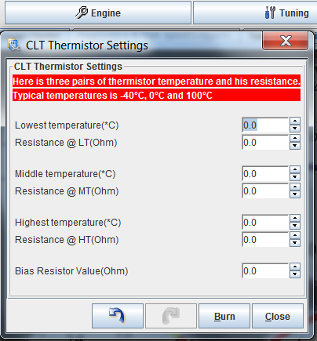

# Temperature Sensing

In order to configure a coolant temperature sensor or intake air sensor you will need to know its resistance at three temperatures - lowest, highest and somewhere in between. You will also need to know the value of the pull-up 'bias' resistor, which together with your sensor makes a voltage divider.

While troubleshooting CLT and IAT, the two most useful console commands are `analoginfo` and `tempinfo`. These show you the voltage registered by rusEFI alongside input pins and resistance processing values.

See also [Measuring Temperature](http://rusefi.com/articles/measuring_temperature/)

## Some data points

[1996 Dodge RAM 1500 V8 Temp spreadsheet from FSM - Forum](http://rusefi.com/forum/viewtopic.php?f=3&t=864&start=60#p15344)

MLX90621

[MLX90620 / MLX90621 - 16X4 pixel IR thermal array](http://forum.arduino.cc/index.php?topic=126244.0)

[MLX90620 Datasheet](https://media.melexis.com/-/media/files/documents/datasheets/mlx90621-datasheet-melexis.pdf)

[Transition from MLX90620 to MLX90621](https://www.melexis.com/en/documents/documentation/how-it-works/how-it-works-transition-mlx90620-mlx90621)

