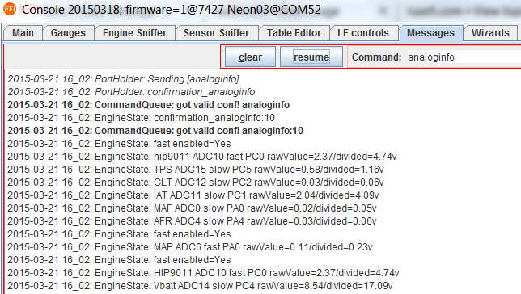
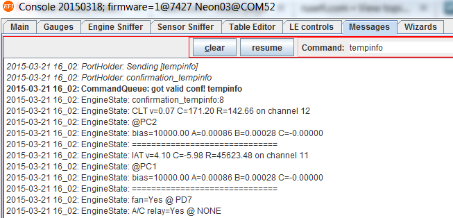
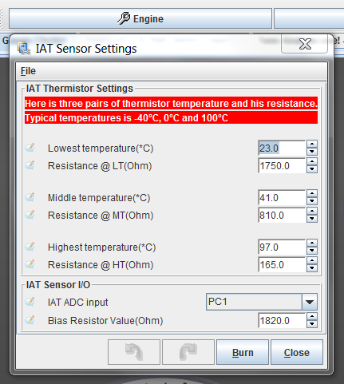

# Temperature Sensing

In order to configure coolant temperature sensor or intake air sensor you would need to know it's resistance at three temperatures - lowest, highest and somewhere in between. You would also need to know the value of pull-up 'bias' resistor, which together with your sensor would make a voltage divider.

While troubleshooting CLT and IAT, the two most useful console commands are `analoginfo` and `tempinfo` - these show you the voltage registered by rusEFI alongside with input pins and resistance processing values.

See also [Measuring Temperature](http://rusefi.com/articles/measuring_temperature/)

See also [Troubleshooting](Troubleshooting)

## Some data points

[1996 Dodge RAM 1500 V8 Temp spreadsheet from FSM - Forum](http://rusefi.com/forum/viewtopic.php?f=3&t=864&start=60#p15344)

MLX90621

[MLX90620 / MLX90621 - 16X4 pixel IR thermal array](http://forum.arduino.cc/index.php?topic=126244.0)

[Broken Link](http://www.melexis.com/Asset/Datasheet-IR-thermometer-16X4-sensor-array-MLX90620-DownloadLink-6099.aspx)

[Transition from MLX90620 to MLX90621](https://www.melexis.com/en/documents/documentation/how-it-works/how-it-works-transition-mlx90620-mlx90621)

