# Toyota 4Runner

[https://docs.google.com/spreadsheets/d/1gp8SxGU_EFDkwlBPFXN4ttVlmq59eoG-xVRPyHyjpw8](https://docs.google.com/spreadsheets/d/1gp8SxGU_EFDkwlBPFXN4ttVlmq59eoG-xVRPyHyjpw8)

## 2004

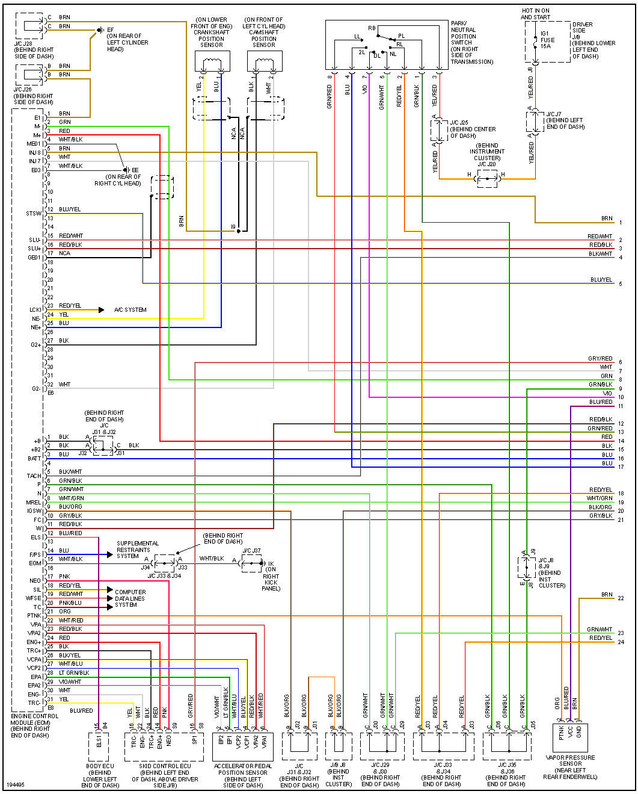

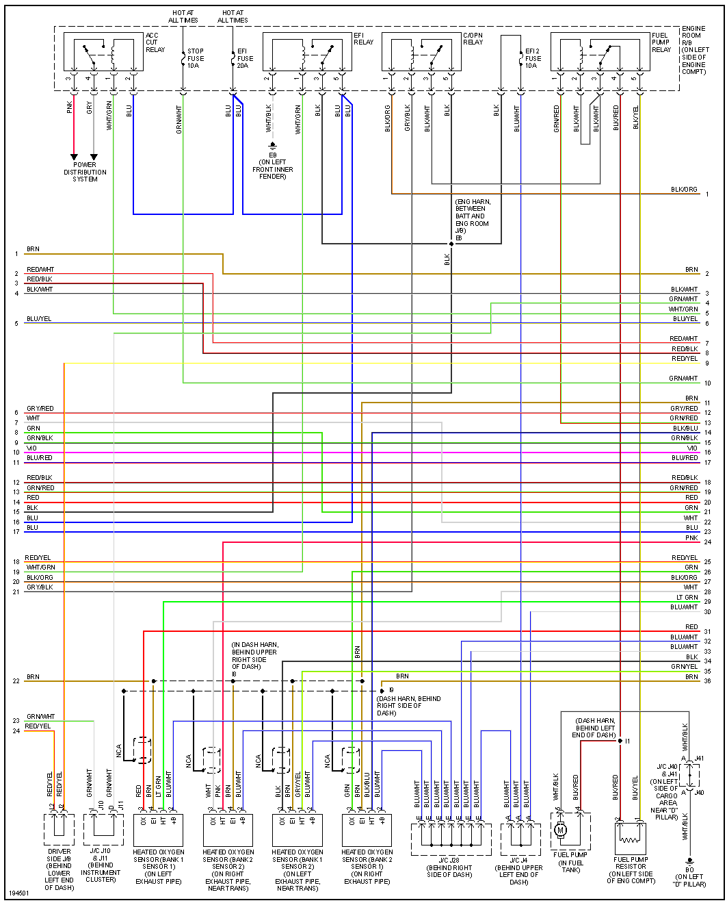

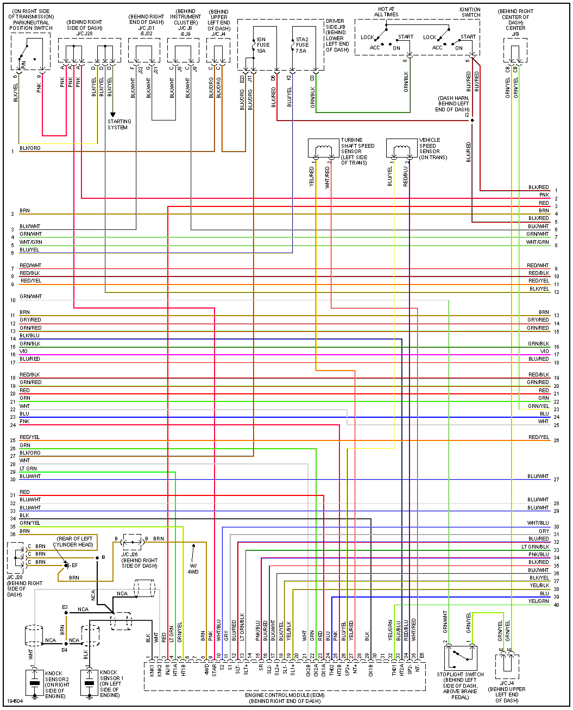

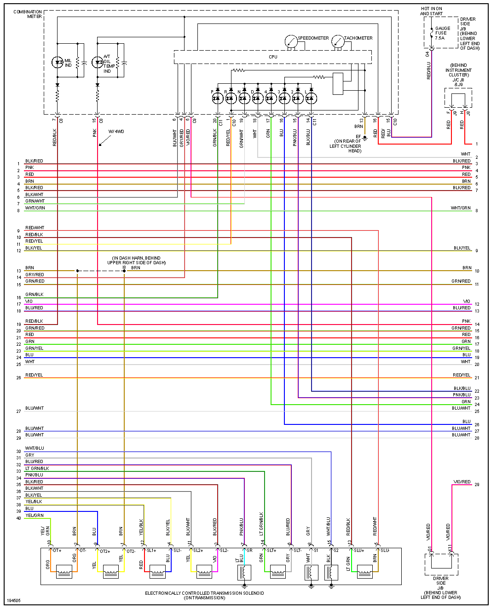

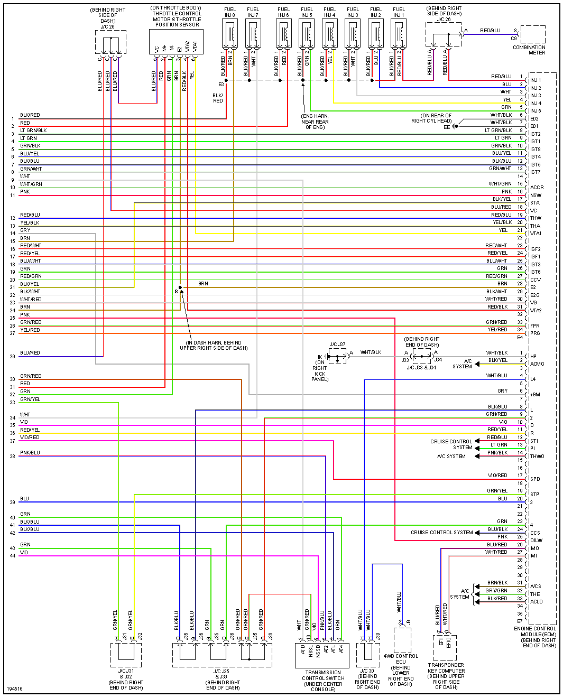

## 2006

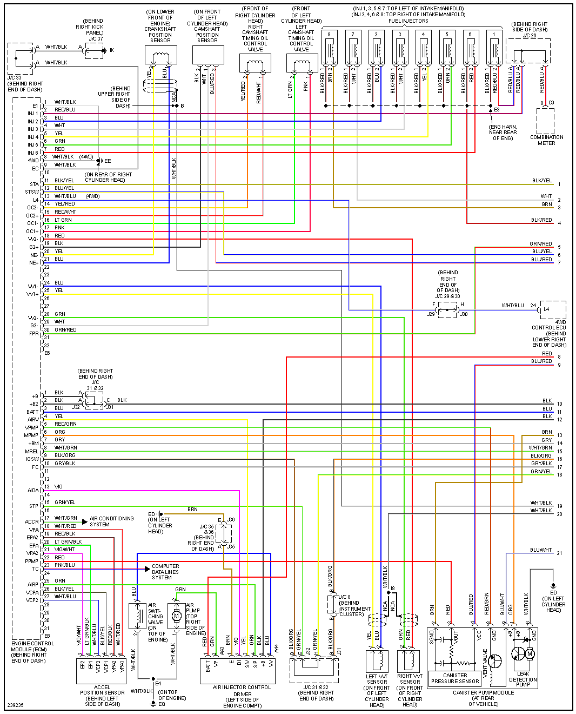

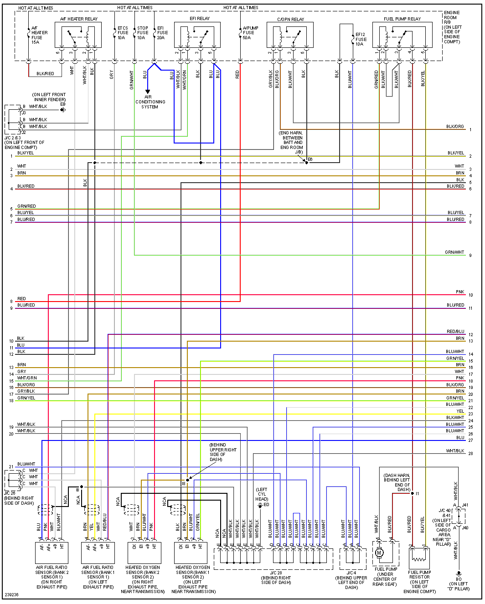

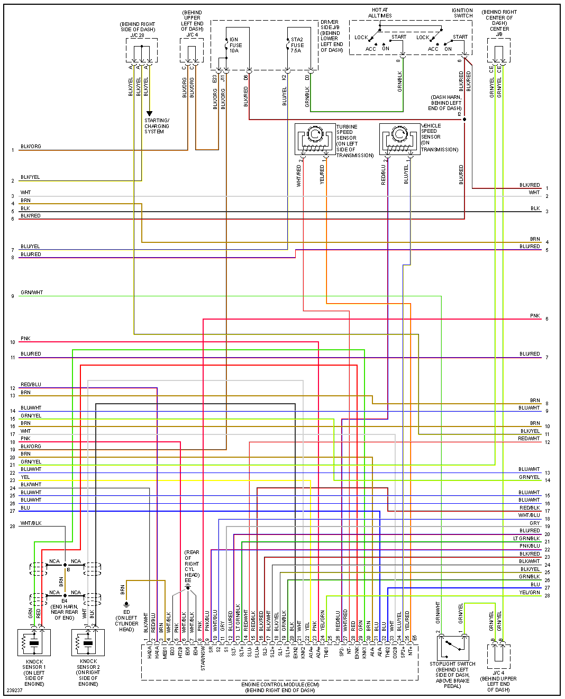

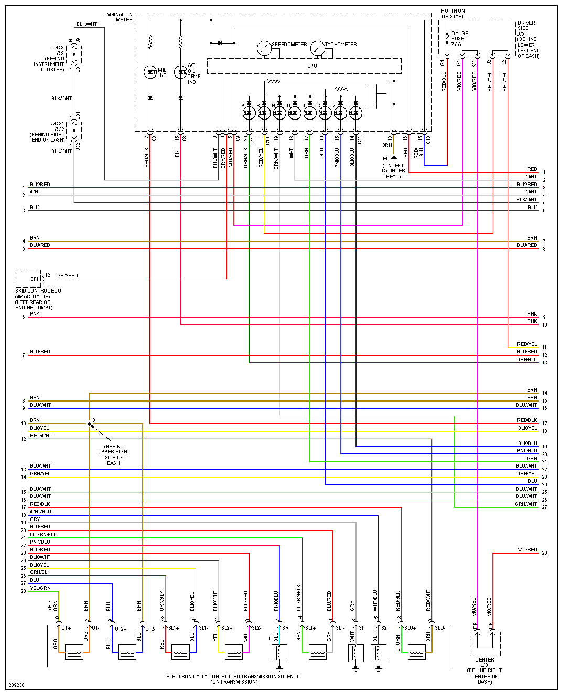

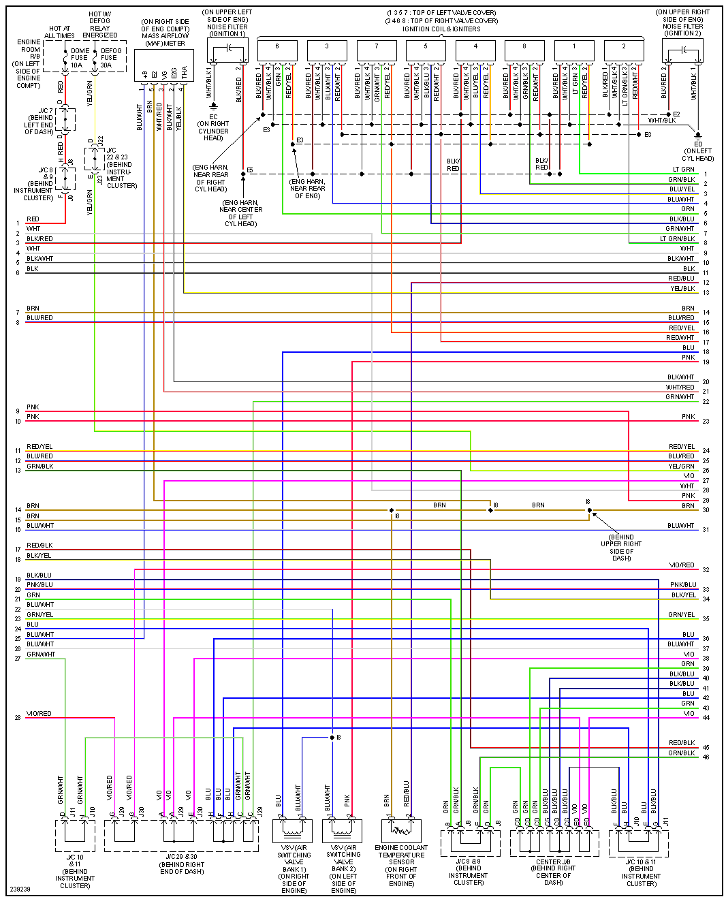

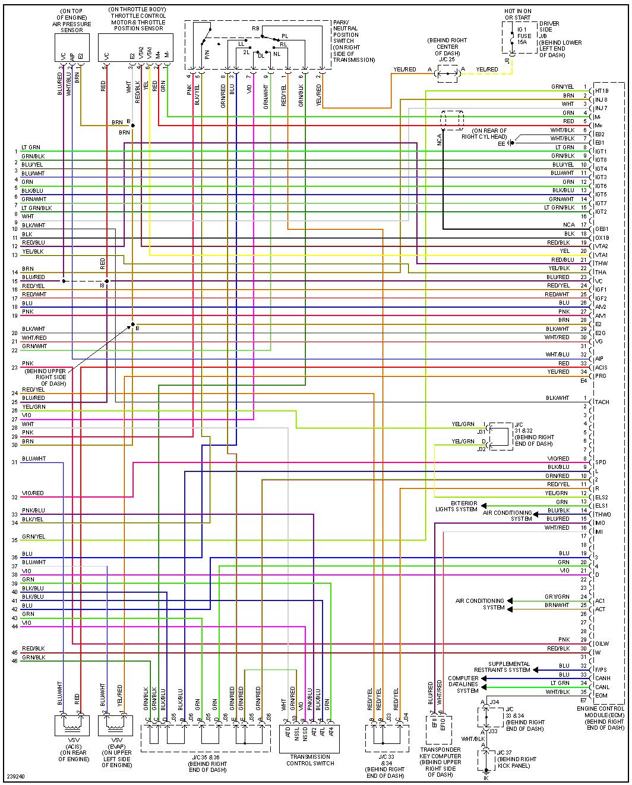
