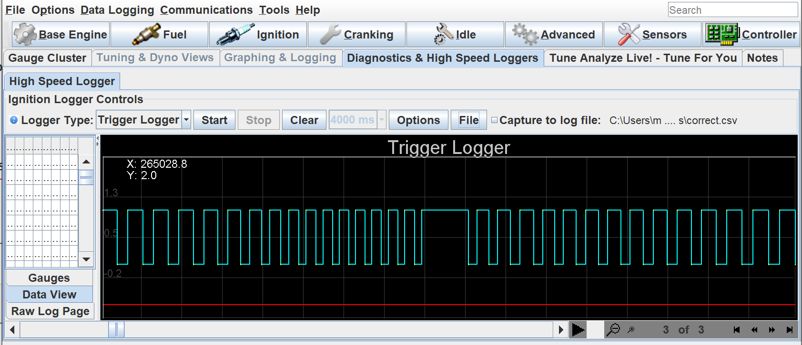
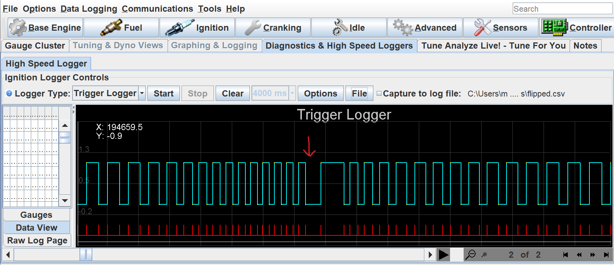
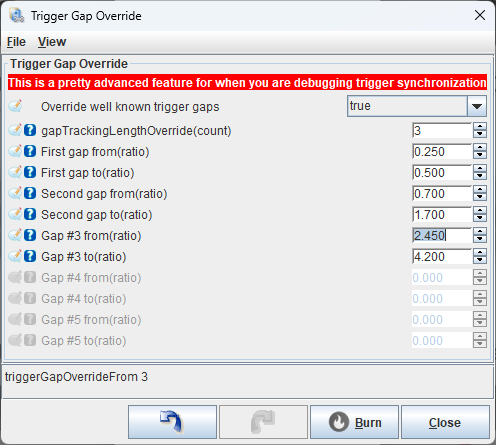
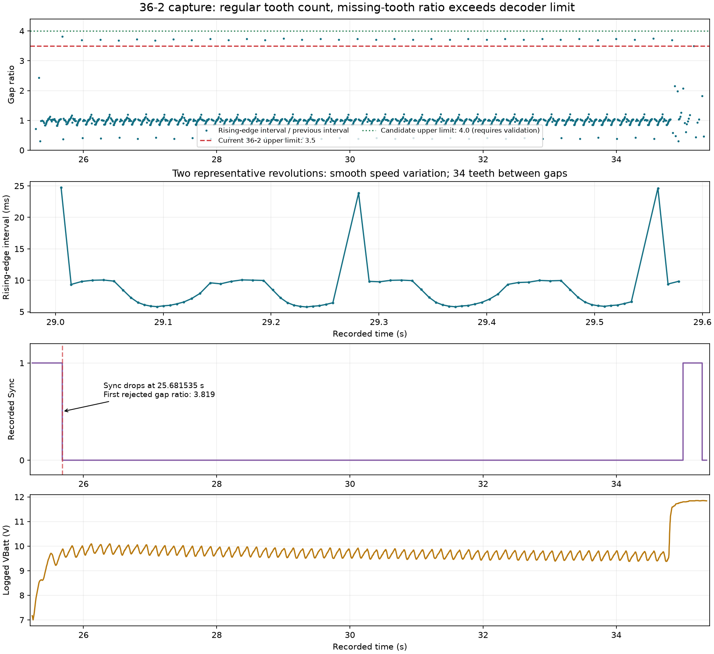

# Trigger Configuration Guide

## Hall Effect Sensors

Optical sensors with comparable digital outputs use the same wiring checks below. Confirm the supply and output specifications for your particular sensor.

### Wiring

Identify the sensor's power, ground, and signal connections from its datasheet or the factory wiring diagram before connecting it. Powered Hall sensors require the correct supply polarity and voltage.

- Connect the power wire to the specified supply, such as 5 V or switched 12 V, following the sensor and ECU wiring instructions.
- Connect the ground wire to the ECU sensor ground specified by the board's wiring guide.
- Connect the signal wire to an input that supports Hall crank/cam signals on your ECU model and revision. Confirm the allowed signal voltage and any required input configuration or hardware jumpers. The sensor's supply voltage alone does not establish its output voltage.
- Confirm the output type. An open-collector or open-drain output needs a pull-up; a push-pull output actively drives both levels. Check the board documentation for any existing or configurable pull-up and whether it suits the sensor. If an external pull-up is required, use the voltage and resistance specified for that sensor/input combination.

Use the [input assignment guide](Trigger#trigger-input-assignments) to choose the logical trigger or cam input, then map it to a connector pin using your board's wiring guide. For example, [microRusEFI wiring](Hardware-microRusEFI-wiring) describes Hall/VR hardware options that vary by board revision.

## VR (variable reluctance) Sensors

### Wiring

VR sensors have two wires, VR+ and VR-, usually with an additional shield that protects these two wires from external noise (mostly from the ignition system). Connect one wire to the VR+ input, and the other to the VR- input. Unfortunately, there is no hard-and-fast standard across manufacturers about which wire is called + and which -, so you essentially have to make an educated guess, then check whether it's correct.

### Determine Correct Polarity

#### ECUs with MAX992x-based VR inputs

The [MAX992x series chips](https://www.maximintegrated.com/en/products/interface/sensor-interface/MAX9924.html) provide an integrated single-chip solution for converting a VR sensor's analog signal to a digital one usable by the micro-controller on the ECU. While these chips are very reliable, they will exhibit incorrect behavior if the VR sensor's wires are swapped. On a negative zero crossing (i.e. voltage decreasing through zero), the output will be exactly aligned with the zero crossing, but on a positive crossing, the threshold is at roughly 1/3 the peak voltage of the VR signal.

Since the zero crossing is the moment with known timing relative to the physical wheel, we want to ensure that the wiring polarity is correct. The shape of the signal received by the ECU at the missing tooth will reveal whether the sensor is wired backwards.

To inspect the missing tooth signal's shape:

1. Wire your ECU's VR sensor and power, with some way to turn over the engine. If the engine already runs (well or not), you can use that too. If you don't want the engine to start, remember to disable fueling and ignition to prevent misfires from an incorrect trigger configuration.
2. On TunerStudio's `Diagnostics & High Speed Loggers` tab, press the **Start** button.
3. Crank (or run) the engine for a few seconds, until you see a trace appear on the screen in TunerStudio, then release the starter.
4. Determine which of the below images matches your trigger pattern:

   **This is the correct missing tooth shape**

   

   **This is the wrong missing tooth shape - swap your wires**

   

   > These images were collected on a Volvo 60-2 trigger wheel, the exact timing may vary, but a long period of low preceding the long high time (marked with arrow on the wrong image) is the clear indicator of a mis-wired sensor. The correct pattern is equally sized low periods, with a single long high period.

5. If your missing tooth looks like the wrong example, swap the VR+ and VR- wires. Repeat steps 2-4, and double-check that it now looks like the good example.
6. In TunerStudio, ensure that "Use only rising edge" is set to `true`, and "Invert Primary" is set to `false`. (found in the menu *Setup* -> *Trigger*). These are the only correct combinations of options for a MAX992x-based VR interface.

#### ECUs with "Bipolar" VR inputs (microRusEFI)

ECUs with bipolar VR sensor interfaces provide accurate zero-crossings for both directions, so inverting the polarity can be done in software, without hardware changes required. You will, however, need to look at the trigger log to determine whether or not to set the "Invert Primary" option.

Here is how to determine your trigger polarity with a bipolar input:

1. Complete steps 1 through 3 of the above procedure for unipolar inputs (crank the engine, collect a trigger log).
2. Determine whether to set "Invert Primary":
    1. If your missing tooth is LOW, then HIGH (looks like the "wrong" example above), set "Invert Primary" to `true`.
    2. If your missing tooth is HIGH, then LOW (looks like the inverse of the "wrong" example), set "Invert Primary" to `false`.
3. In TunerStudio, ensure that "Use only rising edge" is set to `true`.

### I'm a Nerd and Want to Know More

VR sensors output a voltage proportional to how quickly something conductive is moving toward or away from the sensor. This fact is exploited because when the sensor is centered on a tooth, the voltage will rapidly cross zero as the tooth approaches then departs. [More good info and drawings here about how VR sensors work, and which edge you want to listen to](http://mcs.woodward.com/content/motohawk/Documentation/MotoHawk2015bSP0/HTML/MotoHawk_topics/VRInterfacing.html)

## Trigger Gap Override

The **Setup -> Trigger Gap Override** dialog changes the timing-ratio windows used to recognize the synchronization point. Tooth angles and counts remain defined by the selected trigger pattern. Set the [trigger offset](How-Do-I-Set-My-Trigger-Offset) separately to align the decoded position with mechanical TDC.



### What the gap numbers mean

A gap is the time between successive edges used by the decoder. For the built-in **36/2** pattern, synchronization uses rising edges. Measure rising-to-rising intervals, rather than treating every high-to-low transition as another tooth.

At a possible synchronization edge, call the interval just completed `d0`, the previous interval `d1`, and the one before that `d2`:

| Setting | Ratio tested | Source / diagnostic index |
| --- | --- | --- |
| First gap from / to | `d0 / d1` | `gapIndex=0` |
| Second gap from / to | `d1 / d2` | `gapIndex=1` |
| Gap #3 from / to | `d2 / d3` | `gapIndex=2` |

The sequence runs backward in time from the candidate edge. "Second gap" means the preceding interval ratio, not a second missing-tooth region elsewhere on the wheel. `gapTrackingLengthOverride` selects how many consecutive ratios must match; with a value of `2`, both the first and second ranges must pass at the same candidate edge. The ordinary decoder requires ratios strictly between each range's endpoints, so allow measurement margin.

A 36-2 wheel has 36 nominal tooth positions and 34 physical teeth. At constant speed its missing-tooth interval spans three tooth pitches, giving a ratio near `3`. Cranking speed can change considerably within one revolution, so the measured time ratio can differ from the geometrical ratio.

### Where to find the default gaps

Use the firmware version installed on the ECU when looking up defaults. The values below were checked against [rusEFI revision df1467c5b3a](https://github.com/rusefi/rusefi/tree/df1467c5b3ae94cce10e252dd583ea43f6683b67) on 2026-10-06; another release or trigger type can differ.

**On the ECU:** in rusEFI Console's Messages tab, send `triggerinfo`. It prints the selected trigger, synchronization edge and active first range, for example:

```text
gap from 1.60 to 3.50
```

This is the active range, including an override if one is enabled. With overrides disabled and the configuration applied, it shows the built-in first range. It does not list every preceding-gap range. Save the tune before changing settings to inspect defaults, and make these changes with the engine stopped.

For measured ratios and additional active ranges, use `enable trigger_details`, capture a short cranking attempt, then send `disable trigger_details`. Relevant synchronization messages include `gapIndex`, measured `gap`, and `expected from ... to ...`. Indices start at zero, as in the table above. See [Console synchronization diagnostics](Trigger#troubleshooting-synchronization-with-rusefi-console).

**In the source:** search for the selected trigger's enum, such as `TT_TOOTHED_WHEEL_36_2`, in [trigger_structure.cpp](https://github.com/rusefi/rusefi/blob/df1467c5b3ae94cce10e252dd583ea43f6683b67/firmware/controllers/trigger/decoders/trigger_structure.cpp#L686). Follow any decoder/helper function it calls, then check for adjustments made after that call. The 36/2 case explicitly sets:

```cpp
setTriggerSynchronizationGap3(/*gapIndex*/0, /*from*/1.6, 3.5);
setTriggerSynchronizationGap3(/*gapIndex*/1, /*from*/0.7, 1.3);
```

These are two checks: first `1.6-3.5`, then `0.7-1.3`. The `3` in the function name is not the gap index; its first argument is the index. Other patterns may use `setTriggerSynchronizationGap(ratio)` or `setSecondTriggerSynchronizationGap(ratio)`, which expand a nominal ratio using the tolerance helpers in [trigger_structure.h](https://github.com/rusefi/rusefi/blob/df1467c5b3ae94cce10e252dd583ea43f6683b67/firmware/controllers/trigger/decoders/trigger_structure.h#L200). Follow those helpers to obtain the actual bounds. The generic skipped-tooth initializer is in [trigger_universal.cpp](https://github.com/rusefi/rusefi/blob/df1467c5b3ae94cce10e252dd583ea43f6683b67/firmware/controllers/trigger/decoders/trigger_universal.cpp#L43); a generic wheel configured as 36 teeth / 2 skipped need not have the same final windows as the named 36/2 preset.

The editable override fields are separate tune values. Do not assume the values displayed there are a copy of the selected decoder's defaults.

### How to set custom gaps

1. Save the original tune and collect a matching [operating log and trigger capture](Trigger#troubleshooting-with-logs). Confirm the tooth pattern, edge selection and sensor polarity first. Measure both real synchronization gaps and ordinary teeth across several revolutions.
2. With the engine stopped, open **Setup -> Trigger Gap Override** in TunerStudio. The current INI exposes this menu in Full or Installation UI mode; availability also depends on the board's INI.
3. Set **Override well known trigger gaps** (`overrideTriggerGaps`) to **yes**.
4. Set **gapTrackingLengthOverride** to the required number of ratio checks. Enter **every** active from/to pair. Enabling overrides replaces the complete built-in gap sequence; checks beyond the selected count are disabled. Reducing a two-check decoder to one check removes its preceding-gap guard.
5. Keep ranges that already match the capture and adjust the failing range with enough margin for cranking variation. Check that ordinary teeth and startup/stopping transients cannot easily satisfy the resulting sequence. The VVT gap override controls below these fields are separate cam-decoder settings.
6. **Burn** the settings, then confirm the active first range with `triggerinfo`. For a signal-only cranking test, disable injection and ignition. Capture a new log and tune together; compare synchronization and trigger-error counts through acquisition and sustained cranking. Check starting, running and stopping behavior before treating the settings as validated, and verify [timing alignment](How-Do-I-Set-My-Trigger-Offset) before normal operation.

To restore the built-in sequence, set **Override well known trigger gaps** to **no**, Burn, and verify the active range. Stored custom numbers may remain in the tune but are no longer applied.

### Case study: 36-2 cranking gaps exceed the default window

The [original capture, csv_re_261005_192948.teeth](Triggers/36_2/csv_re_261005_192948.teeth), contains 2,368 rows from 25.229980 to 35.355672 seconds. The engine, sensor hardware, firmware version and matching tune were not supplied, so this comparison uses the source revision above rather than claiming to identify the ECU's installed settings.



| Observation | Interpretation |
| --- | --- |
| 35 successive missing-tooth gaps, exactly 34 rising edges between each pair | 34 complete revolutions consistent with a 36-2 wheel, with no extra or missing teeth in that repeating portion |
| Settled revolution-average speed approximately 215-219 RPM | Cranking; the tooth intervals also show substantial smooth variation within each revolution |
| Settled first-gap ratio `3.683-3.746` | Above the named 36/2 preset's `3.5` upper limit |
| Preceding ratio `1.041-1.046` | Comfortably inside the second-gap range `0.7-1.3` |
| First out-of-window gap ratio `3.819` at 25.681319 s; recorded Sync drops at 25.681535 s | The observed loss of synchronization closely matches rejection of that gap |
| Sync remains low until 35.002222 s, then briefly returns during irregular slowing/stopping | Brief late synchronization does not establish correct decoding through cranking |
| Logged VBatt reaches 7.00 V, then approximately 9.38-10.15 V during steady cranking | Cranking supply voltage also needs investigation |

For this analysis, only changes in the Primary signal were counted as crank edges. Repeated rows with an unchanged Primary level, including Sync updates, were not counted as additional teeth. There were no long capture holes interrupting the regular cranking section.

The missing-tooth interval is being compared with the immediately preceding interval while crank speed is changing. A ratio above the ideal `3` therefore does not by itself indicate an extra missing tooth. Here the repeatable 34-tooth count supports 36-2, while the timing ratios explain why the checked decoder windows would reject it.

The following is a **candidate for testing on this capture**, not a new default for all 36-2 installations:

| TunerStudio field | Candidate value |
| --- | --- |
| Override well known trigger gaps | yes |
| gapTrackingLengthOverride | 2 |
| First gap from | 1.6 |
| First gap to | **4.0** |
| Second gap from | 0.7 |
| Second gap to | 1.3 |

An offline check of those two ratio predicates accepts all 35 regularly spaced gaps, preserving the 34-tooth spacing. This was **not a full firmware decoder replay or a hardware test**. Irregular slowing/stopping also produces candidate matches, so acquisition, tooth-count validation and stopping behavior still need testing before adopting the change. No firmware or ECU tune was changed for this analysis.

Falling-edge gap ratios also exceeded `3.5`, so changing edge selection alone would not resolve this particular window mismatch. That observation does not establish correct VR wiring polarity. All cam channels were inactive, and this digital capture cannot establish electrical signal quality or absolute TDC alignment. Those require the appropriate hardware checks and timing verification.

## Related pages

- [Trigger Hardware](Trigger-Hardware) - choosing between Hall and VR sensors, with the pros and cons of each.
- [Triggers](Trigger) - trigger overview: how rusEFI reads crank/cam position, plus troubleshooting.
- [All Supported Triggers](All-Supported-Triggers) - list of built-in trigger patterns with diagrams.
- [Setting Trigger Offset](How-Do-I-Set-My-Trigger-Offset) - setting the global trigger angle offset.
- [Unknown Trigger](Unknown-Trigger) - what to do when your trigger pattern is not yet supported.
