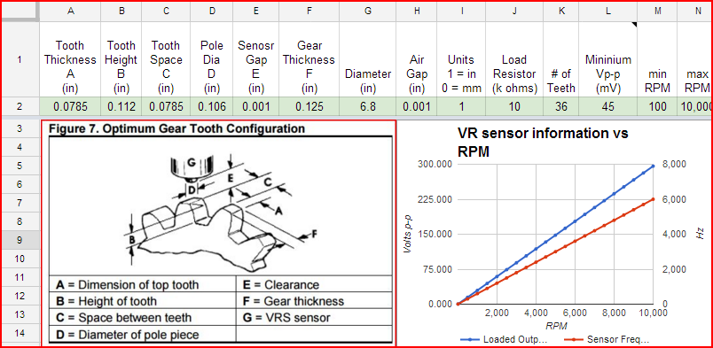

# Trigger Hardware

## Quick Links

[More information about the rusEFI trigger handling software logic](Trigger)

## Summary

The hardware takes cam and/or crank signals from VR, Hall, optical and/or other sensors, and converts them into clean digital pulses that can be used by the MCU.

This page contains information about the Variable Reluctance (VR) style sensor, commonly used for detecting angular rotation (RPM).

## Notes

If the above didn't detail specifically what you need, here are some notes that may provide what you are looking for. Both Hall and VR can detect shaft RPM at the reasonably fast RPM and reasonably slow RPM found in a typical engine. Both can detect the shaft angle at resolutions that are around .01 to .02 degrees of rotation. However there are some differences between the two technologies. These differences typically mean that Hall is a better technical choice of sensor if you have the option to choose your sensor.

### Hall notes

[This is a useful app note about hall sensors](PDFs/Hallbook.pdf).

#### Pros of Hall vs VR

* Halls typically work from around -40C to 150C, which is typically good enough for engine applications.
* Halls can detect 0 RPM
* Halls have very good immunity to EMI. The reasonably low impedance of the 5V pulses coming out of the sensor typically does not require special wiring consideration.
* Halls are low voltage, so you don't need to take higher voltages into consideration or concern beyond your normal ESD protections.

#### Cons of Hall vs VR

* Hall sensors typically have internal self-adjusting circuitry, which causes a certain amount of jitter on the output signal as the sensor is auto-hunting for optimal values. The jitter is typically less than .02 degrees throughout the normal RPM range of an engine.
* Lower max temperature rating limits where you can physically mount the sensor.

### VR notes

#### Pros of VR vs Hall

* VR sensors can easily be made to work at high temperatures around 300C, which is handy for jet engine applications.
* VR sensors *can* have less jitter, but this is dependent on the sensing circuit's design.

#### Cons of VR vs Hall

* Cannot read down to 0 RPM. Depending on the sensor and sensing circuit, they might not work below 50-100 RPM.
* At high RPM, high voltages are generated that must be accounted for in the design of the ECU.
* At low RPM, the signal is at a low voltage that can be more easily influenced by EMI noise from things like spark, causing false triggers, requiring extra shielding of the wiring.

#### VR lower level details, formulas, app notes, etc

VR's have many critical characteristics that need may be of concern. The variations in design will result in different minimum and maximum RPM, noise immunity, and other such items that affect proper detection of the shaft angle. There are critical dimensions and critical materials used in parts of a VR that need to be taken into consideration. There are some equations and examples noted on [this application note](PDFs/VRS_App_Note_005934-2-EN_Final_26Jun12.pdf) These equations help you determine the minimum RPM, load resistor, and voltages produced at higher RPM.

There is a condensed version of this app note found [here](PDFs/VRS_output_voltage_calculations.pdf).

As an example, see the below spreadsheet that includes the information from the above application note. This is a starting point and you can copy [this spreadsheet](https://docs.google.com/spreadsheets/d/1zjY_75mM5rDzKeJ_xcjCDBJ1z_Nbhw614xTaEh1eNq0/edit#gid=1410395179) then enter specifics relative to your application.

It's good practice to design to at least 300V or better, especially if you expect more than 6kRPM, and you don't know your VR sensor. However most VR sensors only get up to around 50V. See the below screenshot of the above spreadsheet. It shows a 10kRPM 36 tooth VR design that would generate 300V.

[One forum member noted their motorcycle VR goes up to 380Vp-p](https://rusefi.com/forum/viewtopic.php?p=13981#p13981).
