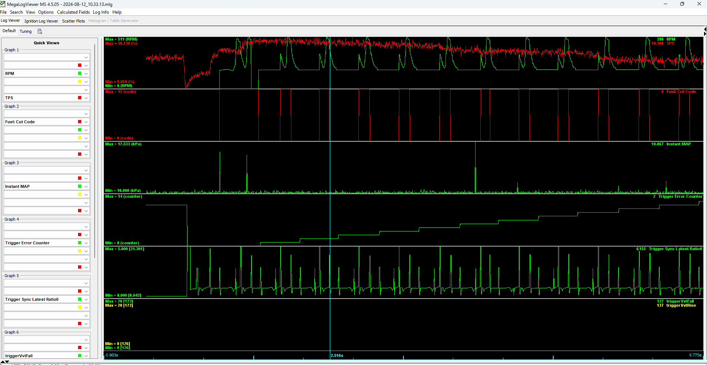
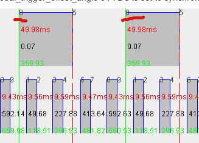

# Triggers

See [list of all supported triggers](All-Supported-Triggers)

See also [Trigger Configuration Guide](Trigger-Configuration-Guide)

See also [Setting Trigger Offset](How-Do-I-Set-My-Trigger-Offset)

See [Trigger Hardware](Trigger-Hardware) for some notes on the difference between Hall and VR sensors.

## Troubleshooting Trigger Input

We use engine sniffer and composite logger only for basic validation at the moment. Please use regular TS logs with a higher data rate if adjustments to trigger gaps are needed. The logs collected with "Data Logging" -> "Start Logging" are the only kind worth sharing.

### Troubleshooting with TS logs

We have not found composite logger useful for trigger troubleshooting. Max data rate 'normal' logs seem to be much more useful.

### Troubleshooting Hardware with rusEFI Console

Use the `triggerinfo` command (go to Messages tab; you can either type or use a button from the panel on the right) to confirm input pin(s). Also use the `triggerinfo` command to see how many trigger events were registered by the firmware ("trigger#1 event counters up=x/down=y").

Use `reset_trigger` to reset the counters if needed.

If using an unknown sensor, confirm the sensor signal. In the case of a Hall type sensor inside the distributor, provide power to the sensor and read the output. A typical sensor switches from ground to floating.

The next step is testing the ECU board itself:

Test #1: Ground input channels 11 and 12 and check what you read on W211 and W212.

Test #2: Float input channels 11 and 12 and check what you read on W211 and W212.

### Troubleshooting Synchronization with rusEFI Console

Type `enable trigger_details` in rusEFI Console to enable verbose synchronization logging. Post the ""Messages" output on the forum.

The "print sync details to console" option in TunerStudio enables the same output, but the output still goes only to rusEFI Console.

### Troubleshooting with TunerStudio

In TunerStudio, there is a "Triggers" gauge category with some gauges that can be helpful for troubleshooting trigger errors.

## Trigger Simulation

rusEFI has a feature of trigger signal emulation on Trigger Simulator Pins. All channels of trigger input would be simulated on corresponding channels of Trigger Simulator.

At the moment rusEFI has no means for VVT/camInput simulation.

## Q & A

*__Q:__ What is the `globalTriggerAngleOffset` configuration parameter?*  
__A:__ In the engine sniffer tab in rusEFI console, there is a signal front with "0" next to it. That's the trigger synchronization event on the primary trigger line. The trigger synchronization always happens at one of the rise or fall events of the primary trigger. globalTriggerAngleOffset is the angle distance between synchronization point and cylinder #1 top dead center. TDC#1 is represented by the green line.

*__Q:__ How do I confirm that the ECU knows the correct top dead center #1 (TDC) location?*  
__A:__ See [Setting Trigger Offset](How-Do-I-Set-My-Trigger-Offset)

*__Q:__ What are the `ignitionOffset` and `injectionOffset` configuration parameters?*  
__A:__ These are one of the ways to offset the whole timing map or define the injection angle. Both should stay zero under normal circumstances.

*__Q:__ Where does the camshaft signal go and where does the crankshaft signal go?*  
__A:__ It depends, but a rule of thumb is that if you have both a camshaft position sensor and a crankshaft position sensor, the camshaft is always trigger#1 input and the crankshaft is trigger#2. In this case we use trigger#1 (cam) to know which cylinder is which, and trigger#2 (crank) to know the precise angle position.

Here is a picture with a one-tooth cam sensor and a 60/2 crank:

*__Q:__ What does `total errors` mean in triggerinfo output?*  
__A:__ This is total count of how many times we detected an unexpected number of teeth per trigger cycle since ECU reboot. `isError` means that we had issues with 4 of the last 6 cycles. We also turn `triggerErrorPin` on in case of trigger error - you can wire an LED to see trigger error. Total errors can also be displayed as a TunerStudio gauge.

*__Q:__ Sync is not reliable; how do I see more details?*  
__A:__ Try the `enable trigger_details` command in rusEFI Console or the "print sync details to console" option in TS. This will produce some helpful messages with synchronization progress details.

*__Q:__ I have a 60/2 crank wheel and I would like to use a cam sensor for fully sequential mode. Should I use "4-stroke with Cam sensor"?*  
__A:__ You can only use "4-stroke with Cam sensor" if your composite trigger shape is known to rusEFI. If you are adding a cam trigger to 60/2, rusEFI probably does not know this combination with all the angles precisely. The way to add sequential to a skipped-tooth crank wheel is via cam input mode, the same as is used for [VVT](VVT).
In this case, your known crank shape is used for shaft position lookup and your cam is only used for phase lookup - the exact cam sensor angular position is less important.
