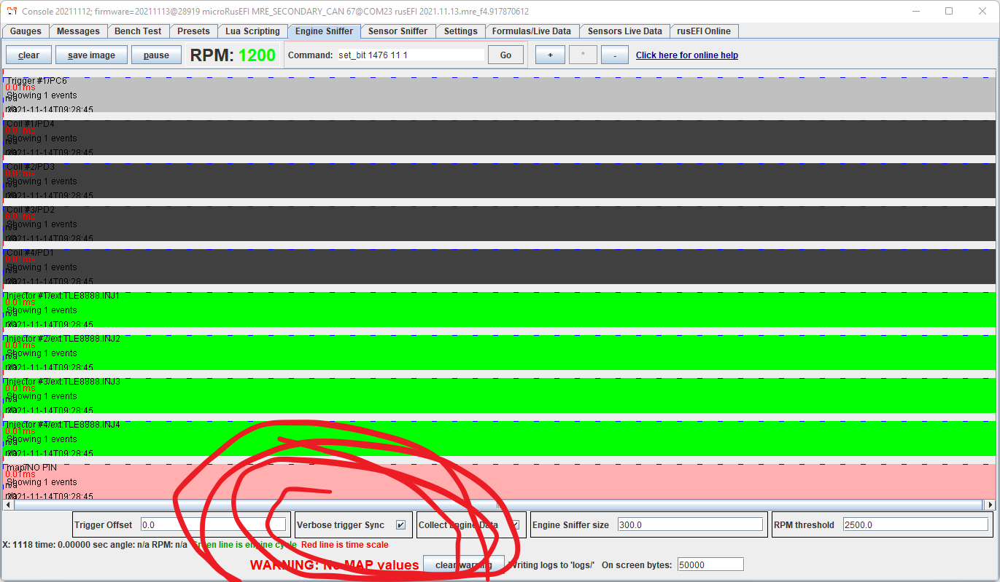
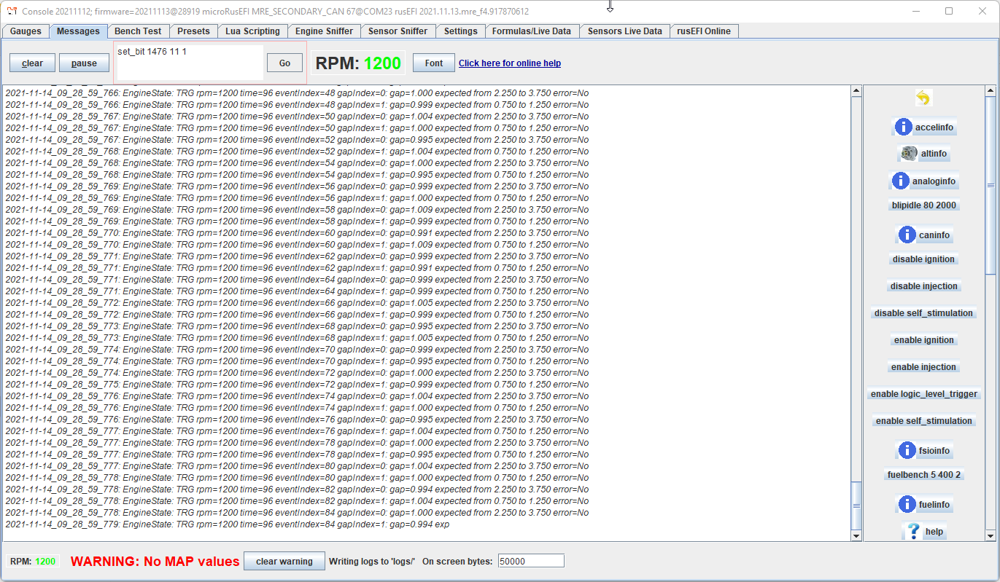
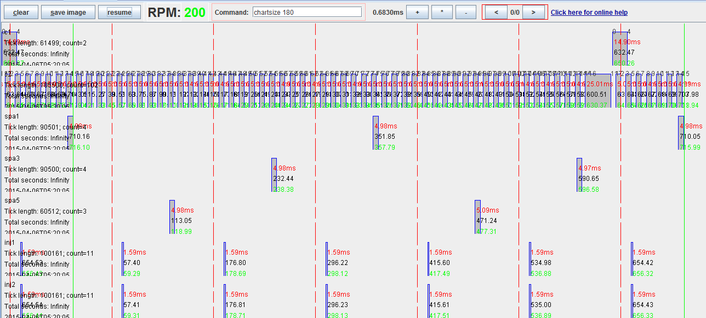

# Triggers

See [list of all supported triggers](All-Supported-Triggers)

See also [Trigger-Configuration-Guide](Trigger-Configuration-Guide)

## Time to document trigger gap override

https://github.com/rusefi/rusefi_documentation/issues/498

Need help with https://github.com/rusefi/rusefi_documentation/issues/499

## Troubleshooting trigger input

We use engine sniffer and composite logger only for basic validation at the moment. Please use regular TS logs with higher data rate if adjustments to trigger gaps are needed. "Data Logging">"Start Logging" is the only kind of logs worth sharing.

### Troubleshooting with TS logs

We have not found composite logger useful for trigger troubleshooting. Max data rate 'normal' logs seem to be much more useful.

### Troubleshooting hardware with rusEFI console

Use `triggerinfo` command (go to Messages tab, your can either type or use a button from the panel on the right) to confirm input pin(s). Also use `triggerinfo` command to see how many trigger events were registered by the firmware ("trigger#1 event counters up=x/down=y").

Use reset_trigger to reset counters if needed.

If using an unknown sensor, confirm the sensor signal. In case of Hall type sensor inside distributor, provide power to the sensor and read the output. Typical sensor would be switching from GND to floating.

Next step would be testing the ECU board itself:

test #1: GND input channels 11 and 12, tell me what you read on W211 and W212

test #2: float input channels 11 and 12, tell me what you read on W211 and W212

### Troubleshooting synchronization rusEFI console

Type `enable trigger_details` in rusEFI console to enable verbose synchronization logging. Post from 'Messages" output on the forum.

"print sync details to console" in TS enables the same output but the output still goes only to rusEFI console.

### Troubleshooting with TunerStudio

Enable Trigger Counters

TIME TO UPDATE DOCUMENTATION SEE https://github.com/rusefi/rusefi_documentation/issues/497

Channel #1 counter would be "debug i1" gauge and channel #2 is "debug i2". These values should go up if you are cranking and that confirms that the events are being registered by rusEFI firmware.

## Trigger Simulation

rusEFI has a feature of trigger signal emulation on Trigger Simulator Pins. All channels of trigger input would be simulated on corresponding channels of Trigger Simulator.

At the moment rusEFI has no means for VVT/camInput simulation.

## Q & A

**Q: what is _globalTriggerAngleOffset_ configuration parameter?**

A: On engine sniffer tab in rusEFI console, there is a signal front with "0" next to it. That's the trigger synchronization event on the primary trigger line. The trigger synchronization always happens at one of the rise of fall of the primary trigger. globalTriggerAngleOffset is the angle distance between synchronization point and cylinder #1 top dead center. TDC#1 is the green line by the way.

**Q: how do I confirm that ECU knows the correct top dead center #1 (TDC) location?**

A: Disable injection. Set whole timing map to 0 or to 10, whatever is easier to confirm with a timing gun. Set whole IAT timing correction to zero so that it does not correct your timing. Crank the engine (injection disabled) and confirm that timing advance on the console/TS gauge matches what the timing light is giving you. If there is an offset adjust globalTriggerAngleOffset accordingly. It's a good idea to confirm that the output LED for the corresponding channel is blinking and bench-test spark if possible.

**Q: what are _ignitionOffset_ & _injectionOffset_ configuration parameters?**

A: there are one of the ways of offsetting the whole timing map or define the injection angle. Both should stay zero under normal circumstances.

**Q: where does camshaft signal go and where does crankshaft go?**

A: it depends, but a rule of thumb is that IF you have BOTH camshaft position sensor and crankshaft position sensor, camshaft is always trigger#1 input and then crankshaft is trigger#2. This case we use trigger#1 (cam) to know which cylinder is which, and trigger#2 (crank) to know precise angle position.

Here is a picture with a one-teeth cam sensor and a 60/2 crank:

**Q: what does _total errors_ mean in triggerinfo output?**

A: this is total count of how many times we detected unexpected number of teeth per trigger cycle since ECU reboot. _isError_ means that we had issues with 4 of the last 6 cycles. We also turn _triggerErrorPin_ on in case of trigger error - you can put an LED to see trigger error. total errors also could be displayed as TS gauge.

**Q: Sync is not reliable, how do I see more details?**

A: try _enable trigger_details_ command in console or "print sync details to console" option in TS. This would produce some helpful messages with synchronization progress details.

_Q: I have a 60/2 crank wheel and I would like to use a cam sensor for fully sequential mode. Should I use "4-stroke with Cam sensor"?_

A: You can only use "4-stroke with Cam sensor" if your composite trigger shape is known to rusEFI. If you are adding a cam to 60/2, rusEFI probably does not know this combination with all the angles precisely. The way to add sequential to a skipped-tooth crank wheel is via cam input mode, same as used for VVT (see also [VVT](VVT))
This case your known crank shape is used for shaft position lookup and your cam is only used for phase lookup - exact cam sensor angular position is less important.

See also [VVT](VVT)
