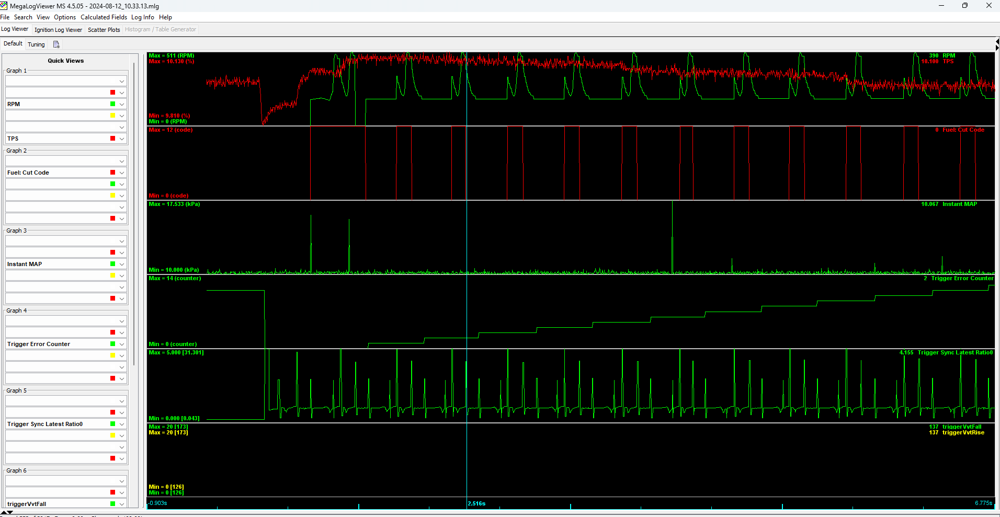
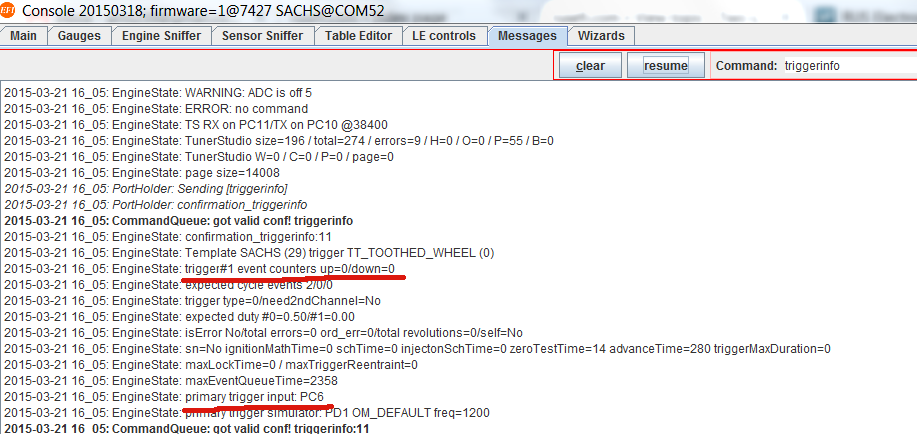
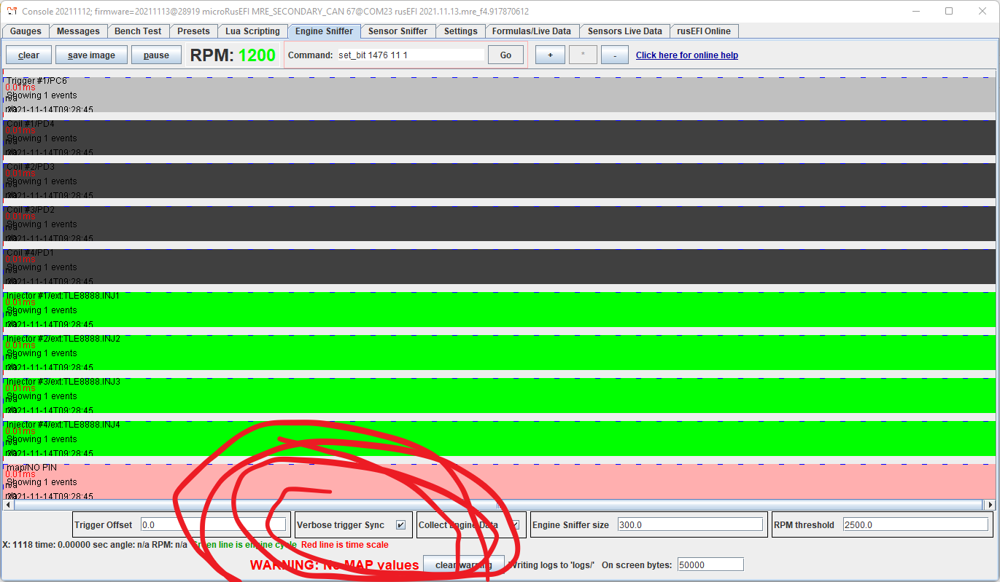
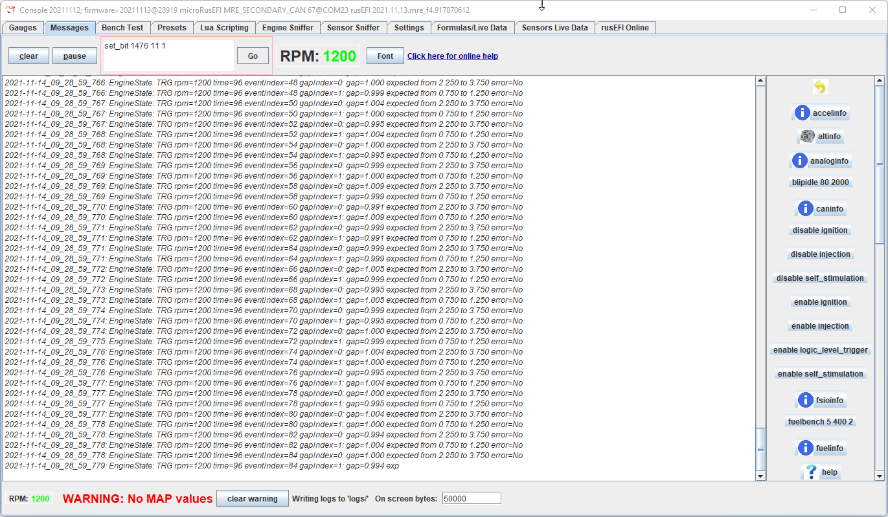
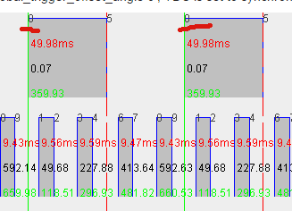

# Triggers

See [list of all supported triggers](All-Supported-Triggers)

See also [Trigger Configuration Guide](Trigger-Configuration-Guide)

See also [Setting Trigger Offset](How-Do-I-Set-My-Trigger-Offset)

See [Trigger Hardware](Trigger-Hardware) for some notes on the difference between Hall and VR sensors.

See [Unknown Trigger](Unknown-Trigger) for what to do when your trigger pattern is not yet supported.

## Troubleshooting Trigger Input

Start with a regular TunerStudio operating log and the tune used for that attempt. Use the evidence matrix below to choose additional captures for the problem you are investigating.

### Troubleshooting with logs

For trigger synchronization problems, set TunerStudio's data rate to **Max reads per second**, then use **Data Logging** -> **Start Logging**. Capture the failing attempt and stop the log afterward. See the [Logging Guide](Logging-Guide#tunerstudio-logging) for the steps.

Share the current tune with the log, identify the time of the failure, and include the ECU model/revision, firmware version, engine, trigger pattern, sensor types, and input wiring. Keep each log paired with the settings used to produce it, especially when changing trigger gap settings.

#### Evidence matrix

| Evidence | What it helps diagnose | What to share and its limits |
| --- | --- | --- |
| Regular TunerStudio operating log | RPM, battery voltage, trigger diagnostics, and engine behavior during the fault | Share the original log and matching tune. Use the maximum data rate for synchronization diagnosis. This log samples operating data; it does not record every tooth edge. |
| Console or SD operating log | Engine behavior when a TS log is unavailable | Identify the logging method and rate and include the tune. Available fields and rates can differ; an SD operating log and an SD tooth log serve different purposes. |
| Engine sniffer or composite capture | Basic pattern validation, edge selection, and crank/cam relationship | Include enough of the trace to show a complete engine cycle, channel labels, and the regular log/tune. Share the capture file when available; an image helps illustrate the pattern. These traces show the ECU's digital interpretation of the inputs. |
| TunerStudio tooth log | Basic tooth-interval inspection | Share it alongside the operating log/tune. Its timing has limited precision; use regular logs for gap diagnostics and consult a developer about a suitable capture for precise replay. |
| Console Messages output | Input activity and synchronization details | Save `triggerinfo` before and during cranking and relevant verbose synchronization messages. Include the log/tune so the messages can be interpreted in context. |
| SD tooth capture | Detailed edge analysis and developer regression tests | Include the original file, capture mode/format, firmware version, and tune. Supported captures can be replayed in unit tests; confirm the format and any required conversion with the developer. |
| Oscilloscope capture | Sensor voltage, electrical noise, and signal conditioning | Include voltage/time scales, channel labels, probe locations, and RPM; share exported data when available. An annotated image can help explain an electrical fault. Include the operating log/tune to connect the electrical evidence to ECU behavior. |

A sniffer TDC marker comes from the ECU's configuration. Verify mechanical timing with the [timing-light procedure](How-Do-I-Set-My-Trigger-Offset).

### Troubleshooting Hardware with rusEFI Console

Use the `triggerinfo` command (go to Messages tab; you can either type or use a button from the panel on the right) to confirm input pin(s). Also use the `triggerinfo` command to see how many trigger events were registered by the firmware ("trigger#1 event counters up=x/down=y").

Use `reset_trigger` to reset the counters if needed.

For a signal-only cranking test, disable fuel injection and ignition in TunerStudio. Confirm the sensor's supply, ground, output type, and signal voltage using its documentation and the wiring guide for your ECU model and revision. See [Hall sensor wiring](Trigger-Configuration-Guide#hall-effect-sensors) and [VR sensor wiring](Trigger-Configuration-Guide#vr-variable-reluctance-sensors).

Compare the input counters before and during cranking. Increasing counters confirm that events are reaching the firmware; also check that RPM and synchronization are stable. If counters do not increase, check power, sensor wiring, and the configured input against the board's pinout.

Use the board's documented test points and procedures for further electrical checks. Connector numbers and test points vary between boards; grounding or applying a test signal to an input requires a procedure for that specific circuit.

### Troubleshooting Synchronization with rusEFI Console

For the meaning of gap ratios, active/default ranges, and custom settings, see [Trigger Gap Override](Trigger-Configuration-Guide#trigger-gap-override), including a [36-2 cranking case study](Trigger-Configuration-Guide#case-study-36-2-cranking-gaps-exceed-the-default-window).

Type `enable trigger_details` in rusEFI Console to enable verbose synchronization logging. Save the Messages output with the log and tune described in the [evidence matrix](#evidence-matrix). Use `disable trigger_details` when finished.

The "print sync details to console" option in TunerStudio enables the same output, but the output still goes only to rusEFI Console.

### Troubleshooting with TunerStudio

In TunerStudio, there is a "Triggers" gauge category with some gauges that can be helpful for troubleshooting trigger errors.

## Trigger input assignments

The assignment depends on the selected trigger pattern and how the cam signal is decoded.

| Setup | Input assignment |
| --- | --- |
| Generic skipped-tooth crank wheel, such as 60-2 or 36-1, with a separate cam phase signal | Crank uses the primary trigger input (trigger #1). Assign the cam to a cam input and select its cam/VVT mode; this can provide phase information even on an engine without variable valve timing. See [VVT](VVT). |
| Single cam/distributor signal providing the engine-position pattern | Use the primary trigger input and a pattern/operation mode appropriate for a cam-speed wheel. |
| Predefined pattern combining multiple crank/cam signals | Follow that pattern's primary/secondary assignments in [All Supported Triggers](All-Supported-Triggers) and its engine-specific setup documentation. The assignments depend on the decoder. |

These are logical input names. Use the wiring guide for your ECU model and revision to map them to physical connector pins, and confirm the configuration with `triggerinfo`. A secondary trigger input and a separate cam input have different roles in the configuration.

<!-- Input assignments and triggerinfo checked against rusEFI revision 0b04635f12b63e5071747c8b2e03ce1cab99b68d: firmware/controllers/trigger/decoders/trigger_universal.cpp, firmware/hw_layer/digital_input/trigger/trigger_input.cpp, and firmware/controllers/trigger/trigger_central.cpp. -->

## Trigger Simulation

rusEFI has a feature of trigger signal emulation on Trigger Simulator Pins. All channels of trigger input would be simulated on corresponding channels of Trigger Simulator.

At the moment rusEFI has no means for VVT/camInput simulation.

## Q & A

*__Q:__ What is the `globalTriggerAngleOffset` configuration parameter?*  
__A:__ In the engine sniffer tab in rusEFI console, there is a signal front with "0" next to it. That's the trigger synchronization event on the primary trigger line. The trigger synchronization always happens at one of the rise or fall events of the primary trigger. globalTriggerAngleOffset is the angle distance between synchronization point and cylinder #1 top dead center. TDC#1 is represented by the green line.

*__Q:__ How do I confirm that the ECU knows the correct top dead center #1 (TDC) location?*  
__A:__ See [Setting Trigger Offset](How-Do-I-Set-My-Trigger-Offset)

*__Q:__ What are the `ignitionOffset` and `injectionOffset` configuration parameters?*  
__A:__ These are one of the ways to offset the whole timing map or define the injection angle. Both should stay zero under normal circumstances.

*__Q:__ Where does the camshaft signal go and where does the crankshaft signal go?*  
__A:__ Follow the [trigger input assignment table](#trigger-input-assignments) for your setup and your ECU's wiring guide for physical connector pins.

*__Q:__ What does `total errors` mean in triggerinfo output?*  
__A:__ This is total count of how many times we detected an unexpected number of teeth per trigger cycle since ECU reboot. `isError` means that we had issues with 4 of the last 6 cycles. We also turn `triggerErrorPin` on in case of trigger error - you can wire an LED to see trigger error. Total errors can also be displayed as a TunerStudio gauge.

*__Q:__ Sync is not reliable; how do I see more details?*  
__A:__ Try the `enable trigger_details` command in rusEFI Console or the "print sync details to console" option in TS. This will produce some helpful messages with synchronization progress details.

*__Q:__ I have a 60/2 crank wheel and I would like to use a cam sensor for fully sequential mode. Should I use "4-stroke with Cam sensor"?*  
__A:__ You can only use "4-stroke with Cam sensor" if your composite trigger shape is known to rusEFI. If you are adding a cam trigger to 60/2, rusEFI probably does not know this combination with all the angles precisely. The way to add sequential to a skipped-tooth crank wheel is via cam input mode, the same as is used for [VVT](VVT).
In this case, your known crank shape is used for shaft position lookup and your cam is only used for phase lookup - the exact cam sensor angular position is less important.
