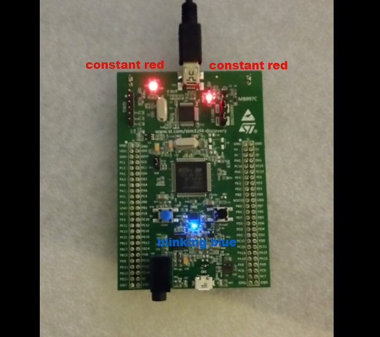
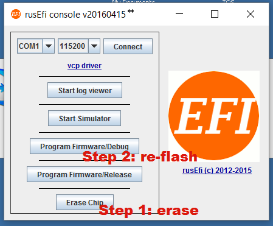

Over the years of developing rusEFI at least 20 of these stm32f4discovery boards were destroyed by just the primary developers. Sometimes we know we've shorted VCC to GND, sometimes the reasons are unknown. TODO: one day we would know more about it

TODO: write down safest operation protocols.

## Does you brain board work?

Remove the green brain board from the ECU and remove all cables. Power brain board with mini-USB - just the top mini-USB, no other cables.

Download latest [http://rusefi.com/build_server/rusefi_bundle.zip](http://rusefi.com/build_server/rusefi_bundle.zip)
Run rusefi_console.exe hit Erase, then hit Program

Expected result: blue LED is constantly flashing. Once your blue LED is constantly flashing, connect micro-USB cable while the green boards is still not connected to anything. The blue LED should start blinking slower. The change in blue LED blinking confirms that your brain board is relatively OK.

## Does you 5v power supply work?

With brain board still removed, apply 12 volts to the power input. Check the 5 volts test pad for 5 voltage with a multimeter.

Expected result: expecting +5 volts on the 5 volt test pad.

## 5 volt regulator tests

1.0 there should be no continuity between pads #2 and #3, #2 and #5, #3 and #4, #4 and #5

1.1 pads #3 and #5 should be both connected to GND

1.2 pads #2 and #4 should have continuity between them. L1001 inductor on F0.4 is the one connecting those.

1.3 with +12v applied pad #1 should read close to +12v

## 5 volts possible problems

2.1 sometimes 5v regulators leads are not aligned and some would be not touching the PCB

2.2 we've seen shorted tantalum 220µF capactors

## Sensor wiring

Invalid sensor readings could be due to faulty wiring or broken configuration. `analoginfo` is the first step in troubleshooting these: with a multimeter, measure voltage on the sensor signal wire while everything is plugged, powered and on (please be careful - everything is on, poking your probe into the wrong spot is the easiest way to burn your board)

What you see on the multimeter should match the 'input' value in the corresponding line of `analoginfo` output.

## CLT and IAT sensors

See Software Temperature Sensors
