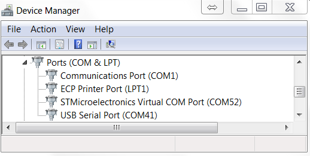
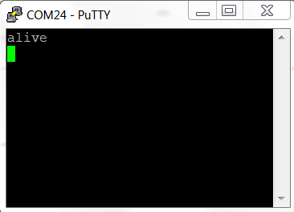
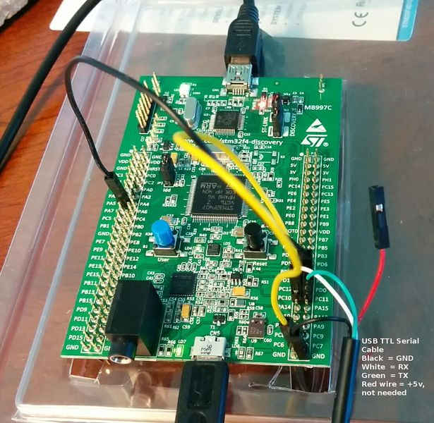

# TunerStudio Connectivity

## Communications Parameters

### COM-port and baud rate


Select the correct COM port for your rusEFI. You will usually see only two COM ports. Chances are, the one with the higher number is the rusEFI COM-port. For most cases, the selected Baud rate does not matter. 

If you can't establish communication, try baud rate 38,400 | 57,600 or 115,200. If that doesn't work, you may need to try a different COM port.

After selecting the COM-port (and baud rate), click on "Test Port". This should result in a "successful!" message. If you get a failed message, you need to adjust your settings. After a successful test of the port click "Accept".

See also: [TunerStudio Console Commands](Dev-Console-Commands#tuner-studio)

## Troubleshooting Tuner Studio connectivity

By default Tuner Studio connectivity is using pin PC10 for TX and PC11 RX. Do not forget about GND wire.

Please be sure to use current firmware version with current rusefi.ini project from [build server](http://rusefi.com/build_server/rusefi_firmware.zip)

First of all make sure that you have serial port drivers installed. STMicroelectronics Virtual for microUSB or USB serial for PC10/PC11



You can test physical connectivity with a terminal application like putty:

1. connect to the TS port
2. type 't'
you are expected to see a response like this:



Q: I try to connect with Tuner Studio and it says 

```text
line:532:rusEfiVersion,20140822@4388 Ford
Aspire,outpin,c1@PC6,outpin,c2@PA5,ou"?
```

A: what you have is a piece of rusEFI own console text-based protocol, you need to connect TS to the other port.

Q: how should it look in Tuner Studio mini terminal?

A: like that. Note that now new lines between 't' symbols, note that at first some random stuff was received once and that's OK


### USB TTL cable

**Question:** found [here](http://rusefi.com/forum/viewtopic.php?f=5&t=210&start=29)

I'd like to try to connect to Tuner Studio and see what happens. I have a USB/TTL device which looks the same as the photo that Andrey posted. What do I connect to what and what is the procedure?

**Answer:**



1. Verify pin assignments for your USB TTL cable.  Colors might be slightly different from what is shown above and there maybe additional wires which are not needed.  Before connecting the TTL to the brain board, connect it to your desktop and install the drivers if required.

2. Once the USB TTL Serial device and drivers are installed, connect GND wire to GND on the brain board

   * connect RX wire of the TTL to pin PC10

   * connect TX wire of the TTL to pin PC11

3. Set up the new serial port @ 38400 with 8/N/1 no flow control using your favorite terminal

4. Hit button 't' on the keyboard. You should get something like this:

   `4073 Alive`

This UART/real serial is just another way to connect either TunerStudio or rusEFI console to the firmware. By combining both microUsb virtual serial and TTL real serial one can connect to rusEFI with both TunerStudio and rusEFI console simultaneously.
