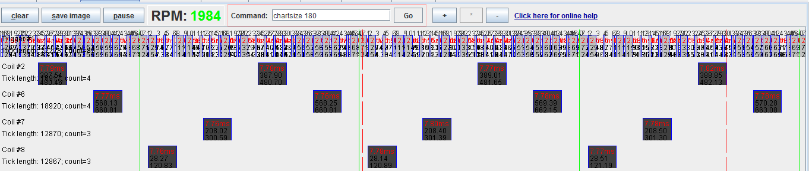

# Unknown Trigger

At the moment the only way to add a new trigger pattern is by having rusEFI developers add a little bit of code into the firmware along the lines of:

s->addEvent(52.960405, T_SECONDARY, TV_RISE);

s->addEvent(122.635956, T_SECONDARY, TV_FALL);

s->addEvent(216.897031, T_PRIMARY, TV_RISE);

s->addEvent(232.640068, T_SECONDARY, TV_RISE);

s->addEvent(288.819688, T_PRIMARY, TV_FALL);

s->addEvent(302.646323, T_SECONDARY, TV_FALL);

s->addEvent(412.448056, T_SECONDARY, TV_RISE);

s->addEvent(482.816719, T_SECONDARY, TV_FALL);

For developers to add the code we need to know the angles of signal rises and falls.

## Step 1: tooth count

Using rusEFI console get a picture of a long enough engine sniff. On this example you see that a cycle of events consists of 24 tooth.

## Step 2: record tooth angles

Once tooth count is know enable a generic toothed trigger. Set Sensor Sniffer mode to 'trigger' and crank the engine for some time to record specific tooth angles. It is recommended to remove spark plugs from the engine to let engine crank freely and more evenly. Specific tooth angles would be logged under 'analog_chart' tag.

`java -cp rusefi_console.jar com.rusefi.AverageAnglesUtil log.csv`

## Step 3: configure synchronization gap parameters

TODO

## Step 4: located TDC

Trigger synchronization is often not happening right at TDC. One would need to find out the angle between synchronization point and Top Dead Cylinder #1.
See [Trigger Q&A](Trigger#q-a)
