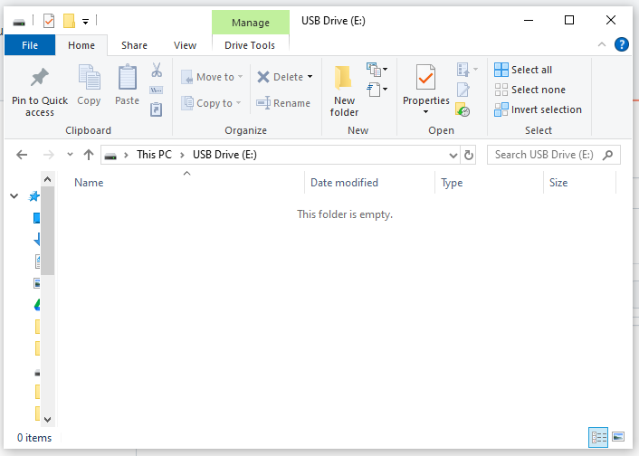

# SD Card

Many rusEFI units have on-board microSD card slot. Most boards access SD cards via SPI. Technically some tiny percentage of SD cards do not support this any more, but it's really a tiny number. See [this issue](https://github.com/rusefi/rusefi/issues/1417).

## Validation Without Vehicle Power

* Windows 10 or Windows 11 is required, Windows 8 and older do not support the rusEFI Mass Storage Device.
* Ignition must be OFF or the ECU not even hooked to vehicle.
* Give it 15 seconds while connected only to PC via USB.
* A USB Drive is expected to apper. It culd be another letter like D:\ or F:\, but it should be in the list of drives.

* In TunerStudio, two green icons are expected:

