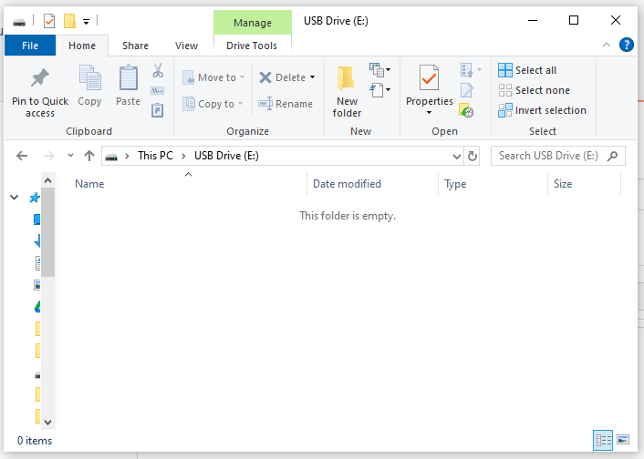

# SD Card

Many rusEFI units have on-board microSD card slot. Most boards access SD cards via SPI. Technically some tiny percentage of SD cards do not support this any more, but it's really a tiny number. See [this issue](https://github.com/rusefi/rusefi/issues/1417).

## Validation Without Vehicle Power

* Windows 10 or Windows 11 is required, Windows 8 and older do not support the rusEFI Mass Storage Device.
* Ignition must be OFF or the ECU not even hooked to vehicle.
* Give it 15 seconds while connected only to PC via USB.
* A USB Drive is expected to apper. It culd be another letter like D:\ or F:\, but it should be in the list of drives.

* In TunerStudio, two green icons are expected:

## SD ownership and MCP control

The SD card can be owned by the ECU for logging/file access or exposed to the PC
as USB mass storage. The live `sdCardMode` byte reports 0 idle, 1 ECU, 2 PC,
3 unmounted, or 4 formatting. Check `sd_present` too. ECU ownership does not
require active logging: logging may be paused or waiting for its trigger.

The ECU MCP server provides `mount_to_ecu` and `mount_to_pc`, with an optional
`timeoutMs` (default 20000, range 1..120000). These tools require firmware and
a matching .ini with `sdCardMode`; they wait for a fresh mount-status report
after the request is acknowledged. The selection lasts until power-off or
the console command `sdmode auto`.

Safely eject the PC drive before switching to ECU ownership. The switch can
disconnect the shared USB console. If completion is unconfirmed, reconnect
and read `sdCardMode` and `sd_present` before retrying. PC mode confirms the
firmware exposed the card, not that the OS assigned a drive letter.

See the [ECU MCP tool reference](https://github.com/rusefi/rusefi/blob/master/java_console/mcp_ecu/README.md).
