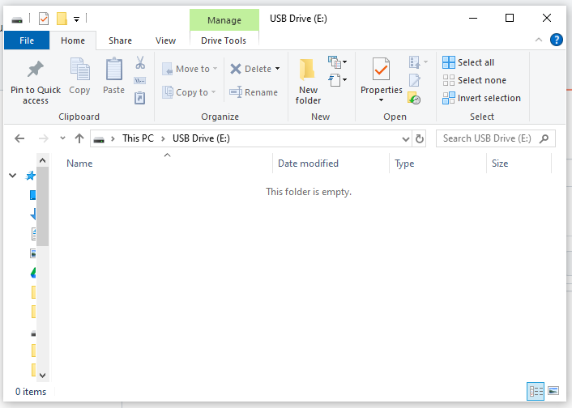

# SD Card

Many rusEFI units have on-board microSD card slot. Most boards access SD cards via SPI. Technically some tiny percentage of SD cards do not support this any more, but it's really a tiny number. See [this issue](https://github.com/rusefi/rusefi/issues/1417).

## Validation Without Vehicle Power

* Windows 10 or Windows 11 is required, Windows 8 and older do not support the rusEFI Mass Storage Device.
* Ignition must be OFF or the ECU not even hooked to vehicle.
* Give it 15 seconds while connected only to PC via USB.
* A USB Drive is expected to apper. It culd be another letter like D:\ or F:\, but it should be in the list of drives.

* In TunerStudio, two green icons are expected:

## Error report on SD

The **Error report on SD** indicator means a saved fault report was found on
the card. Reports survive ECU restarts, so rebooting does not clear this
reminder. Read the report to see what was recorded; the indicator alone does
not identify the cause.

1. Select **Mount to PC** and review the SD drive's contents on your computer,
   or power off the ECU and use a card reader.
2. Look in the card's root folder for `*_fail_*.txt` files, such as
   `00042_fail_HardFault.txt`, and open them in a text editor.
3. Share the **full report contents**, or attach the files, with rusEFI
   developers in your [GitHub issue](https://github.com/rusefi/rusefi/issues)
   or on the [rusEFI forum](https://rusefi.com/forum/). Include your board,
   firmware version and what happened before the message appeared.
4. Copy and share the reports before deleting them or formatting the card.
   To clear saved fault reports, safely eject the SD drive from your computer,
   select **Mount to ECU**, then **Remove all fail reports**.

Removing the files clears the reminder but does not fix the cause. If new
reports appear, save and share those too. The SD Card and Fail reports panels'
**Help** buttons provide these instructions in the tuning UI.

## SD ownership and MCP control

The SD card can be owned by the ECU for logging/file access or exposed to the PC
as USB mass storage. The live `sdCardMode` byte reports 0 idle, 1 ECU, 2 PC,
3 unmounted, or 4 formatting. Check `sd_present` too. ECU ownership does not
require active logging: logging may be paused or waiting for its trigger.

The ECU MCP server provides `mount_to_ecu` and `mount_to_pc`, with an optional
`timeoutMs` (default 20000, range 1..120000). These tools require firmware and
a matching .ini with `sdCardMode`; they wait for a fresh mount-status report
after the request is acknowledged. The selection lasts until power-off or
the console command `sdmode auto`.

Safely eject the PC drive before switching to ECU ownership. The switch can
disconnect the shared USB console. If completion is unconfirmed, reconnect
and read `sdCardMode` and `sd_present` before retrying. PC mode confirms the
firmware exposed the card, not that the OS assigned a drive letter.

See the [ECU MCP tool reference](https://github.com/rusefi/rusefi/blob/master/java_console/mcp_ecu/README.md).
