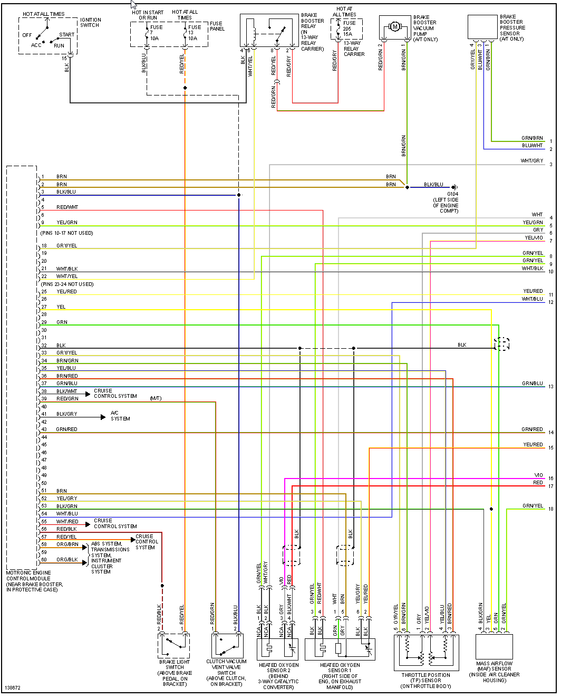
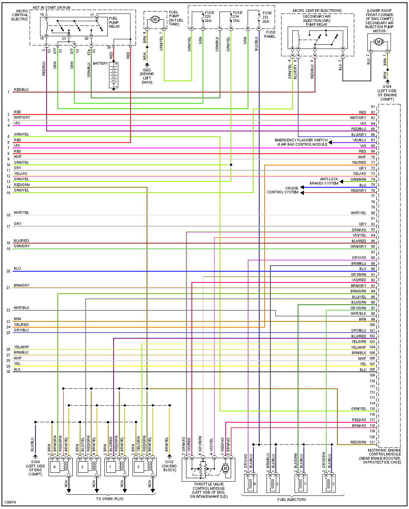
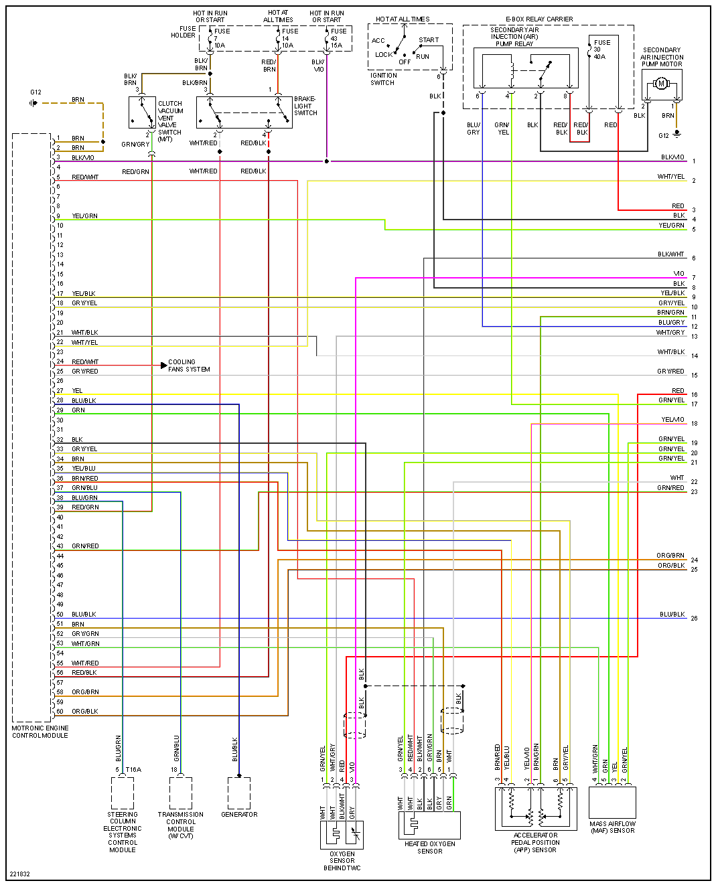

# VAG B5 Platform

[B5 platform - Wikipedia]](<https://en.wikipedia.org/wiki/Volkswagen_Group_B_platform#B5>)

[sensors-2-1_bosch_2013_2014.pdf](OEM-Docs/Bosch/sensors-2-1_bosch_2013_2014.pdf) and [more](https://github.com/rusefi/rusefi_documentation/tree/master/OEM-Docs/Bosch)

| Connector/ Pin Number | OEM Color | Name / Function |
| --------------------- |------- |---------------- |
| 1 | color     | name                          |
| 2 |           | name                          |
| 3 |           | name                          |

## 2000 1.8T

## 2000 2.8

## 2001 1.8T

## 2005 1.8T

