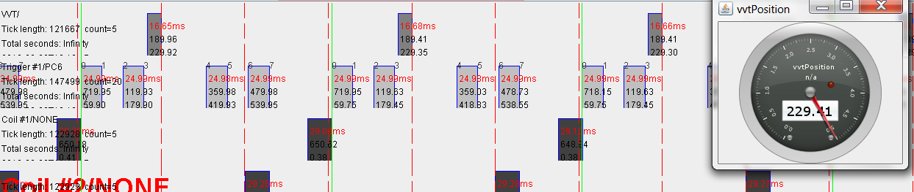
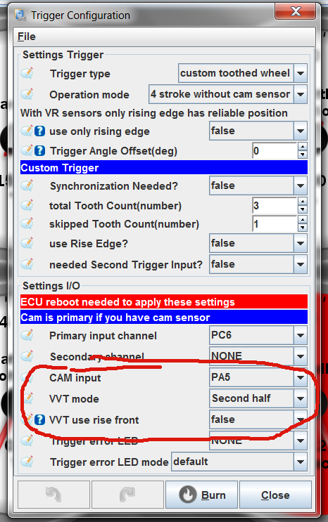

# VVT: Variable Valve Timing

rusEFI has proper closed-loop VVT control, supporting multiple trigger options including:

- "one-tooth"
- Mazda Miata NB (2nd generation)
- Mazda Skyactive
- Toyota 2JZ family
- Bosch Quick Start
- Ford Focus ST 170
- Ford Barra: 3+1
- Nissan VQ family
- Nissan MR18
- Honda K family
- Mitsubishi 3A92
- Mitsubishi 4G92/93/94
- Mitsubishi 4G63
- Mitsubishi 6G75

rusEFI supports up to quad VVT input/output.

rusEFI trigger configuration is the most confusing part of rusEFI configuration, unfortunately.

If rusEFI does not know your exact overall trigger shape and you use a composite setup with a crank sensor driving RPM and a single-tooth cam sensor providing phase information, that's considered "4 stroke without cam with VVT", even if you do not have VVT. :(

## VVT mode 'first half'

This mode could be used for skipped-tooth wheels with single tooth cam sensors in order to support individual injection and coil-on-plug setups.

For example, 3/1 skipped wheel with cam sensor in the first half of the 720 cycle:

Full list see [All Supported Triggers](All-Supported-Triggers)

## VVT control

Beyond decoding cam position, rusEFI can actively **control** variable cam timing in closed loop: it compares the measured cam angle against a target and drives the cam phaser to reach it.

- **Feedback:** the camshaft sensor (`camInputs`) provides the actual cam position. `vvtOffsets` sets the "Angle between cam sensor and VVT zero position", which calibrates the measured cam angle so that the target is meaningful.
- **Target:** separate **VVT intake target** and **VVT exhaust target** tables set the desired cam angle across the operating range.
- **Actuation:** a PID controller drives a PWM output to the cam (oil) control solenoid to move the cam toward the target.
- **Enable conditions:** VVT control only runs above `vvtControlMinRpm`. Cam phasers depend on engine oil pressure and temperature, so control is not expected to work at cold start or very low RPM.

> ⚠️ **Set VVT limits conservatively.** On interference engines, commanding the cam too far can cause valve-to-piston contact and serious engine damage. Confirm the achievable cam range carefully and verify behaviour on a [log](Logging-Guide) before relying on VVT control.

Configure the VVT targets, PID gains, control pins, and limits in TunerStudio; no values are prescribed here.

## Technical sources

- Configuration field definitions: `firmware/integration/rusefi_config.txt` — `vvtControlMinRpm`, `camInputs`, `vvtOffsets`, the VVT intake/exhaust target tables, and the VVT PID.
