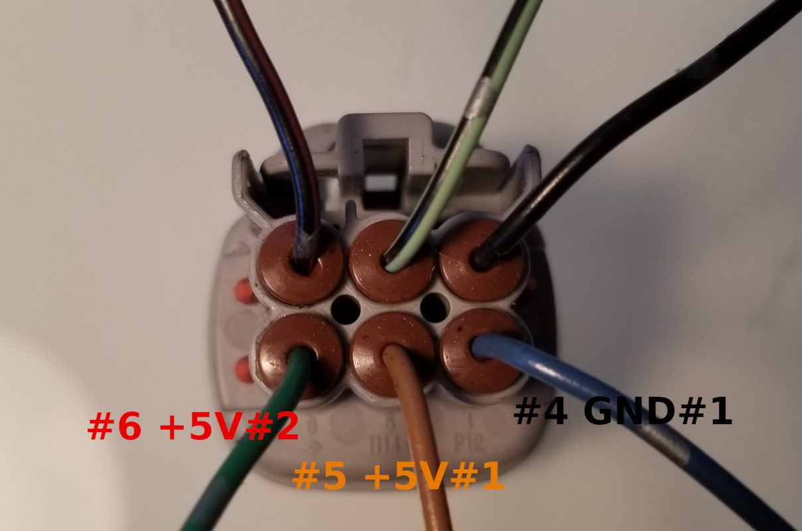

See https://github.com/rusefi/rusefi/wiki/HOWTO_electronic_throttle_body

# VAG pinout
Bosch 0280750009 1.8T and hopefully many others 

5n1973206 connector

# Nissan

Hitachi SERA576-01 60mm

2003 Nissan Altima green plug

Alternative connector. This connector goes all the way to Nissan X-Trail T30 01-07 and Nissan Patrol.

 
 
18002 4z800 Pedal with build-in position sensor - 2004-2007 Nissan Altima Maxima
 
18919-AM810 Pedal Position Sensor (separate from pedal) - Nissan 350Z 2008, Infiniti G35 2007

Wire side connector 6189-0029

