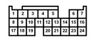
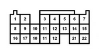

# Vault of Honda OEM Information

## OBD-1

Civic EG gen5 1992-1995

[OBD1 connector part number](OEM-connectors#64-pin)

[1993 Honda Prelude](Honda-Prelude-1993)

[1995 Honda Accord](Honda-Accord-1995)

[ECU Pin diagrams](https://ff-squad.com/technet/wiring.obd1.htm)

[https://github.com/rusefi/proteus-Honda-OBD1-adapter/](https://github.com/rusefi/proteus-Honda-OBD1-adapter/)

## OBD-2

Civic EK gen6 1996-2000

[Proteus OBD2A Adapter](Proteus-HondaOBD2A)

[2a pinout](https://www.ff-squad.com/technet/wiring.obd2a.htm)

[OBD2 connector part number](OEM-connectors#104-pin)

[1996 Honda Civic](Honda-Civic-1996)

[https://github.com/rusefi/proteus-Honda-OBD2A-adapter](https://github.com/rusefi/proteus-Honda-OBD2A-adapter)

## DBC K

[DBC Honda K](OEM-connectors#125-pin)

## K engine plug

[Hellen 125 Honda K](Hellen-125-Honda-K)

[Proteus 125 Pin Adapter](Proteus-Honda125)

A  B  C  D  E 

## Misc

[TPMS CAN trick](Honda-TPMS-CAN-trick)

[Honda-S2000](Honda-S2000)

[Element Diagrams](Honda-Element)

[Element Readme](element-readme)

[2008](Honda-2008)

[bomarc-services-p28.pdf](OEM-Docs/Honda/bomarc-services-p28.pdf)
