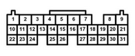
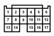
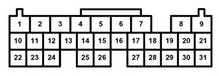

# Vault Of Honda OEM Information

# OBD-1
[OBD1 connector part number](OEM-connectors#64)

[1993 Honda Prelude](Honda-Prelude-1993)

[1995 Honda Accord](Honda-Accord-1995)

[ECU Pin diagrams](https://ff-squad.com/wp/?paged=2&cat=17)

[https://github.com/rusefi/proteus-Honda-OBD1-adapter/](https://github.com/rusefi/proteus-Honda-OBD1-adapter/)

# OBD-2
[OBD2 connector part number](OEM-connectors#104)

[1996 Honda Civic](Honda-Civic-1996)

[https://github.com/rusefi/proteus-Honda-OBD2A-adapter](https://github.com/rusefi/proteus-Honda-OBD2A-adapter)

# DBC K
[DBC Honda K](OEM-connectors#125-pin)

# K engine plug

[https://github.com/rusefi/proteus-Honda-K-125-adapter](https://github.com/rusefi/proteus-Honda-K-125-adapter)

A  B  C  D  E 

# Misc

[Honda-S2000](Honda-S2000)

[bomarc-services-p28.pdf](OEM-Docs/Honda/bomarc-services-p28.pdf)
