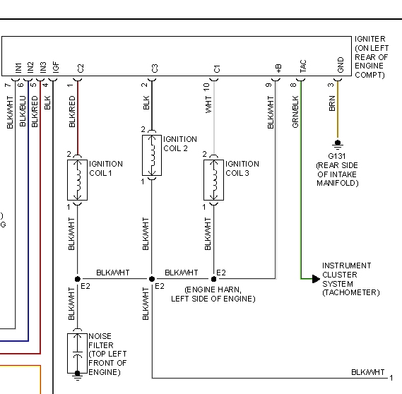
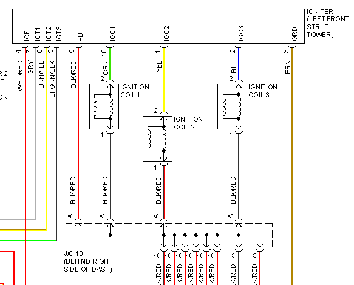

### This page is intended as a container for all trialed ignition components that are external to the ECU. 

---

## Ignition coils 
### Smart coils
* LSx ignition coils - Considered the cheap goto for US users. Can be purchased cheaply from junkyards and Ebay.

### Dumb coils
* BMW M50 coils - Tested and working with VW ignition module

* OEM B-series Honda Single coil for distributor used with the OEM ignition module, 3-4ms dwell

---

## Ignition Modules (aka "ignitors")
* VW 1.8t 4 cylinder module - PN 4D0905351  for igniter location see https://www.youtube.com/watch?v=X-iyKYUeGvc
Tested and working with BMW Coils, uses a pair of ampseal plugs (easily available on ebay). Wiring layout available on the forum. 
Plugs - TE 282193-1 x1, TE 282192-1 x1, TE 929937-3 x9, TE 828905-1 x9

* LX615 OEM B-series Honda ignition module. Pull low to charge, release to fire. 3-4ms dwell, internally pulled up to 12v. Integra Accord Civic Del Sol CRX Prelude (inside the huge distributor, not considered very reliable)

* LX230T 1989-1995 Ford Ranger / Mazda	B2300 4 cylinder 2.3 (in front of the battery, bolted to heat sink)

* Dis4-03 Hitachi 90-96 Subaru 

* Toyota / Lexus 6 cylinder 1998-2005 2JZ GS300 89621-30020

* Toyota 92-95 Camry ES300 89621-33020

 * Toyota 1991-1999 89621-16020

* Toyota 89621-35020

* Bosch 0227100211 - VW Audi 97- 05

* rusEFI's own BTS2140 module http://rusefi.com/forum/viewtopic.php?f=4&t=286

---

* Template for new parts - Part number  
Comments go here, Comments go here, Comments go here, Comments go here.
