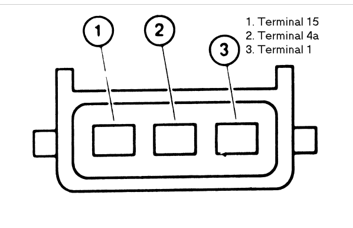
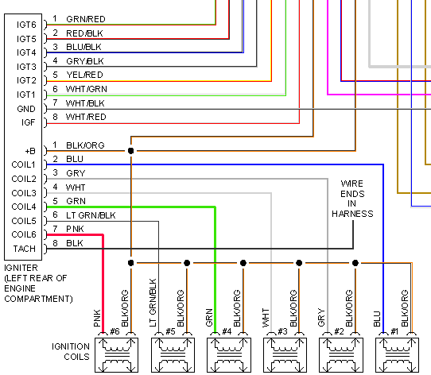
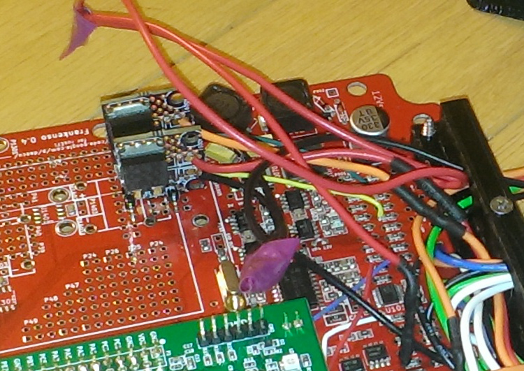

# Vault of Ignition Parts

**This page is intended as a container for all trialed ignition components that are external to the ECU**---

## Ignition coils

### Smart coils

* LSx ignition coils - Considered the cheap goto for US users. Can be purchased cheaply from junkyards and Ebay.

* VAG Normal/Long

See also [OEM-harness-connectors#volkswagen](OEM-harness-connectors#volkswagen)

* VAG Short is different

### Dumb coils

* BMW M50 coils - Tested and working with 4D0905351 ignition module

Pin #1 "15" is +12V

Pin #2 "4a" Body GND

Pin #3 "Negative" from igniter

* OEM B-series Honda Single coil for distributor used with the OEM ignition module, 3-4ms dwell

* Ford V6 wasted spark coil - PN _Unknown_ - Used successfully at about 4-5ms dwell in conjunction with the 4D0905351 ignition module  

---

## Ignition Modules (aka "igniters")

* VW 1.8t 4 cylinder module - PN _4D0905351_  
For igniter location see [broken link](https://www.youtube.com/watch?v=X-iyKYUeGvc)
Tested and working with BMW Coils, uses a pair of Ampseal plugs (easily available on ebay). Wiring layout available on the forum.
Plugs - TE 282193-1 x1, TE 282192-1 x1, TE 929937-3 x9, TE 828905-1 x9  
Also known as: VW Audi 97- 05 - Bosch PN _0227100211_  

* OEM B-series Honda ignition module - PN _LX615_  
Pull low to charge, release to fire. 3-4ms dwell, internally pulled up to 12v. Integra Accord Civic Del Sol CRX Prelude (inside the huge distributor, not considered very reliable)

* 1989-1995 Ford Ranger / Mazda B2300 4 cylinder 2.3 - PN _LX230T_  
(in front of the battery, bolted to heat sink)

* Dis4-03 Hitachi 90-96 Subaru

* Toyota / Lexus 6 cylinder 1998-2005 2JZ GS300 - PN _89621-30020_  

* Toyota 92-95 Camry ES300 - PN _89621-33020_  

* Toyota 1991-1999 - PN _89621-16020_  
Harness side connector Sumitomo _6189-0515_ Toyota _90980-11653_

* Toyota - PN _89621-35020_

* [rusEFI's own BTS2140 module](http://rusefi.com/forum/viewtopic.php?f=4&t=286)

---

Template for new parts

* Name - PN _Part number_
Comments go here, Comments go here, Comments go here, Comments go here.
