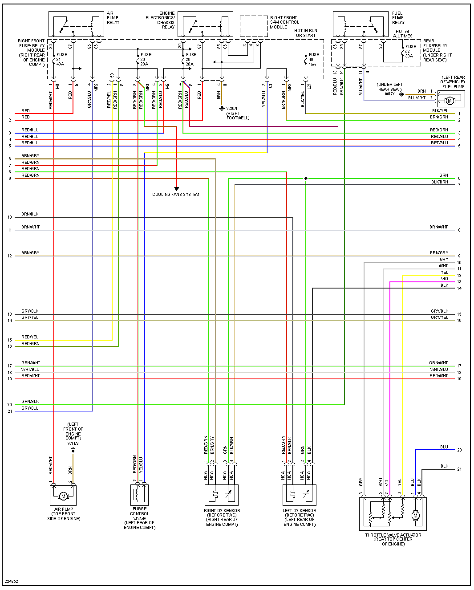
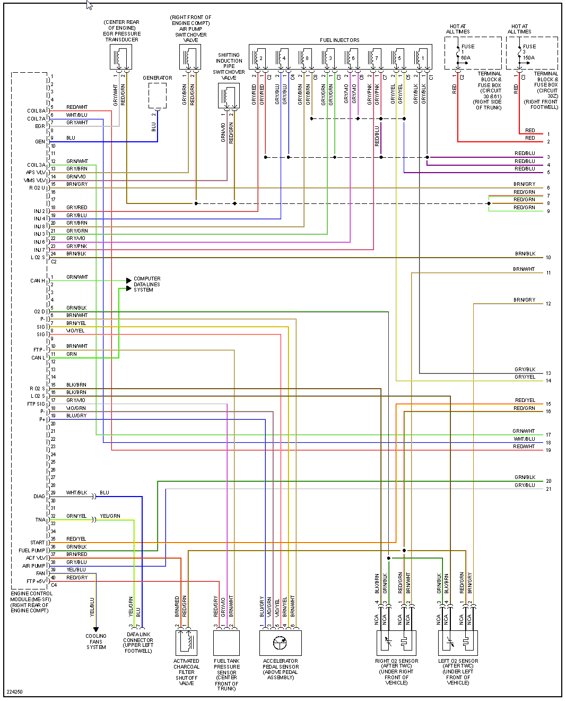
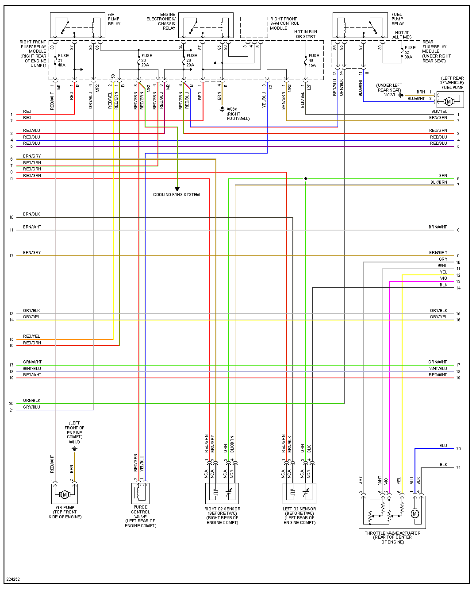

A: 8 pins

[HOWTO M111 on microRusEFI](HOWTO-M111-on-microRusEFI)

# 99 SLK230

# 99 E320

| Connector/ Pin Number | OEM Color | Name / Function | 
| --------------------- |------- |---------------- |
| A3  | BRN | KL31(GND)         Ground   Ignition earth |
| A7  | BRN |                  Ground                  |
| A8  | BRN |                  Ground                  |

| Connector/ Pin Number | OEM Color | Name / Function | 
| --------------------- |------- |---------------- |
| B1  |          |                                |
| B2  |          |                                |

| Connector/ Pin Number | OEM Color | Name / Function | 
| --------------------- |------- |---------------- |
| C8  |          |                                |
| C8  |          |                                |

| Connector/ Pin Number | OEM Color | Name / Function | 
| --------------------- |------- |---------------- |
| D8  |          |                                |
| D8  |          |                                |

| Connector/ Pin Number | OEM Color | Name / Function | 
| --------------------- |------- |---------------- |
| E8  |          |                                |
| E8  |          |                                |

| Connector/ Pin Number | OEM Color | Name / Function | 
| --------------------- |------- |---------------- |
| F8  |       x |                                    |
| F8  |       x |                                     |

# 2005 S430

# 2005 S500

