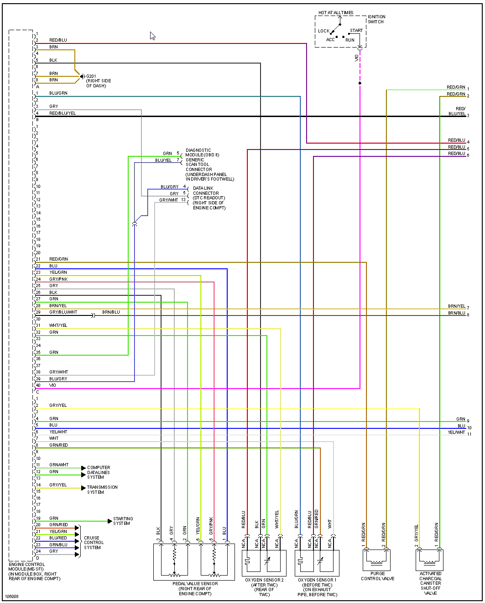
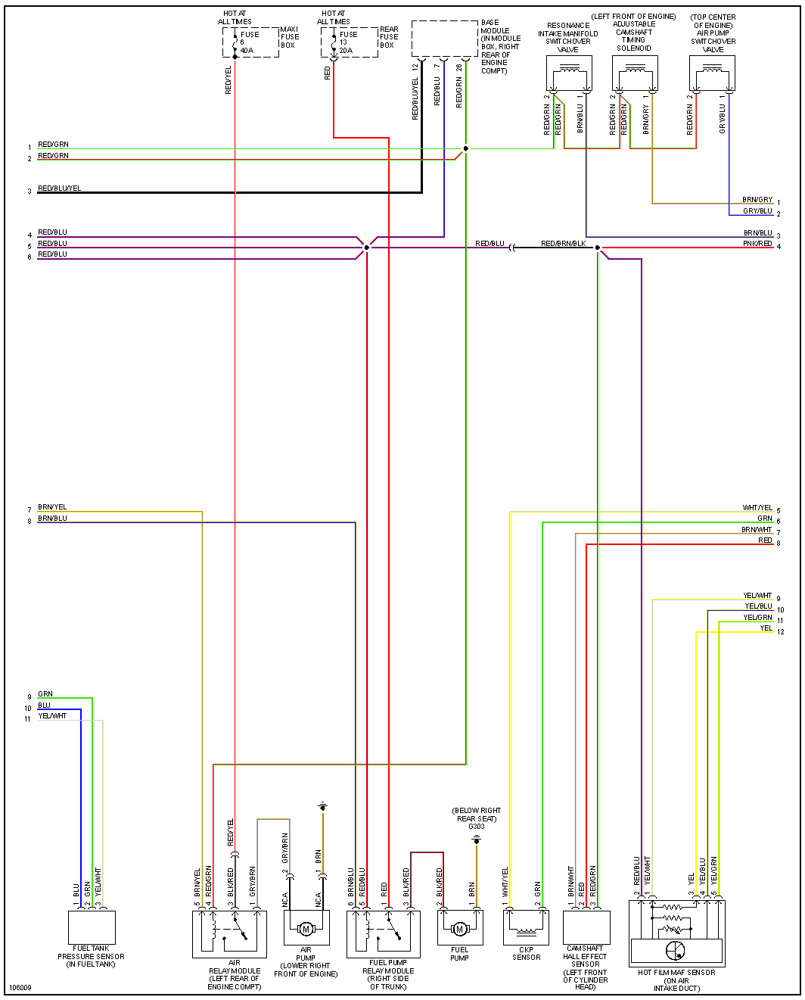

# Vault Of Mercedes-Benz OEM Information

## M111 - I4

99 SLK230 See [Mercedes-C230-and-SLK230](Mercedes-C230-and-SLK230)

[M111 Variants Wiki](https://en.wikipedia.org/wiki/Mercedes-Benz_M111_engine)

[HOWTO M111 on microRusEFI](HOWTO-M111-on-microRusEFI)

Jimmy, Scott have M111 2.3 Compressor engine, both as swaps into 190e body [wireing detailes](https://docs.google.com/spreadsheets/d/1I-lZKRajTiEGFUXdZpXEtKF2pymlOo-lPahy3cLMnl4)

Alex has M111 1.8 (now swaped M111.961)
[Forum](https://rusefi.com/forum/viewtopic.php?f=2&t=1700)

[w202.018 C180 MY99](OEM-Docs/Mercedes/w202c180m111wiring4.pdf)

[ME 2.1 description/Pinout](OEM-Docs/Mercedes/motronic.pdf)

## M112 v6 320

[1999-e320 Connector and Wiring](1999-e320)

## M113 v8

### 430

[1999-e430 Connector and Wiring](1999-e430)

[2000-s430 Connector and Wiring](2000-s430)

[Mercedes-v8 Wiring](Mercedes-v8)

M113K is 113.990 or 113.991? Looks like 134 pin connector?

M156 looks like 154 pin connector? [WebETM Starfinder](http://benz.ehost.tj/) is amazing?

2011 W212 E63 1569001300 ME9.7

## 1997 S320

## Mercedes OEM Engine harness layout (ME2.0/1/8)

This is helpful information for swapping or building your own "improved" Engine Harness.
ME2.0/1, (Roughly MY96/7 to MY99), the stock ECM for a Hellen128 system will have 2 plugs for E/F in the ECM, and then a handful of other plugs depending on chassis.
W210 chassis will have 210 545 81 28 (Black Strip Plug), R129 will have 029 545 72 28 (Green Oval Plug), W202/208/170 may have both. In addition to the Engine Harness, most cars with ME2.0/1/8 ECMs also have rear mounted batteries, there will be a bulkhead connector on the firewall which connects to the starter; these cars will also have 722.6 Transmissions, which have a 13 pin connector on the right side of the transmission.

The strip or oval plugs connect a handful of accessory sensors, power leads, and the starter wire. *In General*, on a MB wiring harness, plain brown is GND, plain red is +V, purple is starter circuit.

Seen here is a 029 545 72 28 from a MY97 R129 SL320.
Purple wire on pin 13 is starter signal
Blue/Yellow wire on pin 12 is A/C Compressor
Blue/Green wire on pin 9 is a sensor on the Oil Filter housing
Brn/Wht wire on pin 7 is GND
Brn/Wht wire on pin 6 is ECM GND
Black/Green wire on pin 3 is IGN +V
Red/Green wire on pin 2 is VVT/Resonance Flap +V
Red/Blue wire on pin 1 is INJ +V

NB These plugs are not indicated on the wiring diagrams posted here.
